# 16-化工-韩笑-华东理工大学

## 基本背景

> 绩点排名：24/79
>
> 四级：490
>
> 六级：523
>
> 奖证：全国大学生化工原理实验大赛华东赛区二等奖
>
> 科研：无

## 考研结果

> 录取学校：华东理工大学+化工学院+化学工程与技术（学硕）
>
> 初试总分：404
>
> 政治：70
>
> 英语（一）：74
>
> 数学（二）：116
>
> 专业课（801化工原理）：144
>
> 复试情况：83.60分；总排16

## 考研心得

### 一、考研资源： 

1、中国学位与研究生教育信息网（学位网） 该网站由教育部主办，可查询全国学校的专业排名：

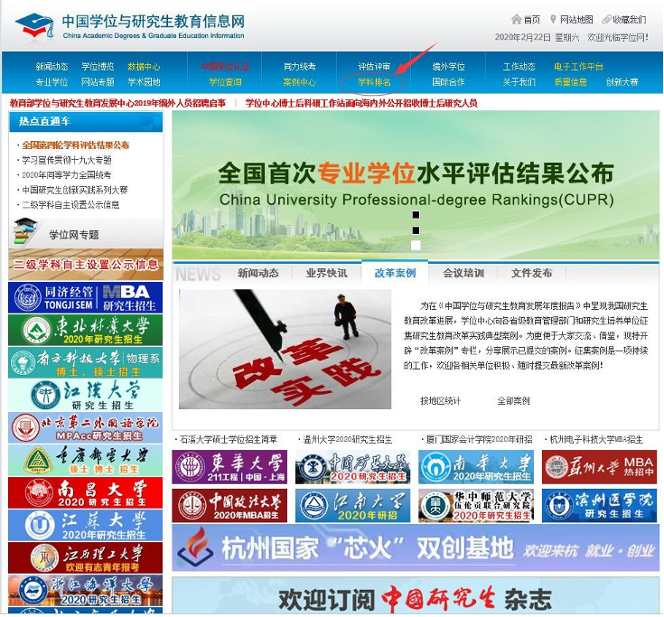

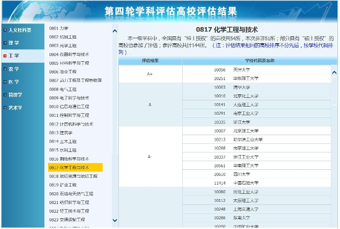

2、中国研究生招生信息网（研招网）功能多强大就不用我多说了，直接放图：

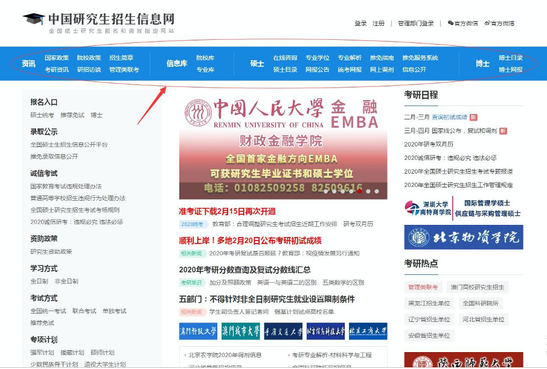

3、报考院校研究生院： 搜索方式：百度“XX 大学研究生院”。可在主界面招生工作一栏，找到往年的录取人数，考研参考用书，和今年大致的招收人数等：

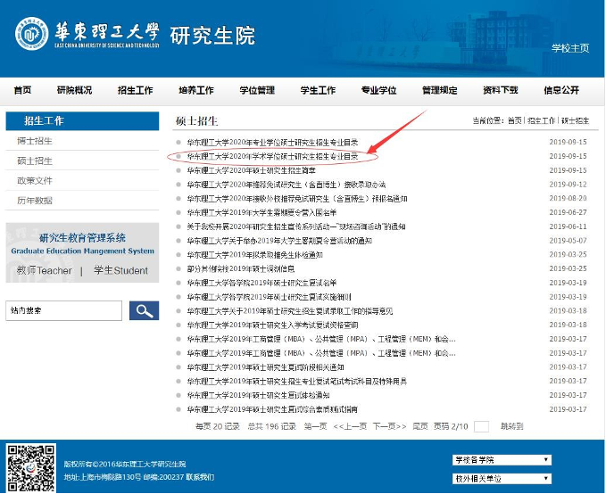

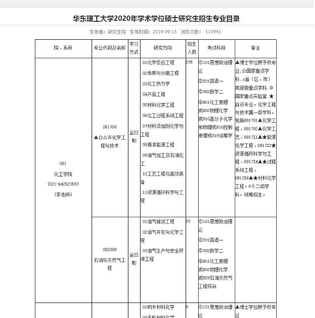

如不知道专业课所用书版本，可直接百度或淘宝搜索“专业课代码+课程名 称”如“801 化工原理”

4、目标院校的学长学姐

5、微信公众号（考研公共课视频资源）：资料分享菌、资料魔法屋、研料库、给力考研资料（若预算充足请支持正版）

6、APP：B 站（专业课视频）、知乎（考研经验贴）、考研帮、欧陆词典（可安装拓展词库，有需要可找我要网盘），墨墨背单词，Forest，百度网盘（2 倍速看网课）

### 二、一些关于考研的事实

1、考研的知识量是高考的三倍以上，但只有高考时间的 1/3 去进行复习。所以大家不要觉得时间很充足。

2、考研很大程度上拼的是熟练功。

3、考研复试存在一定程度的歧视复试时学校歧视一直都存在，本校考生、好学校的考生明显更受青睐。但歧
视不来自于学校，而来自于学校的某些导师。

4、复习途中放弃的人很多，不同于初高中有老师保姆式的辅助学习，考研复习全靠自觉，遇到的问题全
部要自己解决。因此每年都有大量考生中途放弃。能坚持下来，就已经赢了很多人。

5、摇摆不定的人往往会悲剧。边找工作边考研、边考公务员边考研等等等等把考研当备胎的人有很多，除
了少数天赋异禀的考生，结果都是两边不讨好。还是推荐专注于一个方向，不要两边摇摆不定。

6、英语、政治 70 算高分，80 算超高分。 一般复习没有走偏的人，英语政治保证 60 以上是没有问题的。不要想着靠
这两门来拉分，也不用担心被拉分。

7、数学、专业科拉分最狠。数学和专业科都是 150 满分，考研初试能否力压其他竞争者，很大的程度上由这两科来决定。在复习时间分配上，这两门要多一些。

8、情报非常重要。情报收集是考研中最重要的一环，甚至超过了复习，它很大程度上决定了你这一年的努力有没有白费！ 很多人都忽略了情报，觉得某学校某专业很好，也不做调查，就开始埋头苦学，辛辛苦苦进了复试，结果没想到名额被保送的占了大半，还有很强的本校考生偏好，最终只能选择调剂。复习前一定一定要对报考目标进行详细的调查，尽早发现问题尽早应对。 

9、学硕与专硕。以培养教学和科研人才为主，授予学位的类型主要是学术型学位。学术型学位按招生学科门类分为哲学、经济学、法学、教育学、文学、历史学、理学、工 学、农学、军事学、医学、管理学、艺术学 13 大类。（搞科研）具有职业背景的学位，培养特定职业高层次专门人才。中国经批准设置的专业硕士已达 15 类，专业硕士教育的学习方式比较灵活，大致分为在职攻读和全日制学习两类。（读研去工作）

10、考研地区的划分。考研地区总体分为两大类，国家按照一类、二类确定考生参加复试基本分数要求：

一类：北京、天津、上海、江苏、浙江、福建、山东、河南、湖北、湖南、广东、河北、山西、辽宁、吉林、黑龙江、安徽、江西、重庆、四川、陕西21个省（市）

二类：内蒙古、广西、海南、贵州、云南、西藏、甘肃、青海、宁夏、新疆10个省（区）

每类地区考研要求分数线（俗称国家线）是不一样的，一类对应 A 区线，二 类对应 B 区线，其中 A 区要求较高，B 区较低

11、四六级成绩与考研初试无关，与考研复试有关。 可以趁着考研的同时，在当年六月份成功考过四六级，这样会在你复试面试的时候提供帮助。

12、考研资料不是越多越好？ 记得考研初期，跟风买了好多考研资料，在手机上下单的那一刻真的是太爽了，结果到最后有一半的资料还是空白。资料买太多的话，一个是浪费钱，一个是会自己压力。在这里建议，可以先根据自身情况，做出学习计划之后再去购买资料。

13、大学挂过科是否影响考研？ 不影响初试。可能会在复试面试老师看你成绩单时有影响，但影响不大。

14、大学未参加过比赛、发表过论文、没拿过奖学金是否影响考研？ 不影响初试。对于复试的影响：有的话相当于锦上添花，没有的话就要看面试老师了。总的来说影响不大，至少不会扣面试分。

### 三、生活习惯

**1、制定自己的学习计划，养成一个适合自己的作息**

制定学习计划的几个步骤：

（1）将考研期间的 10 个月时间分段：如 2-5 为基础阶段，5-8 为提高阶段，9-11 查漏补缺，11-12 为冲刺阶段，为阶段性计划。

（2）列出考研期间，每门学科所用的所有书籍、视频、试卷，按照自己需 要，分配在（1）的时间段中。我们以高数单科进行举例如下图：

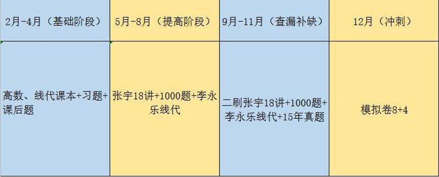（该图仅供举例使用，不为本人的学习计划）

（3）将每个阶段继续拆分成每个周，制定自己的周计划。举例如下图：

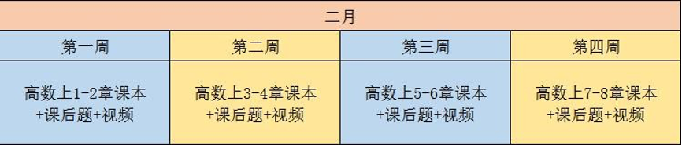（该图仅供举例使用，不为本人的学习计划）

（4）将每周继续拆分成每天，制定自己的日计划。举例如下图：

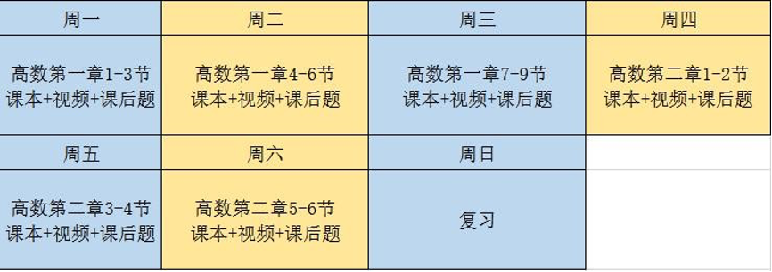（该图仅供举例使用，不为本人的学习计划）

（5）对每日的时间进行安排，举例如下图：

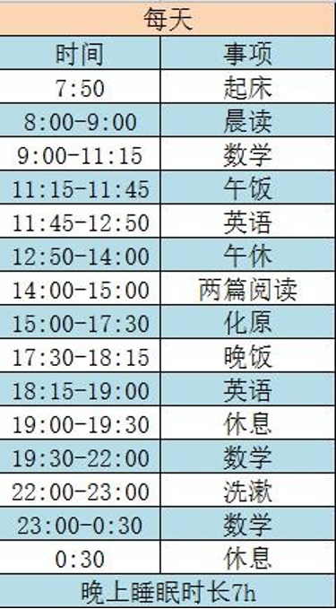（该图仅供举例使用，不为本人的学习计划）

计划需要根据每天计划的完成程度，进行反复调整（一般情况下，正常的考 研人每天的高质量学习时间不低于 8h）。不要以牺牲睡眠为代价来去学习，休息好第二天才有精神！

**2、坚持每天锻炼：**不要认为除学习之外的事情都是浪费时间！有一个好的身体，好的精神状态是为了更好的学习。举个小例子：每天的锻炼时间是 1h，你把这 1h 用来学习， 但体质下降。换季或流感来临，感冒发烧可能就要浪费至少 2 天的学习时间！考研期间，最害怕的就是自己生病了，所以我坚持每一天，或两天在操场跑 4km。

**3、补充营养：**建议在备考期间，多吃水果（久坐、压力大可能会引起便秘或者胃胀气或者肠胃不适，便秘可以吃火龙果、多喝水，胃胀气可遵医嘱买点碳酸镁铝咀嚼片）， 有条件吃点维生素片（善存、21 金维他），如后期失眠严重可以适量喝点褪黑素。

**4、劳逸结合：**每周要腾出半天，或一天的时间给自己放个假。否则你会慢慢失去学习的动力。如出去聚餐、看电影、打球来放空自己。但不是利用休息的时间熬夜刷手机。 我们要明白，我们休息的目的，是为了释放压力，放空自己，从而有更好的学习状态。

**5、考研必备神器：**多功能计时器、百乐笔 p500（墙裂推荐）、午睡枕、ohropax soft 隔音耳塞（考研期间一直在用）、双肩包（推荐小米双肩包）、无线蓝牙耳机、平板电脑等。

### 四、数学二备考 

**1、题型：**选择 8 题 32 分，填空 6 题 24 分，大题 9 题 94 分。 

**2、市面资料汇总：**

李永乐系列：李永乐复习全书（知识点详细且全面）、李永乐 660 题、李永乐 330 题、李永乐最后 6 套卷（知识点很全，可帮助查漏补缺）、李永乐系列视频

张宇系列：张宇高数 18 讲（题型多）、张宇线代 9 讲、张宇 1000 题（题 目偏难）、张宇闭关修炼（暑假看图书馆人手一本）、张宇最后 8+4 套卷（题 有点偏）、张宇系列视频

李林系列：李林辅导讲义、李林 880 题（风格像真题）、李林 108 题、李林最后 8+4 套卷（风格像真题） 

汤家凤系列：汤家风辅导讲义、汤家凤接力题典1800（题目基础）、汤家凤最后 8 套卷、汤家凤系列视频

李正元系列：李正元复习全书、李正元 400 题

合工大系列：合工大超越 5 套卷（风格像真题）、合工大共创 5 套卷（风格像真题）

真题：1988-2020 年真题

真题精讲：张宇、李永乐、李林、汤家凤真题精讲 

注：以上资料为个人搜集，不为市面全部资料。且以上为个人观点，请理性选择资料书。 

**3、本人所用资料**

课本:同济大学高等数学、概率论教材

视频：B 站川大徐小湛的高数、线代视频（看过的人都说好） 习题册：张宇 18 讲、张宇 1000 题、李永乐线性代数精讲（讲得很详细，推荐）、05-19 年真题、李林最后 8+4 套卷

**4、本人备考之路：**高数上课本→高数下课本→线性代数课本 →张宇 18 讲+李永乐线性代数+1000 题→近 15 年真题→李林 8+4→考试

第一阶段(2.15-4.30）：我从 19 年 2 月 15 号开始学习数学。跟着徐小湛老 师的视频，一节一节的学习课本上的内容，并做课后习题。在这里先说下，备考 数学期间，只看过徐小湛老师的高数和概率论，并没有看过考研老师的视频。所 以不要一味地去比较哪一位考研老师好，而减慢学习进度！

第二阶段（5.1-10.15）：高数、线代课本、习题、视频结束，开始看张宇 18 讲。因为我是按顺序先高数，后线代的顺序看的课本。等我翻开张宇十八讲， 我会发现，2 月份看的高数上已经全忘光了！所以在这里我走了弯路，建议学弟 学妹们学习数学初期，学习新知识的同时一定要及时复习学过的旧知识，并做配 套习题！

第三阶段（10.15-11.10）：模拟考场时间做近 15 年真题（8:30-11:30）， 并整理错题。

第四阶段（11.10-12.20）：查漏补缺，复习错题，并做适量的模拟卷。我 是两三天一套。

考研数学需要下狠功夫，在备考期间，我大概把一半的时间给了数学。因为我做题慢的缘故，我并没有做市面上太多的习题集。期间也常怀疑自己，我没有这么多的题量，我数学会学好吗？但心中都会提醒自己：不要给别人比进度，题海战术不可取，慢慢来，比较快。

**5、备考期间所走弯路：**

（1）学完新知识之后没有及时复习旧知识，导致旧知识点遗忘速度很快；

（2）题目量不够，导致做题的速度和准确度差强人意。建议有时间多做题，但不是进行题海战术。把你手头的每一道题做透，每个知识点吃透， 就行了。

（3）总与别人比进度。这点不可取，因为你与别人考的学校不同，学习方式也不同，按自己计划来就好。

（4）觉得别人的资料书、或网络上推荐的资料书比自己的好，自己的资料书做到一半又去换别的资料书从开始。我没遇到过，但是要提醒一下： 相信自己的选择就好了！

（5）背题型，认为把资料书上所有题型背完，就能考好。结果今年数学线代部分的大题出的特别灵活，让人难以下手。所以开始要从课本出发， 搞懂课本上的每一个定义，每一个知识点，看到一道题，不是通过回忆用哪种学过的题型去解题，而是先判断题目中涉及的知识点，利用所学知识点进行解题。做到以不变应万变。

**6、如何利用手中的习题集？** 以下是我认为习题集的几个用处，供大家参考：

（1）找到每个题目中对应的知识点，加深对课本知识点的理解

（2）增加题型的储备量

（3）为解陌生题目提供灵感

（4）形成对该类型题目的肌肉记忆和敏感度

（5）对于知识点模糊或不会的题目，要进行标记，并着重复习

（6）对每一类型题目的解法进行梳理（一个题目会有不同解法，一个知识 点会有很多题型）

（7）题海战术不可取，要搞懂每一道做过的题

### 五、英语备考

**1、题型：**完形填空 1 篇 20 空 10 分，阅读 4 篇 20 题 40 分，新题型 1 篇 5 空 10 分，英翻汉 1 篇 5 题 10 分，小组作文 10 分，大作文 20 分。

**2、本人所用资料：**恋恋有词、墨墨记单词 APP、张剑 98-19 年真题精讲、田静语法课视频、唐迟 04-19 真题精讲。

**3、本人备考之路：**英语备考的思路还是很清晰的：先背大量单词，提升词汇量→看语法课→98-19 年真题+视频→考试。 但是市面上充斥着大量的辅导资料，让人眼花缭乱，我也跟风买了大量英语资料：何凯文长难句、恋恋有词、阅读的逻辑、王江涛写作，结果一本没看。所以，书不在多，而在精。你买书下单的那一瞬间，可能很爽，但是买回来不看，可能会给你增加不必要的心理压力。

**(1)单词：**前期也受他人影响，看了朱伟恋恋有词的视频，但是在这里并不 推荐通过看视频的方式来学习单词！一会浪费大量时间，有这些时间可以做一些 更有价值的事情；二是与其说其为考研老师，不如说是带货商人，相声演员。你 可能觉得视频很有意思，但与所学不相关，那就是浪费时间！

买本单词书，或者用手机老老实实背单词就够了!前期留下印象，只有当你 做真题碰见那个单词之后，才能真正的了解这个单词在文中含义！若真想学习单 词用法，这里推荐柯林斯词典（英英词典）。

通过 APP 背单词很容易，会有自动复习机制。那用单词书背单词时，如何做到边背新单词，边复习旧单词呢？下面是我所使用的方法（艾宾浩斯遗忘曲线法）：

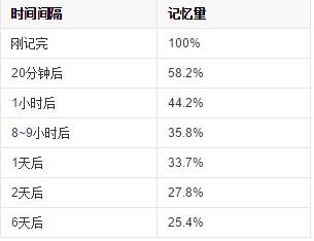

上图为人脑对于新事物的遗忘程度，从上图我们可以说：第一天早晨学习新 事物，在第 1 天的晚上、第 2 天的晚上、第 4 天晚上、第 8 天、第 15 天、第 30天、第 60 天复习时最好的，列成表格的形式（早晚背诵效果最好，有科学依据，就不用我多说了）：

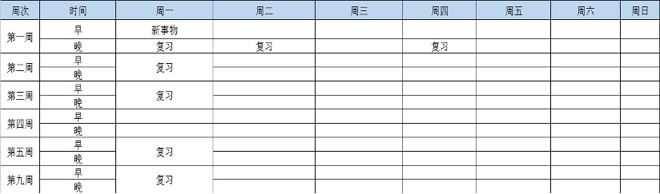

然后就可以安排每天的新单词量，并合理地复习旧单词。下图为我在考研初期的部分背单词计划：

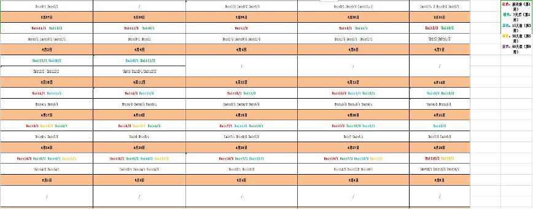

**（2）语法：**若语法不好，我的建议是，新东方田静的语法课就足够了。 有人推荐用课本学习长难句，如何凯文长难句。但我认为该书排版太紧凑，看得让人眼花，而且看书太枯燥，不如看视频。

**（3）真题：**

**①阅读：**英语真题最最最重要的就是阅读！所谓得阅读者得英语，我英语备 考期间，80%的时间都花在 40 分的阅读上。导致我的完型只做了 5 篇，新题型做了 5 篇，翻译没做，作文只花了一周去准备。这里也体现出我的考研时间安排有 问题。但是也反映出，当阅读全都吃透，其它客观题型都不在话下！

一定要去下狠功夫去研究阅读，我这里墙裂推荐唐迟的阅读课！！！考研英 语考得是文章的逻辑，是有解题技巧的。所以很多同学会有疑问，为什么我对着 中文翻译，还是选不出正确答案。

我阅读不像别人反复刷好几遍，我只认认真真地做了一遍。怎样才算认真做呢？下面是我的建议：

（1）里面的生词、模糊词、短语要全部记下来并背诵；

（2）学会利用所学语法去切分文章中的长难句；

（3）学会识别文章中的特殊句式，如强调、比较、倒装等；

（4）尝试像唐迟老师一样，去分析文章句间/段落间的逻辑；

（5）文章要会全文翻译；

（6）学会利用阅读的解题巧进行解题；

（7）学会分析文章中的正确和错误选项；

（8）错题要去思考为何做错，在脑中留下印象。

（9）记得留 3-5 年做考前模拟，防止出现题慌。市面上的所有英语模拟题都不推荐！真题就足够了。

**②完型和翻译：**如果考研初期只背单词觉得任务量太少，写阅读又太早，建议可以通过做完型和翻译来增加词汇量并提高阅读能力。

**③新题型：**新题型可以考研后期 9、10 月份集中去做。

**④作文：**作文是能用最少的时间，产出最大效益的一个题型。学长备考作文初期，也是花了大量时间去背诵范文，但收益甚微。最后听从学长建议，开始自制作文模板。如何自制作文模板?此处展开篇幅太长，可私聊我领取作文模板制作方法。 

**4、备考期间所走弯路：**

（1）认为只有当单词全部背完才能做真题，导致真题做的太晚。此处 建议可以在背完必考词，基础词之后开始做真题（6、7 月份）

（2）真题只做一遍，对方法掌握不够灵活。建议真题二刷、三刷，但不建议做模拟卷

（3）真题上的生词模糊词，只记不背。真题上的生词尤为重要！当你开始做真题后，背单词一定要以真题为主！

（4）作文准备太晚。十一月份建议就开始写作文模板，不建议背范文

### 六、政治备考

**1、题型：**单选 16 题 16 分，多选 17 题 34 分，主观题 5 题 50 分

**2、所有用书籍：**肖秀荣精讲精练、肖秀荣 1000 题，徐涛提高班班网课、肖4肖8、和市面所有模拟卷（徐涛、陆寓丰、米鹏等）

**3、本人备考之路：**肖秀荣精讲精练(也可换成徐涛的核心考案）+徐涛网课+1000 题 （看一节立即做该节题目）→肖四肖八(尤其是肖四前两套）+模拟卷→考试 

**4、几点建议：**

（1）政治与数学不同，其能通过短期学习来考取不错的分数

（2）政治建议提早复习：7-8 月份（我拖到 9 月初复习，到最后要崩溃）

（3）政治知识点庞大，一轮复习要 1-2 个月。一定要及时进行旧知识 点的复习，因为政治科目的知识点忘得非常快！我因为一轮复习的时候没有进行旧知识点的复习，导致二轮复习时一轮复习最开始的知识点忘得一干二净！

（4）肖秀荣的 1000 题可以反复做，题目不够可以去看徐涛老师刷题班！（用碎片时间，走路、吃饭、睡觉前都可以）

（5）今年有反押题的情况出现，所以大题不要全仰仗押题如肖 4 肖 8、 徐涛小黄书（当然你能把我列的背完，当我没说话），有时间还是要去背诵当年的重点考点！

（6）推荐徐涛的提高班网课

（7）市面所卖考研政治全家桶，尽量不要买，做不完。

### 七、专业课备考

**1、题型：**801 化工原理，简答题 10 题 30 分，大题 4 题 120 分

**2、所用书籍：**陈敏恒化工原理上下册（第四版）、黄婕化工原理学习 指导与习题讲解、历年真题

**3、备考之路：**课本→习题集→91-20 年真题

**4、几点建议：**

（1）化工专业考本专业研究生且选择化工原理当专业课的同学，可以积极参加**化工实验大赛**，对你专业知识的掌握很有帮助

（2）6、7 月份开始复习专业课

（3）不要做所谓学长出的模拟题，真题反复做，积累题型

（4）多找不同版本的教材来看

（5）不要背题型，要通过所学知识点进行解题

（6）华东理工专业课上手很难，但很容易考高分

### 八、写在最后

（1）俗话说，没有经历过崩溃的考研人，不能称作考研人

（2）制定自己的计划，不要给别人比进度

（3）慢慢来，比较快

（4）学会减压

（5）去看知乎经验贴

（6）考研就像在黑屋子里洗衣服，你不知道洗干净了没有，只能一遍 一遍去洗。等上了考场的那一刻，灯亮了，你发现有的人忘了加洗衣粉，有的人用的是洗衣机。但只要你认真洗过了每一个地方，那件衣服一定是光亮如新的，而你以后每次穿这件衣服时都会想起这段岁月。共勉！
