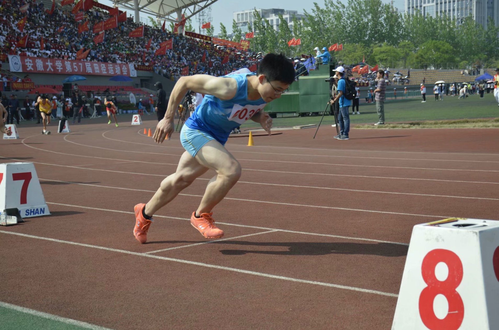
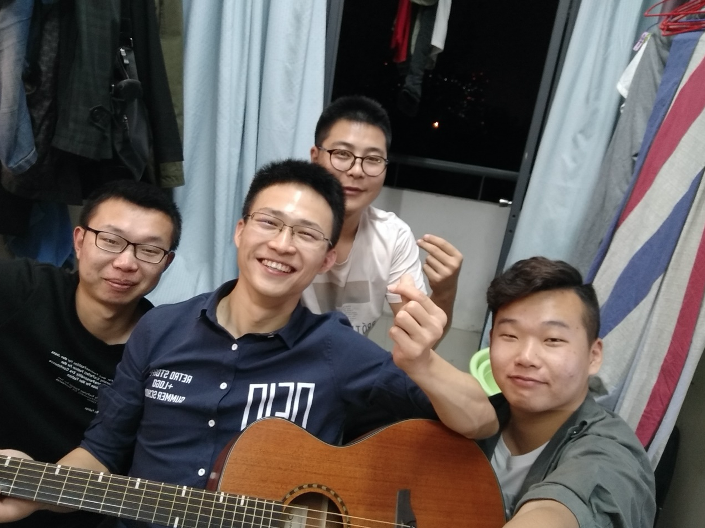

# 17-应化-文豪-中国科学技术大学

本文原标题：优秀毕业生事迹分享

## 基本信息

> 我叫文豪，是2017级应用化学专业毕业生。党员，在校期间担任班级组织委员职务。四年平均绩点3.97。曾获得安徽省第二届普通高等学校大学生化学竞赛三等奖、2018年度国元奖学金、2017至2018学年文体活动奖学金、第一届全国大学生化学实验创新设计比赛安徽大学选拔赛二等奖、2018至2019学年优秀学生奖学金，获得安徽大学第56届田径运动会男子甲组200m第三名、400m第三名、男子乙组4X100m第二名、4X400m第五名，获得安徽大学第57届田径运动会男子乙组200m第八名、400m第八名、男子乙组4X100m第三名、4X400m第三名；曾获得2017至2018学年“三好学生标兵”荣誉称号、安徽大学2018年度团内评优工作“优秀共青团学生干部”荣誉称号、2018至2019学年“优秀学生干部”荣誉称号、2019至2020学年“三好学生”荣誉称号、安徽大学“优秀共产党员”荣誉称号优。推免至中国科学技术大学化学与材料科学学院。

## 成长经历

刚进入大学时，大学给我的第一印象就是这是一个完全自由的环境，想做什么就做什么，几乎没有人约束自己。经历了高中单一乏味的为高考而拼命学习的生活后，对学习的热情已被消磨殆尽。刚开始的两个月真的是过着“人生苦短、及时行乐”的生活，游戏、看剧、睡觉占据了我生活的大部分。尽管当时的我对学习莫得什么兴趣，但出于对老师的尊敬，我没有翘过课，这也许是我刚进大学时唯一可以炫耀的“资本”了吧。但好景不长，期中考试从天而降，这次考试高数不及格，现实狠狠地给了我一记耳光，把我从骄傲自满、纵情享乐的梦境中打醒了。那次事件后，我开始思考，我来上大学是为了什么，贪图一时享乐、随心所欲？不！我要成才，我要变得足够优秀，不负青春年华。那以后，图书馆和教室就是我去得最多的地方。

运动能使我保持良好的工作学习状态，因此，我一直就有锻炼的习惯。记得在新生运动会上我报了200米和1500米，还都拿了名次，其中200米还得了冠军。因为新生运动会表现还不错，我有幸进入院田径队，在这里，我遇见了一群优秀的学长，他们不仅在训练上给了我很大的帮助，在学习工作上也给了我不少启迪。冬训、春训时，很多院的高手在一起训练，本以为自己在短跑方面还挺有天赋的，没想到在这些人面前我什么也不是，每每都是我垫底。垫底的次数多了免不了出现些负面情绪，想过体育竞技这东西很拼天赋，我再怎么练也超不过他们，放弃吧。但又心有不甘，我练这么久了，说不干就不干，这也太不负责了吧。后面训练强度更大了，记得有两天，每跑完一个200米就去卫生间吐一次，但我还是硬着头皮把训练吃下来，所受的苦、所流的汗在校运会的时候都得到了回馈，我获得了安徽大学第56届田径运动会男子甲组200m第三名、400m第三名、男子乙组4X100m第二名、4X400m第五名。田径队的魔鬼训练和校运会的喜人成绩让我对“你的努力还没有到拼天赋的程度”这句话有了更深的见解。 

也许是学有余力吧，在大二时我选择了辅修计算机。这个选择其实还挺戏剧性的。由于是农村孩子的缘故，在上大学之前很少有机会接触电脑，只知道简单地开关机，连现在觉得是学习生活必备技能的word、ppt、excel是完全不会，打字更是连字母对应位置都要找半天、有的标点符号还打不出来，现在想想那时的自己还真无知。不幸的是，入学不久，大学计算机基础这门课要对学生的计算机水平进行摸底，考试科目中就有上面提到的打字和office的使用，可以考三次，一次正考、两次补考，考试不通过的话就不能期末考试，这门课就算挂了。第一次考试来的很突然，office什么的老师还没教，我现在还清晰地记得第一次考试我的打字速度是7字/分钟，有的标点符号还不知道怎么打出来。这次考试没有通过的人不多，我就是其中之一。还有两次机会，不过就挂科了，这不行啊，我就拿着实验教材一点点看，一点点上机试，终于第二次考试过了，期末的考试也拿到了九十加。令我没想到是，在这个过程中，我竟喜欢上计算机，我开始看计算机相关的各类书籍，在我学会office后，我自学起了C语言，在大一下的程序设计基础课中我拿到了满分。至此，系统学习计算机的种子在我心底埋下了。在大二时，综合考虑了自身的情况，决定辅修计算机。算了一下，已经辅修了的课程有四十多个学分，相当于一个学年还要多的课，因为选择了辅修，我没有了周末，但因为热爱，我坚持把课程都修完了。主修辅修双管齐下，还要都学好是很花时间精力的。也有不少次想过算了吧，自己何必为难自己呢，这本就不是你必须承担的，但也许是在田径队训练时磨炼出来的坚韧性格和内心的倔强的作用吧，终究我还是把读书的苦吃了下来，将每次的放弃拒之门外。

## 毕业寄语

很荣幸高考能考上安徽大学，并在这里度过了四年的美好时光。感谢母校给我提供了优质的学习平台，让我在这相对自由的学习生活环境中找到兴趣、不断成长、提升自己，成为我想成为的人。也要感谢我的同学、室友和田径队的伙伴们，和你们一起走过这四年，你们陪我一路成长，收获颇丰，感悟颇深。我想学弟学妹们说大学是我们成才的地方，不是变成朽木的地方，走出自己的舒适区，多挑战自己，趁年轻，多尝试，找到自己心中的热爱，梦有多大，舞台就有多大，学弟学妹们加油！最后，我想对自己说 “既然选择了远方，便只顾风雨兼程。”，不辜负昨天，对的起明天，努力做好今天，加油。

## 座右铭

每一步，都算数。

## 推免经验分享-夏令营经历

【申请院校】

中国科学技术大学、南京大学、西北工业大学

【夏令营安排】

由于疫情，夏令营都是线上进行的，对申请院校的食宿、待遇、和学校环境没有直观的感受。中国科学技术大学和西北工业大学都是头两天线上听报告，最后一天组织面试。南京大学是听线上报告，和线上笔试。

【考核内容】

中国科学技术大学和西北工业大学只有面试，中科大面试是英文自我介绍3min，然后老师根据自我介绍和简历提问7min；西工大是ppt自我介绍5min，然后老师根据ppt提问5min。南京大学是笔试，但由于在南大笔试之前我拿到了中科大的offer就没有继续参加南大的笔试了。

【优秀营员】

中科大没有优秀营员，只给面试合格，具体录比不清楚，从一起夏令营的同学那里了解到，几乎是参加面试都给合格了。西工大面试通过获得优营资格，优营比例挺高的，拿到优营就是offer。

【注意事项】

中科大只给面试合格，几乎是人手一份，只有导师愿意接受面试和个才有效，所以要在夏令营提前联系老师。总的来说，保研到中科大需要同时满足三个条件：拿到本校推免资格、中科大面试合格、有导师愿意要你。

学弟学妹们在报夏令营时不需要海投，选一个需要冲一下可能能上的、一个比较稳的、一个完全有把握保底的就行了。报得太多分散精力，不利于充分准备各个学校的夏令营，而且如果收到太多offer又鸽了太多学校，对下一届保研的想去你鸽掉学校的学弟学妹会造成不好影响。

## 附加

