# 18-新能源-陈炳旭-上海大学

## 基本背景

> 报考院校：中国科学技术大学-化学与材料科学学院-材料科学与工程（复试线350）
>
> 初试分数：总分343；政治69，英一54，数二112，专业课（802材科基）108
>
> 最终调剂：上海大学-材料基因组工程研究院-材料科学与工程
>
> 学生工作：化学化工学院学生会学生干部，安徽大学第二十届学生委员会委员
>
> 主要奖证：国家级大创负责人，安徽大学社会实践奖学金、团学工作奖学金、学术科技奖（团队）三等奖等
>
> 比赛获奖：第四届“互联网+”大学生创新创业大赛安徽省银奖；第六届“互联网+”大学生创新创业大赛安徽省金奖、国赛铜奖；第十届安徽省“双百大赛”优秀奖
>
>  

## 前言

这篇文章前前后后想了好久，最开始是不太想把我的考研拿出来说，因为初试结果不太满意；调剂与一志愿上岸不同，在安大飞跃手册、知乎等其他平台上有很多一志愿上岸的经验文章可参考，但关于调剂的内容少之又少；我在三月份四月份找调剂的时候也很迷茫，这段时间也有学弟学妹问我当时咋没有选择校内调剂，思前想后，最终还是打算把我的调剂经历写下来，希望能给有需要的人提供帮助。

我的初始结果不太理想，主要是考研后期心态有问题，当然，归根结底还是我🥦（别🐎🌶别🐎🌶）。初试的准备流程和经验我就不分享了，可以参考飞跃手册其他同学的内容，比如电院黄安吉同学的文章，很丰富[AHUer LeapLap Wiki - 安徽大学飞跃手册-黄安吉](https://www.ahu.wiki/#/升学就业/电子信息工程学院/17-微电子科学与工程-黄安吉) 。在正式开始之前，想给大家吃个定心丸，如果真的迫不得已走到调剂这一步，也不要慌，稳住心态，我有肥工的同学三百五十分最后调剂到了中山大学，在前几届中也有同学调剂到了厦门大学，只要认真准备也可以找到较好的去向。

本篇文章主要详述我的个人调剂经历，前前后后联系过科大先研院等校内调剂、上海大学材料科学与工程学院、上海大学材料基因组工程研究院、合工大材料科学与工程学院、厦门大学萨本栋微米纳米科学技术研究院、南方科技大学等院校的老师，广撒网多捞鱼，当然这一切都是建立在**不浪费老师招生名额**的情况下！！！同时也提醒各位同学，**不要主动放老师鸽子**！都是安徽大学走出去的学生，切忌给后辈学弟学妹挖坑，真的有高校的老师在被某院校的学生鸽了后，对后续想要保研或者报考的学生有不好的印象，毕竟高校学者千千万，有的人对被鸽很不爽。

不论是分数不够一志愿院校的复试线还是在一志愿复试中被刷掉迫不得已走到调剂，心态多多少少都有些变化，别人看自己、自己看自己、自己看别人的情绪很容易受到干扰，这个时候我们更要稳住心态，虽然临门一脚没有踢进，但是通过点球（调剂）仍然可以补救回来。在这个阶段，不仅仅要把精力投入到复制准备中，还要花心思查找调剂信息、老师信息、收发邮件，时间要分配合理；并且准备调剂复试与一志愿复试有所不同，不同院校调剂复试的方法、标准、形式都是不一样的，复试形式采取线上还是线下、口语自我介绍是中文还是英文、有无英语问答、专业课问答以及综合问答等等环节都存在差异，下文我将分环节叙述。

## 1. 调剂信息来源

调剂来源主要分为三大类：各高校**招生信息网或学院官网**发布的调剂信息、**小木虫**（APP或网站[小木虫论坛-学术科研互动平台(muchong.com)](http://muchong.com/bbs/)）、考研**微信公众号**（例如材子考研）；下面分别为中国科大校内调剂、小木虫网站示意图、材子考研搜集的调剂信息：

* 最可靠、准确的信息来源还是各高校招生信息网上发布的调剂信息，例如下图为中国科大校内调剂信息。但这种官方的信息有的发出比较晚，如果看到后再开始准备稍微有点迟了，可以提前多浏览意向院校研究生招生网上往年发布的调剂信息，参考一下某院系某专业有多少调剂名额，如果这个专业前几年都招收调剂的话，那今年也大概率会招收调剂，这样就有底气在官方发出调剂信息前向院系的意向老师发自荐邮件（在下一环节有详述）

  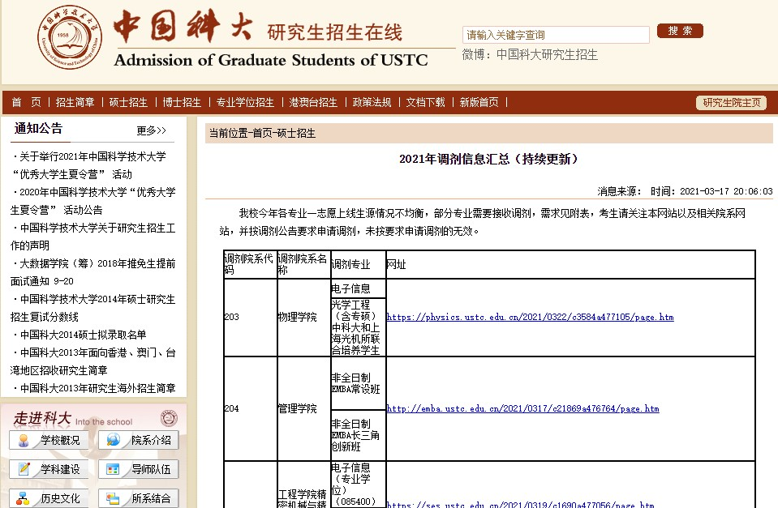

* 其中小木虫上相应板块可以查找院校老师发布的调剂信息，也可以后台填入考生相关信息后发布《求调剂》，如有经常浏览小木虫的硕士导师看到信息后可能会联系你（可能性非常小，还是得靠自己主动联系）或者其他研友也会给予些建议。在这里可能也会看到不少热门985、211院校的课题组也会发招生信息……这就很离谱，正常来说那些热门方向的课题组是不会缺学生报考的，但他们实际上也在养鱼，通过发布课题组资源和招生信息吸引除了报考相应院校的一志愿考生外，还有生源质量较好的调剂生。

  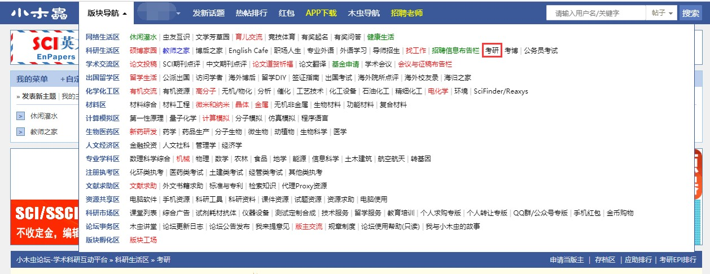

  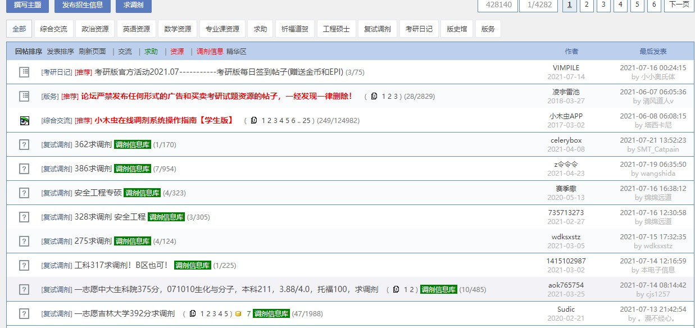

  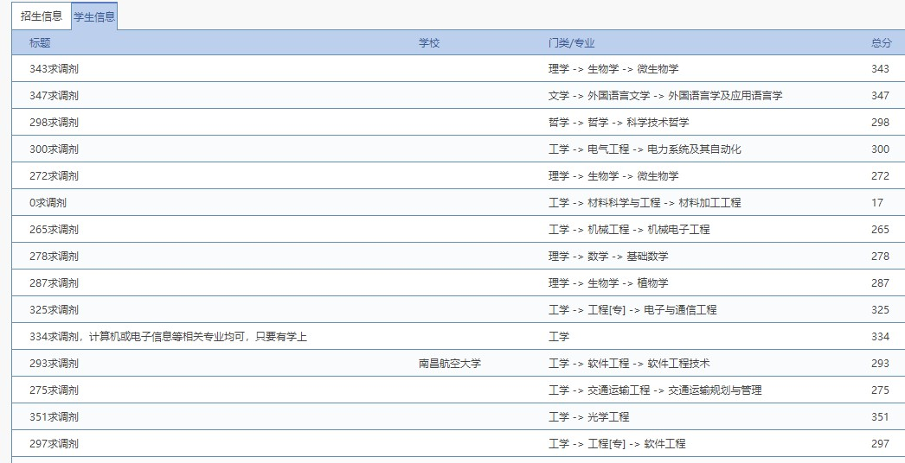

* 像材子考研这类公众号发布的调剂信息，实际上都是从小木虫上搜集处理出来的，但分类归总后看着比较舒服也方便查阅，很清晰的找到对应级别高校发出的调剂，包括这些公众号也会建一些调剂信息群，可以加群适当参考信息。

  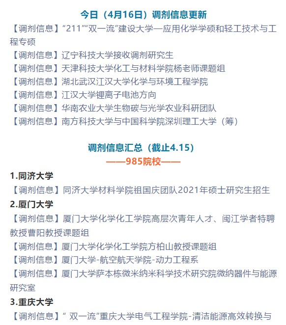

  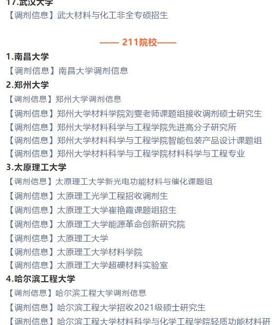

  除了以上几种主要的调剂信息来源，本科期间如果做科研项目跟老师比较熟悉的话，可以咨询下老师的意见或老师那里有没有推荐的同门师兄弟。那么在确定有几个意向的院校后，就可以着手给意向老师发自荐邮件和相关材料（个人简历、本科成绩单、获奖获优、科研项目经历、创新创业等赛事奖项）

## 2. 院校抉择与联系老师

为了更详细的叙述院校抉择和联系老师的流程和注意事项，我还是用我个人的经历做参考。在经过前期查找信息等环节，我大概确定的几所调剂意向院校主要为：中国科大校内调剂、上海大学材料基因组工程研究院、厦门大学萨本栋微米纳米科学技术研究院、合工大材料科学与工程学院、南方科技大学。其中中科大校内调剂主要包含先研院、稀土学院、同步辐射，其中同步辐射招收07物理学、07化学和08能源动力的校内调剂，我一志愿报考的08类，肯定不能调到07，也联系招生老师咨询过，原则上可以调剂到08能源动力，但优先一志愿同为能源动力相关专业的学生，我填完信息申请后，果不其然被拒了；稀土学院当时也了解过，第一印象感觉很高端，但深入查找信息后发现那个地方很偏僻，而且毕业后就业面很窄，就没有填那里的调剂申请，中科大校内调剂我主要是选择先研院。

确定院校的过程中一定要多查找信息，包括但不限于：近几年复试线、往年招收调剂人数、某所高校可以调剂的院系，尤其是第三部分，拿安大来说，如果你是材料专业相关考生，大部分人肯定都是选择调剂化院，但实际上还可以调往物科院和物院，虽然物科院科研实力和资源最强，但因建立时间没几年，不少人忽略了这个院系；例如厦门大学萨本栋微米纳米科学技术研究院，也是同样的道理，建立时间较晚，在厦门大学材料学院复试线315分且只有个位数极少数调剂名额的背景下，萨本栋微纳学院计划招生17人但只有一人上线，且初试只有318分……

那确定了这几所院校后，大概在三月上旬，我就开始陆陆续续联系老师了，你没有看错，就是三月上旬，那个时候绝大部分一志愿考生都没开始复试，下面我会说为什么要**尽早联系相应院校的意向老师！**个人建议通过电子邮件的方式联系老师，在这之前要浏览意向院校官网上的师资力量这一栏，查阅每位老师的个人主页或方向，确定跟自己的意向方向或者本科项目经历相关的老师，最好能够把确定的各院校意向老师统一汇总在word文档里，备注上相关信息，方便自己查阅。

发给各院校意向导师的自荐邮件主要包含三个方面：

i. 个人基本信息（本科院校、报考院校和分数、邮件意图）

ii. 本科的项目经历，为何想要报导师的研究生，对导师研究方向的了解，之后的打算等

iii. 如果可以的话，可以进一步沟通交流

以下两张图是我当时联系老师的邮件，仅供参考。

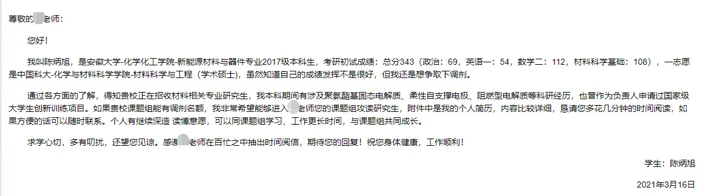

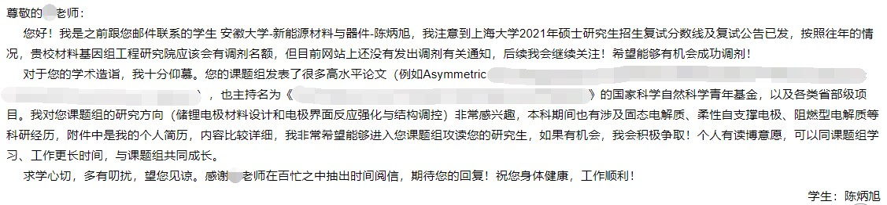

这时候还要提醒一下，**切忌同时对同一院校相近方向多位导师发邮件！**课题组老师之间都会有沟通的，同时联系同一院校相近方向的老师，这不是明摆着跟老师说“我是海王”吗……我个人建议可以每天上午给不同院校的两三位老师发送邮件，每封邮件针对不同老师的方向进行内容修改，在邮件发出一两天仍没有回复后，再继续给其他老师发送邮件。

我当时三月上旬开始陆陆续续发了很多很多份邮件，老师的各种回复中，有直截了当说没机会或者名额的，也有部分表达可以进一步了解沟通的，但更多的是邮件发过去后石沉大海，没动静了。这个时候就要有足够厚的脸皮，只要老师回复了邮件就不亏，哪怕老师明确说了没有名额甚至我不要你这个学生，都问没什么问题，因为已经可以排除一位老师，安心联系下一位意向导师，如果老师表达可以进一步交流那就赚了。最难搞的是不接受也不拒绝，只告诉你加油准备……这种情况大概率是老师的备胎，自己就需要多留意，不能只在一棵树上吊死。

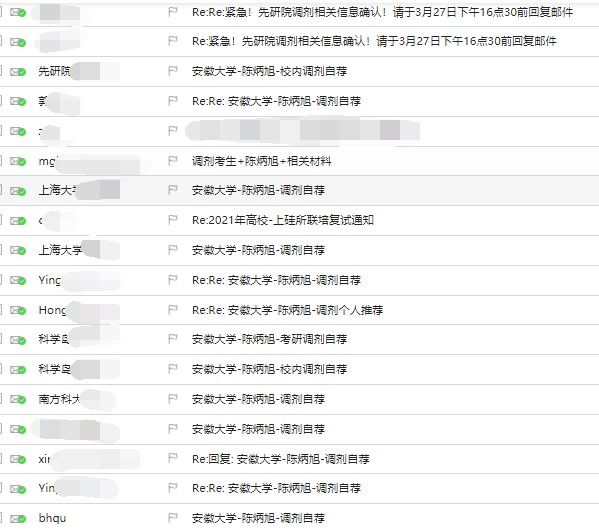

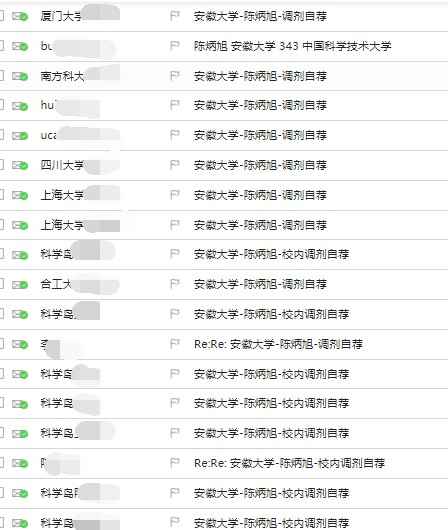

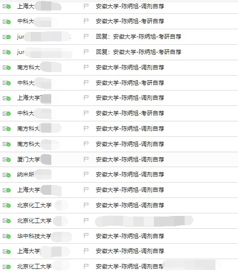

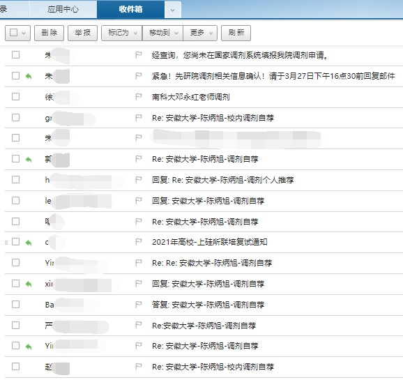

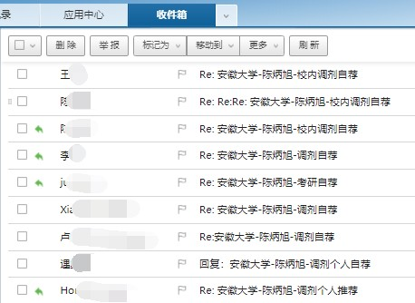

当时我也觉得三月中上旬这个时候联系老师已经足够早了，但实际上，一些热门方向的老师组里名额已经没了。热门方向的大牛导师更倾向于推免生，毕竟有更多的时间提前进组搬砖。不早下手的话，最后可能会分到一些夕阳方向或者口碑不太好的导师手里，没有人希望自己硕士三年时间是个刮奖-开奖的过程。如果觉得自己发挥比较好，本科经历也比较有竞争力，大概率可以高一志愿院校的复试线几十分，在初试分数出来的前一两周就可以联系导师了；如果估分没有把握一定能比复试线多一二十分，那**初试分数出来后再发邮件**；当然还有种情况是估分和往年分数线差不多甚至低一些，比如我……那就不要在一志愿院校导师上花太多精力，抓紧时间去找校内调剂或者其他院校的调剂。同时导师在复试过程中也是有一定话语权的，如果导师真的想要你这个学生，他会想办法让你在复试中占先机。

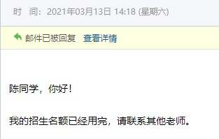

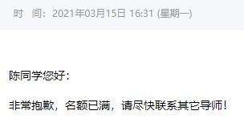

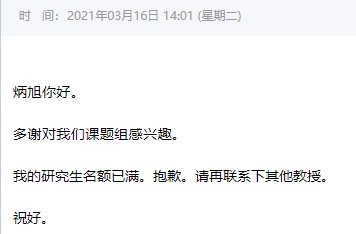

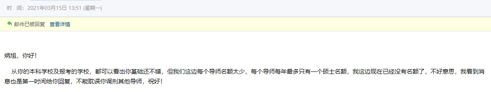

也有部分导师是不太喜欢复试还没结束就确定培养学生的，比如下图这位老师，我先后联系了他两次，给予的回复大概意思都是复试后组里才招生。我一开始以为是因为组里要求高，我的简历不过关，复试结束确定录取后才发现这老师是真的没有提前招生，而且收的学生的质量也不是很高。

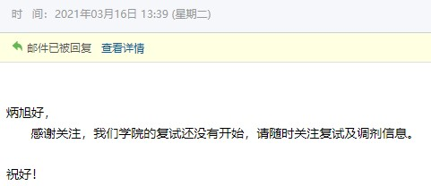

回邮中老师给予一定肯定的话语，愿意通过微信或者QQ进一步沟通，这种情况他大概率还有招生名额，并且对你有一定的兴趣会进一步沟通了解双方背景，这种就比较有机会。这时候就得停手“养鱼”，一旦某所调剂院校有一位导师给了这种比较有把握的回复，沟通中自我感觉也比较好，就别继续联系这所院校的老师了，切忌玩火自焚，可以去看看其他的意向院校。我最先联系的是合工大的一位导师，人也非常好，在确定如果我成功通过复试大概率能进入他的课题组后，我也就花更多的心思去联系南科大、上海大学等院校的老师。最终因为上海大学那边最先复试，和导师聊的也比较好，就直接确定去了上海大学，之后及时跟合工大那位老师说明情况后他也表示理解和认可。

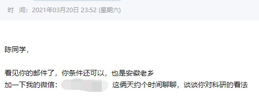

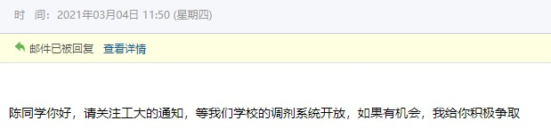

我当时联系的导师基本上都是半导体和锂电方向，想着之后不论继续深造还是就业，前景都还可以。复试前在和上海大学一位老师（也是我现在的导师）双方沟通都比较满意，他就直接说了，如果我能通过复试，并且在学生-导师双选上填他的名字的话，他就直接录我进组，如果我想去更好的组里，他也比较理解，不会反对；这个时候真就说到我心里了，也就直接回他，尊重是双方的，这样说的话如果通过复试，我也不会填其他导师了。

在调剂考生找调剂院校的背景下，实际上各个学院也在抢调剂生源，毕竟调剂生源大部分都是一志愿985被刷下的学生，本科也不会差，整体质量要比本校一志愿报考的学生要好。可能比较出名的就是宁夏大学之前上了热搜，一志愿专业课疯狂压分导致只有极少数一志愿考生过了复试线；广西大学又被称为“调剂小清华”。南京邮电大学去年在正式复试前提前几天搞了次导师交流会，我一开始发邮件过去的时候以为真的是正经的导师交流会，交流会前一天拉群、发短信通知才知道实际就是提前批复试，美名其曰“导师交流会”……提前确定调剂录取学生后，剩下只走个流程。包括去年先研院原本调剂生的安排是3.20发布校内调剂公告、3.26意向调剂报名链接截止、3.31开始调剂复试，在确定复试拟录取后，最后才在研招网系统里走一遍调剂和拟录取的流程；要知道研招网调剂系统里名额有限，最多填写三个，并且考生进入调剂复试环节的院校，也能看到考生在系统里填写的其他调剂院校；31号这个时间点面试太晚了，包括化材院、纳米学院、科学岛、先研院一志愿复试都在24号25号之前结束了，和其他大部分985211院校的调剂复试也都集中在26~29号，只有极少数院校的调剂复试拖到4月；估摸后面几天先研院也发觉到了调剂考生流失，提前在27号给之前填了意向调剂链接的同学发了邮件，再次确认是否已经被其他院校录取、是否有意向调剂至先研院，并且要求在28号中午前在研招网调剂系统填报先研院调剂申请。

## 3. 复试准备

在复试材料准备这一块，除了本科的成绩单、获奖获优、科研项目经历外，个人建议最好能准备一份个人简历，一方面可以用在上文提到的联系导师时自荐邮件，简单明了突出自己一些优势，另一方面也可以让复试老师迅速抓住自己想要呈现的重点。线下复试的话可以自己带着简历，复试面试开始前逐一发到老师手里，线上复试的话也可以将简历连同其他复试材料发过去。在简历制作过程中也要学会换位思考，整些花里胡哨的颜色或背景在那些四五十岁的老师面前只会是减分项；同时简历内容也要有所侧重，主要包含：

**i. 基本背景** 

绩点排名和考研初试分数，本科部分主修课程和分数（这部分别傻到把低分专业课放上去，可以挑一些有代表性的写在简历上），本科任职学生工作情况

**ii. 实践经历**

科研项目经历是最主要的（包含那些大创、创新实验和毕业论文），用两三句话简明介绍项目内容和自己所获；如果除了毕业论文真的没有啥项目经历的话，可以从本科的课程实验中选出一两个比较有代表性的实验拿出来，美名其曰创新实验…

以及本科见习或实习经历，不过实习这些不重要，简单带过就行

**iii. 获奖获优等荣誉**

优先选择与报考专业相关的荣誉，除了本科期间日常的获奖获优外，那些专业性赛事的奖项很关键

**iv. 技能证书**

语言能力（英语四六级、托福雅思、普通话等级证书等）、专业技能（专业软件以及仪器使用程度等）

**v. 自我评价或未来展望**

复试过程中老师主要看重的几个点：科研项目经历>本科获奖获优或各类高质量比赛获奖>本科成绩>社会实践等。具体到各个老师的想法，可能有点不同，比如我导师就非常看重科研经历以及有没有实际动手操作过一些设备，不太看重那些创新创业类比赛；而我之前联系的合工大一位老师他就会侧重这部分，他自己也有指导学生参赛；厦门大学的一位老师也是主要关注本科项目经历。可能有的同学觉得本科经历比较少，尤其是在科研项目这一块，但我们考研复试那个时候，毕业论文课题是已经确定的，就有必要抓住考完研的那个暑假，扎扎实实搞懂毕设，也可以给老师留下好的印象。更重要的一点是，我们呈现在简历上或者展现给复试老师的这些**项目或比赛获奖，一定是自己实打实做过并且很了解具体内容！**哪怕自己在项目里只是划水，在复试前也有花时间必要详细了解内容！要不就不要放出来，放出来就得有足够的自信和底气，否则复试过程中一问三不知只会是减分项。

调剂生的复试很难搞，可能要面对多所院校不同标准和流程的面试，有的学校要求英语口语自我介绍，有的学校有英文问答或翻译等等。但所有高校复试都有的环节就是综合素质面试（自由问答），并且占比比较大，主要是根据自我介绍或者考生提供的本科材料进行问答，虽然各院校复试专业课考核不同，但自由问答这一项完全是可以由考生掌握主动性的。

因为上海大学的复试专业课问题要求是与初试专业课不同的科目，现场抽到了一个物化的题目，我没咋准备，英语翻译抽到的大概是SEM构造和工作原理，三分钟的翻译限制时间已经用完了我才翻译到一半，这两部分基本上白给，我的英语口语自我介绍应该还行但这部分分数占比较少，主要就靠着综合素质面试这一部分，复试成绩拉到排名第二（一志愿考生+调剂生）。综合问答的时候尽量迎着老师来，综合问答的时间是有限的，大概不能超过十五分钟，如果我们能够在一些非常有把握的问题上用较多的时间回答较丰富的内容，剩下给老师刁难自己的时间就比较少，尽量营造有利于自己的情景。当时我在简历上放了三个项目经历，国家级大创（阻燃型电解质）、毕业论文（聚氨酯基导电胶）还有一个创新项目；记得老师上来就对我的大创很感兴趣，问我的第一个问题大概就是“我看你这个毕设做的是阻燃型固态电解质，请简要说下这个项目的内容”，是的没错，老师把我的大创和毕业论文看反了，不能直接说老师你看错了让他难堪，又不能回答和老师的问题文不对题，我当时的回答“好的老师，感谢您的提问，我毕业论文课题是…聚氨酯基导电胶…，大创做的是…阻燃型电解质…，既然您刚才提到了阻燃型电解质，那我就主要说这个项目……”；当然临场反应是建立在我对这几个项目都非常熟悉的情况下，回答完这个问题再加上老师追问的两三个小问题，我大概用了八九分钟的时间，基本上不会有什么很棘手的问题。
## 4. 写在最后

虽然已经走到了调剂，但我还想提醒各位同学宁缺毋滥，没必要为了硕士学历去一些比本科还要差的院校，也没必要铤而走险去极少数口碑很差的导师组里，硕士期间过的快不快乐还是只有自己清楚。差不多的分数，我有同学调剂到了中山大学、中科院，也有朋友毕业后想走定向选调，调剂去了东北大学。我们专业考研上岸还是比较简单的，只要真的付出了，终究会有个好的结果。

记得准备复试的那段时间，早上到研修室，我同学在准备专业课，而我早上起来是翻一翻前一天的邮件，浏览各个院校的师资力量，编辑新的邮件，祈祷今天的这几位老师能给个回复，等九点后还得抽时间打电话咨询各个院校的招生办或院系关于调剂名额的事请，人已经麻了，甚至3月27号那天晚上七点半确认研招网拟录取通知的时候，身边的同学都比我激动。

成功上岸怎么样，考不上又怎么样呢？不要把考研当作救命稻草，这样生活就失去了它原本的意义。
