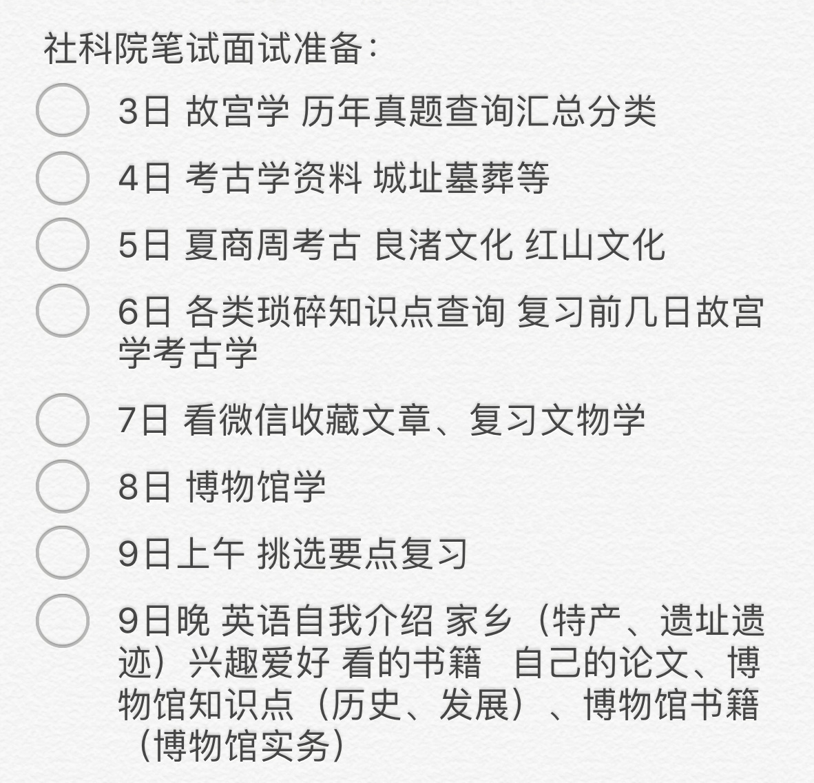
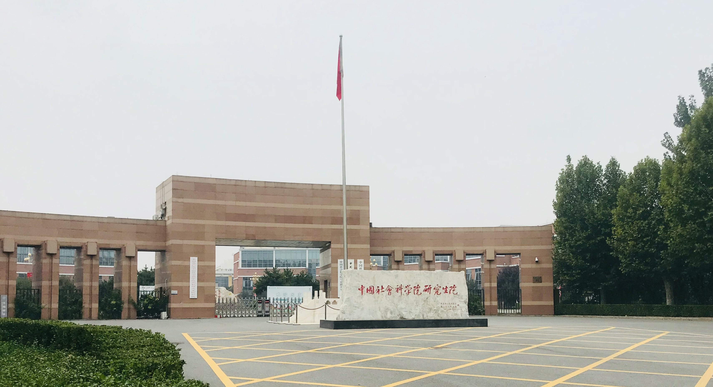

# 17-历史-王雨婷-中国社会科学院大学

## 基本背景

> 综合排名：保研名额的后半段
>
> 绩点：3.81/5
>
> 四级：558
>
> 六级：517
>
> 奖证：校奖学金；校系“优秀团员”；优秀学生干部；暑期社会实践先进个人；校舞蹈大赛二、三等奖；校征文优秀奖等（跟专业关系都不算大）
>
> 科研：省级大创《湖北谷城县出土宋墓壁画的制作工艺研究》；安徽省合肥市庐江县某考古工地实习；安徽省考古所室内整理、文物修复实习

## 保研结果

> 最终录取学校：中国社会科学院大学+文物与博物馆专业+博物馆策展与研究
>
> 其他录取结果：
>
> * **获得Offer:**
>   * 中山大学历史系文物与博物馆专业**（注意中山在社会学院也有文博专业 专业方向不一样）**
> * **被刷**:
>   * 南开大学+文物与博物馆+简历材料准备不足；复旦大学+文物与博物馆+简历被刷；南京大学+考古系+简历被刷；浙江大学+文物与博物馆+简历被刷

## 保研心得（长文预警）

> 没有人能替你放弃你。
>
> 这是我想写在最前面告诉所有保研路上迷茫慌乱又跌跌撞撞的孩子。大四是人生的一个重要的选择关卡，但它和高考一样的，同样不能决定你的一生。因而，满怀希望就能所向披靡。

### 1. 前期准备

我是对于高考有遗憾的，江苏高考下的魔鬼数学曾经令我感到灰暗，但是高考分数里最出乎意料的是我素来省心的语文，最后录取到八个平行志愿里的最后一个的第一志愿，虽然是自己满意的专业，但还是带着假装平静和内心不甘第一次踏上安徽，走进安大。所以，从一开始我对自己要好好学习的目标是很明确的，但是没想过保研，年少轻狂地觉得自己一定会选择考研。

在不大的历史系里，大一的时候靠上课的努力和期末的突击获得了很靠前的排名；但大二的时候很快就发现了这种“偷懒”模式的不可行，大二上学期的成绩差强人意，总结经验教训后本想下学期发奋努力，不过因为私人原因再次重大影响了成绩；到了大三的时候听了几次学长学姐做的保研考研找工作的经验分享会，忽然惊觉自己其实更倾向于保研的路。好在也不晚，大三的课业相比大二轻松不少，校和系里的团学工作轻松了很多，因而大三上结束的时候再次跨进了保研名额中游。大三下的时候，虽然基本完成了所有的学分要求，但是为了提高绩点选择了不少选修课，不过人算不如天算，本来想着在前两周教务系统可以选退课的时候先试课再保留几门刷分，结果疫情影响直接取消了退课的过程，硬着头皮上着其中几门不感兴趣的课的感觉真的有些疲惫，结果反而影响了自己的绩点。总结发现自己真的很不会选课，各种素质课经常拉我的后腿，鉴于我校绩点排名按照所有课程计算，各位学弟学妹一定要慎重选择和努力选课，千万被学我佛系地捡漏上课。另外，提高排名也有其他方式，竞赛拿奖、参与科研、发表论文……参照每年学校和院系的《推荐优秀应届本科毕业生面试攻读硕士学位办法及遴选条件》提前根据自己的能力和条件准备。最终，虽然获得了保研名额但是排名并不如人意。

### 2. 定好目标

开题我就说过，我是跨专业保研。历史学归于历史大学科，考古学也是，和历史学是同一级的学科，因而文博作为考古学下属学科，我的选择是跨专业保研。

**跨专业保研是有风险的**，自己是否了解跨专业的难度？是否具备跨专业条件？是否能接受保研失败结果？很多院校接受保研时会标明门槛，哪些专业可以投递简历。且大多数跨保是在一定学科区域内，如人文社科专业、理工科专业之间，当然也有少数例外。在了解跨专业的可能性和难度之后，如果仍然坚定自己的选择，就要搭建一定的学科背景。选课的时候无论选修课还是专业课尽量选择靠近自己感兴趣学科的课程；选择其作为自己的第二专业辅修研读等等。在此基础之上，需要利用假期等时间系统学习构建相关知识。从三月中旬到六月中旬，我用了三个月时间，如果学科的难度和专业性更高的话，建议至少半年以上。高效学习是其关键，无论是报班、咨询学长学姐还是网上找经验贴的方式都可行，沉浸式学习非常必要。

另外，因为文博专业的特殊性，目前国内多数硕士学位都是专硕，极少数设置文博的学硕。如果考虑跨考文博，要考虑自己是否有读博深造计划，因为国外部分高校不接受专硕的申请；国内读博则需要考博，比起学硕优势少很多。第二点是，专硕的学费较高，一般几万起步，社科院文博文物鉴定修复方向学费为一年7-10万；复旦大学文博硕士7.6万两年且不提供住宿；南京大学从今年开始不再提供专业硕士学生住宿，而研究生一般在位于市中心的老校区上课，这将是一笔不菲的开支……所以，这一方面如果还未能经济独立需要和家中进行商讨。

在了解了各个学校相关专业的导师和研究方向之后，可以对院校有几个清晰的目标，但也不必过于执着。至于提前联系导师的问题，为防止适得其反，我没有尝试过，没有太多经验。

### 3. 更新信息

保研是场信息战，了解的信息决定了你的机会。学会和保研的大家共享信息，是朋友也是竞争者；也可以在贴吧、公众号了解保研政策、过程、准备材料和相关学校的通知；最重要的是咨询学长学姐，没有必要不好意思，注意问一些有深度的网络查询不到的问题，当然要注意礼貌和学会感谢。整理清楚自己要做什么，如何做，才能不惧。

### 4. 保研经历

#### 夏令营

夏令营是保研儿的第一次机会，也是机会最多的。很多高校利用此时开展面试，取得优营者意味着手握了该高校的offer。

首先是准备夏令营材料，基本为成绩单证书英语证明等和各校的申请表，有的学校需要专家推荐信，这需要自己联系专业老师帮忙。疫情影响没能返校，所以我虽申请了南开大学，但当时证明材料不足，而时间已近截止，难免影响申请。建议大家及时保存自己的所有奖状等材料电子版。如果申请了较多学校，建议分类整理好文件，做好汇总，单独建成一个资料夹。同时，很多学校是在自己的网站上注册申请，每一个账号密码也要记录好，可以省去很多麻烦。申请院校的时候，大家可以多多尝试，虽然夏令营各个学校要求成绩一般为年级前10%或20%，对于排名较后的孩子并不太友好，但难免会有例外。由于本人当时意不在此，重点放在巩固知识阶段，所以只申请了三个学校，其中一个简历未过是因为本专业较多同学申请，显而易见没有优势，所以同专业的大家尽量分散申请，成功率更高。

今年疫情影响，夏令营比起去年有所推迟，而且原本线下举行的参观学校、学习讲座、举行面试的夏令营基本替代为线上的开营仪式、讲座和面试。6月30日的时候打开电脑做一些党支部工作忽然冒出了邮件，才发现自己入营了中山夏令营。大家申请之后，要注意时刻关注消息，不同学校的通知方式不同，有的通过短信，有的发邮件，有的公布在学校网站上，不要错过确认入营的截止时间。面试时间是7月10日，准备时间不算短，抓住重点做好中英文面试的自我介绍和一些简单的相关问题准备，以及巩固专业知识。自我介绍部分，可以从个人基本情况、学术背景、竞赛科研经历、未来规划等方面进行。学会在这其中突出重点，展现自己的创新或能力，牢牢把握住自己擅长的部分，做好细节和延展，不熟悉的部分一带而过，防止老师提问。 

准备面试中，不紧张是不可能的，尤其是中山还存在师生交流会这样的流程，对于一个轻微社恐的人来说，压力更甚。所以我想说，其实保研也是一场心态之战。自信首当其冲，适当的紧张能够更好地发挥，过度紧张会影响思考回答的逻辑性；其次是专注，重点放在面试上，不要思虑过多，只要诚心，不求结果，允许犯错，在失误中成长即可。

顺带提醒大家，**线上面试都是要求双机位**。准备好电脑、手机、三脚架；提前预约好空教室或是和邻居交涉保持安静；确保网络和手机电话通畅；准备好身份证、学生证以进行资格审核。

10日面试，老师首先询问了我参加的其他高校夏令营的情况，此类问题在面试中也很常见，**老师会在意你对于其所在高校的看法和重视度**，这就要大家谨慎回答。之后提出了六七个专业问题，我准备地不错，基本流畅回答。最后是一个英文专业问题，我询问能否思考三十秒后分点列出了答案。在面试中曾被老师打断几次回答且与老师没有交流问题，以为自己已经凉凉。结果意外地在三四天后在商场逛街时接到了面试通过电话。 

#### 九推/十推

疫情影响使得保研政策和文件推迟，在不确定和焦虑中迎来了新一轮面试，因为最心仪的学校只有夏令营而没有九推，所以这次我还是只随缘填了三个学校。接到社科院电话让我去北京线下笔试和面试的时候，已经将近国庆假期，赶紧定下了机票和酒店，而距离考试不到十天。参考了网上的经验，我抓住了社科院考试重点进行准备，由于社科院各个方向用一张卷子考试，所以故宫学的内容我是临时买书看完划重点背诵记忆，并且加深复习了一下文物鉴定修复内容。

10月7日早起从家里坐高铁顺利到了上海，转机飞北京，然后拖着大箱子里的沉重书籍坐了三个半小时地铁到了学校附近，此时已近傍晚。途中经房山区的荒凉真的有震惊到，一天的疲惫和北方的气候不适应使得自己的心理防线一下子坍塌，甚至想要放弃。休息一晚后，有始有终的精神又促使我坚持。第二天我提前去踩点，社科院没有安排在校内考试，以防考试当天迟到。果然由于大楼的名字重叠，我花了一上午才找到了地点。10月9日下午，我顺利完成笔试三小时的考试，内容囊括万象，考古学、文物学、博物馆学、故宫学皆在其中，同时涉及热点新闻，角度新奇但无所局限。10日上午面试，英文面试与专业面试分开，英文面试是与一位老师面对面交流，时间约为10分钟，内容涉及个人爱好、性格、家乡、对学校认识等。紧接着进入另一个教室进行专业面试，约7、8位老师分别轮流提问，从个人论文、博物馆新展、对社科院老师的研究的了解度、选修课程相关内容和思想政治等方面提问，时间大约25-30分钟。老师非常亲切，有个小插曲，当时前去面试的路上等待电梯时恰好遇上了两位面试官老师，当时不知老师身份，但老师非常绅士地“女士先请”让我先进，虽带着口罩且两位老师正在交流，但我对老师表示微笑以示感谢。礼貌真的很重要，至少没有给老师留下不好的印象。当天下午，结果出来，我通过了。

此时距离推免系统开放仅有两天，其实我在准备笔试和面试期间一直在纠结，因为中山从九月中下旬便打电话催促是否确认去中山，但我还没做好选择。我是江苏人，于我而言，广州和北京的生活习惯都需要适应，而两个学校的培养模式完全不同。最终在朋友学姐老师和家人的帮助和建议下，我选择了社科院。不是没有人跟我说，中山多好呀，为什么不选啊。想告诉大家的是，**选了什么都会可惜，选择了便不要后悔**。

### 5. 写在最后

保研的路真的漫长。尼采说过：一个人知道自己为什么而活，就可以忍受任何一种生活。2020年是我喜欢考古文博的第十年，这是特别的一年。上半年里我按照自己的计划每天看书背书听英语，下半年里我匆匆忙忙地面试笔试、独自旅行和实习。总结一下，其实我深知自己在专业上并没有多么突出，但我知晓深刻剖析自己。我爱玩，每个月学习之余会有几天出门约朋友小聚、面试完出去旅行，我知道适当的放松是为了更高效率地学习。不过，就算是在疫情影响的这一年里，我去了韩国首尔、上海、苏州、北京、婺源、景德镇……看了大大小小展览不下二三十个。这样的经历和体验让我在面试中用丰富的阅历和见识打动老师，这是我的优势所在。

凡心所向，素履所往，生如逆旅，一苇以航。相信你所热爱的东西，有一天会反过来拥抱你的！