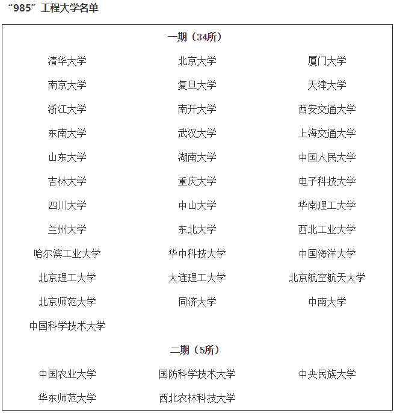

# 17-人力-“摸鱼罐头”-南京理工大学

## 基本背景

> 前五学期绩点排名：2/61
>
> 三年绩点排名：3/61
>
> 综合排名：3/61
>
> 绩点：4.01/5
>
> 六级：446
>
> 奖证：无
>
> 论文：中文非核一篇
>
> 实习：保研时无实习经历

## 保研结果

> 最终录取学校：南京理工大学+经济管理学院+人力资源管理+学硕
>
> 其他录取结果：
>
> * **未参加夏令营**
> * **预推免offer:**
>   * 南京师范大学；东北大学；北京科技大学；东华大学

## 保研心得(对整个保研流程进行整体性、综合性把握)

### 1. 前言

2020 是一个极度不平凡的年份，突如其来的新冠疫情打破了原有的社会运行规律，国际国内经济下行，交通贸易壁垒高高竖立。对于 2017 级的大学生来说，要出国的留学计划要搁置，要保研的白白丧失了一次刷六级的机会，要就业的突然被要求暂停外地实习计划。

2020 年是一个极度内卷化的年份，格尔茨的内卷化概念可以概括为“一个系统在外部扩张受到约束的条件下内部的精细化发展过程”。从格尔茨、黄宗智到杜赞奇，无论在哪一种意义上使用“内卷化”概念，其所描述的实际上都是一种不理想的变革形态，亦即没有实际发展(或效益提高)的变革和增长。想要获得更优质教育资源的竞争越来越激烈。由此纵览保研形势，各顶级高校如清华北大纷纷出台了很多国际合作项目，满足一部分出国者需求。与往年相比，本专业的保研生想要获得 985 复试机会的难度加大，例如，以往保研生排名靠后均能进入中国海洋大学经管专业复试，而今年好几位同学却惨遭被拒。一方面，985 高校内部为本校保研生预留名额，另一方面，由于线上夏令营、预推免面试的开展导致保研生纷纷海投院校，造成了优质生源“充足”的现象，985 高校之间接收 211、双非院校的保研生的几率大大降低。

虽然，这仅仅是 2020 年度因为新冠疫情各高校基本均采取线上复试的情形，但并不排除一些高校在今年的线上复试中尝到甜头，在今后采取此种招生方案。

按照以往的经验，教务处只给每个保研生盖五份成绩单证明，且受到经济、时间、交通成本限制，各保研生参与面试的机会有限，学校和学生之间选择成本增加，offer可信率提升。

对比两种情形，常规的线下面试鸽王更少，需要保研生自己抉择；线上面试院校和学生互相海王，无论学生和院校都有可能被鸽的很惨。往后的保研生需要做好线下和线下两种准备！

### 2. 自我定位

从专业排名、英语成绩、科研经历、竞赛经历四个方面来做自我定位。

首先给大家参考一下往年本专业保研去向。

这是前三届学长学姐们保研院校，南京上海院校居多，这些学校本专业的保研儿们都可以在后期夏令营或预推免当中尝试，因为在本校有稳定生源，学校也会更多考虑我们的保研儿。

不过保研儿仍然要从以上四个方面给自己做个定位。

若自评为一级，一定要抓住机会参加夏令营报名 985 高校，在预推免中也可以继续投递。比如中南大学预推免今年要求专业排名 5%的人报名，但实际上他们在夏令营的要求并没有那么严格的排名要求，但是可能要有论文一作才能参营。

若自评为二级，可以尝试投递还不错的省级 985，中科大，以及北京、南京、上海等地不错的 211，若想求稳同样可以尝试以下 211。

若自评为三级，在夏令营期间可以尝试河海大学、东华大学等 211，密切关注中科大夏令营和预推免情况，也许你会发现中科大是你最好的选择。先拿个保底的 211 offer在继续冲刺梦校。

​      专业排名    英语成绩    科研经历     竞赛经历

一     1-3 名      600 以上          有                有 

二      靠前        500 以上          有                无 

三      靠后        500 以下          有                无

### 3. 选择院校（地域、985、211、专业排名）

每年都会有保研儿不清楚所谓的 39 所 985 院校有哪些，甚至将其误认为 211 或者双非院校，对想要冲刺 985 的保研儿来说，以上名单也许会给你提供帮助。不过保研儿也不要盲目去冲刺 985，还是要根据自己的未来职业规划去斟酌。

一方面我们要在夏令营和预推免中海投院校，另一方面对学校要从地域、综合实力、学科排名等方面进行剖析和抉择。如果你未来目标是研究生毕业以后进入职场，那么就多考虑学校地域和综合实力。如果你的未来目标是学术科研、做大学教授，那么就要看看学校的学科评估（研究生招生网）。

如果你真的很想去到 985，可能需要跨专业到非法学法硕、教育学、社会学、心理学等等，像一般比如华东师范大学、北京师范大学、华中科技大学、浙江大学、厦门大学、山东大学等，如果你不是本专业第一名而且六级分数很低，基本上报了就是精卫填海，但是有很多保研儿投递了社会学以及教育学方面可以进复试。

> 备注：教育学院和非法学法硕是没有本科专业，所以研究生招生名额会更多哦，不过如果对经管专业更执着的话，选择本专业一直走下去也一定会有收获的。

### 4. 准备材料（基本材料）

材料包括以下几大类：一类（身份证、学生证、学信网证明）；二类（成绩单、成绩证明、英语四六级及其他外语考试）；三类（各类荣誉证书）；四类（学术科研活动证明及论文）。

大家用“扫描全能王”扫描以后保存至手机和电脑存在两个文件夹中即可，因为有的学校的网申需要用手机公众号填写（北京科技大学），但大部分还是网申哦。

网申各校填写系统的格式是不一样，但是也会有一定共通性。比如我就发现很多985 用的一种网申系统，一些 211 用的又是同一种网申系统，因此所需信息是一致的。如果你们需要海投的话，建议用一个 wod 文档把一些网申所需要的信息记录下来，每次复制粘贴。所需要的基本信息一般包括，家庭住址和邮编、学校地址和邮编、家庭联系人姓名及电话；你的身份证号、电话号码、邮箱；你的个人陈述、科研经历概述、获奖经历（获奖名称、获奖时间和颁奖单位）。

在夏令营期间会需要前五个学期的成绩单和成绩证明，以及 1-2 位导师推荐信。

### 5. 参加面试

参加面试也是非常关键性的一个环节，有些人面试可以加分、弯道超车，有些人因为面试拉跨导致顺位降低。一般来说面试主要分为四大部分：自我介绍、英文面、素质面、专业面。甚至一些 985 高校会考你对时事政治的认识。

#### 自我介绍

1 分钟英文、2-3 分钟英文、PPT 汇报。因此建议提前准备好这三种材料。自我介绍主要包括以下情况，个人综合排名成绩等、个人性格兴趣、科研项目经历、竞赛经历、研究生规划等等。

#### 英文面

英文问题基本上都是很常规的，但是比较具有竞争力的 985 高校可能对英文口语要求更高，因此一定要做好准备。

**专业问题**

1.Please Introduce your paper in English.

2.What is the most difficult part of doing projects?

3.What's your acquaintance of doing projects?

4.How to be a good researcher.

5.Say a little about management.

6.Say a little about human resource management.

7.Can you describe one of your course?

**生活问题**

1.Which city do you want to travel most.2.Why do you choose our university?

3.Tell me something about your university?

4.Tell me something about your home town.

5.What kind of landscape surrounds your hometown.

6.Please tell me something about customs of your hometown.

7.Please tell me something about your family.

8.Can you describe your favourite idol or celebrity,why?

9.Introduce your favourite food and explain the reasons.

10.Describe a book you have read recently.

11.Please tell me a movie that impressed you most.

**个人篇**

1.What's your greatest advantage or weakness?

2.Tell me three advantages of you.

3.what does the friends mean to you and what kind of people do you want to 

make friends with?

4.How do you learn English in your daily life?

学校最常考的问题包括你的优点、你如何理解管理、为什么选择我们学校等等。

#### 素质面

包括个人性格、挖掘你的科研项目经历、竞赛经历等等。

#### 专业面

微观宏观经济学、人力资源管理、管理学基本原理等等，从整体上去把握每门学科，挑出重点知识，熟悉管理学基本理论等等。

#### 时政面

我并没有被问到时政问题，基本上可以关注下贸易战、小康社会、五位一体、四个自信什么的，不用太过于关注此方面积累吧。

### 6. 联系导师（选修）

比如上海大学以及一些 985 高校需要提前与导师沟通好再安排面试，因此需要给老师发邮件询问名额以及接收意向等等。

我在联系上海大学的导师时候经历了著名的“社会性死亡”事件，同时联系了上海大学的李燚和马君导师（大家如果再联系马君老师就不要再鸽他了呀，其实他人很好哒）。结果第二天同时收到了老师的回复，并且被老师们发现。因此告诫学弟学妹们，联系导师虽然有可能石沉大海，但最好不要一天内联系两个。如果老师第二天没回你，那就再发一个追问的邮件，此时老师基本上就会回复你了哦。

联系导师的邮箱可以在院系内部名师一栏查找资料，了解导师的研究方向以及联系方式，在发邮件时尽量做到体现真诚和积极性。如果想去的学校有学长学姐在读，也可以积极询问相关情况。

### 7. 结语

保研的过程比较漫长，很多人前期在学习期间付出了努力，最后却产生懈怠情绪（比如学姐我），因此一定要与其他保研的同学积极合作分享与交流，在最后的夏令营和预推免阶段占据主动，争取夏令营拿到保底的 offer，然后才能在预推免时不会自乱阵脚。学弟学妹们千万不要因为觉得自己太菜而放弃某些机会，在学校没有明确的拒绝参加复试的那天，一切皆有可能。

我以前一直以为夏令营很难，就想好了走预推免这条路。结果错失良机。但有很多学校到了预推免阶段也只接收参加过夏令营的同学参与预推免面试的哦。多面试积累经验总不会错的。

最后，科研和竞赛经历也许并不需要你达到什么高度，一篇比较普通的论文一作也许就足够支撑你面试了，如果能做实证分析还是要做的，能够发 SCI的话当然会被载历史了啊。但是，英语六级成绩绝对是你 to be or not to be 的关键问题。在校期间任何一次刷分六级的机会都不要放过。也许你很忙，但如果你要保研，就一定要把六级刷到500+或者 600+以上，这是你进入高校的必备门槛。

说一句题外话，希望学弟学妹们把本专业保研经验分享传承下去，踩好的雷就不要再踩一遍了啦。

>此次经验分享比较仓促，有个别错误不要太在意哈。我还有些总结的材料以及必修课专业书籍，如果有需要的学弟学妹可以私戳我，QQ:1772138416
>