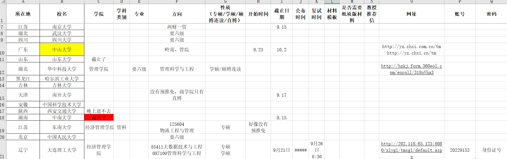

# 18-物流管理-龙婧-华中科技大学

## 基本背景

> 绩点：3.7/5.0
>
> 三年绩点排名：11/64
>
> 综合绩点：3.95/5.00
>
> 综合排名：8/64
>
> 四级：刚过
>
> 六级：未过
>
> 奖证：第五届“日日顺物流创客训练营”全国金奖；全国商业精英挑战赛经贸物流实践竞赛全国季军（队长）；安徽省大学生创新创业ERP管理大赛三等奖；学习优秀奖学金二等+三等、社会实践奖学金、团学工作奖学金；优秀学生干部、优秀团员、军事训练先进个人。
>
> 科研：国家级大学生创新创业训练项目优秀结项（组长），两篇普刊论文二作；安徽省社科规划一般项目（课题组成员）。
>
> 学生工作与实习：安徽大学商学院2018工商管理类五班班长；安徽大学物流管理系2018级物流管理班生活委员；出版社的编辑助理；公众号编辑组和美图组成员；学校老师省级社科项目的课题助理；安徽省合肥市中外运物流合肥有限责任公司实习。

## 保研结果

> **最终录取学校：**
>
> 华中科技大学+图书情报（医药方向）
>
> **其他录取结果：**
>
> * **获得offer**：
>
>   预推免阶段：深圳大学管理科学与工程；
>
>   九推阶段：兰州大学管理科学与工程、山东大学企业管理、重庆大学工业工程与管理、华中科技大学图书情报。
>
> * **获得面试机会后放弃**：
>
>   预推免阶段：东华大学物流管理（学费过高）、北京交通大学交通与运输（海王直接放弃）；
>
>   九推阶段：哈尔滨工程大学管理科学与工程（嫌太远了）、中山大学MPH（面试冲突放弃）。
>
> * **被刷**：
>
>   预推免阶段：华中科技大学社会医学与卫生事业管理（替补）、华东理工大学管理科学与工
>
>   程（简历被刷）、华南理工大学管理科学与工程（简历被刷）、重庆大学管理科学与工程（简历被刷）；
>
>   九推阶段：中国科技大学非法学法硕（简历被刷），合肥工业大学管理科学与工程（因为预推免没投，不让进）。
>

## 前言

**因为留给我准备保研的时间只有两周，所以我只参加了预推免和九推。因为时间较短，系里老师说如果我拿不到推外接收函，系里最后会接受我，给了我极大地动力去认真准备推免。在此感谢老师和院系！**

* **个人情况**

  从奖优获得情况可知，我的在校三年的绩点排名并不靠前，甚至有一年连奖学金都没有拿到（前35%），英语水平也一直是拉后腿的部分，只有课堂外的比赛和科研项目勉强看得过去，最终获得保研资格是有极大幸运成分加成的。9月14号晚上得到通知保研政策更改，我的综排从11名升到8名，拿到了班级的最后一个保研名额。保研边缘人充分利用最后两个礼拜的黄金时间，成功推免外校。

* **参考人群**

  临时获得保研资格人群、保研边缘人群、跨保人群、管理科学与工程、物流管理、公共管理等专业同学。

* **声明**

  全文均为个人针对自身情况的表述，存在个人偏好和差异性，仅供参考，希望读者可以求同存异，兼容并包。

## 保研前你必须要知道的事情

作为一个反面教材，我最深有体会的事情是在保研过程中的重要性排序是，绩点>六级>科研>比赛，当然这也不是完全绝对的事情。如果发表了核刊或者是建模比赛国奖，这必然会是一个极大地闪光点，可能会比绩点和六级更有影响力。

就我个人而言，学校在保研过程中不占优势，绩点和六级拉后腿，科研和比赛经历较为丰富但含金量不高，就很难在内卷的保研过程中拿到好的offer。我的财务管理专业的室友，个人情况和我差不多。她的排名属于中游，但是六级擦边，科研和比赛不突出。她早在夏令营之前就开始准备，投入大量时间和精力，却由于个人短板，在重视专业能力和英语水平的“内卷之王”会计类保研中，收获寥寥无几。她的夏令营拿到了两个学校的替补，预推免一无所获，长时间沉浸于保研，心态已经崩了，不敢尝试九推，等到了补录就只能带着不甘心上岸。

如果你选择了保研，你就需要知道你其实不是为了学而学，说句功利性的话，是为了保研而学。内卷的时代，如果想要得到预期的收获，就不得不牺牲掉纯粹学习的快乐。由于保研政策每年都会更改，所以需要时刻关注具体细则，针对学习或参与活动，毕竟可能微小的加分都会影响到最终排名，从而影响保研资格。无论政策怎么改变，总体来说还是绩点、六级、科研、比赛等四方面的综合能力。

## 保研中你必须要知道的事情

* 首先，你需要准备一份保研定位池，罗列保研择校的因素及账号。可以根据双一流高校排名和第四轮学科评估，筛选自己想去的城市、学校、专业，再去详细了解需要提交的材料。以我个人为例，我想要去离家较近的发达城市，985高校或者较好地211学校（方便就业或者考选调），专业非理工课都可以（跨保的时候，理工科跨人文社科容易，反过来难度极大）。

  

  有以下信息源可供参考：

  ①网站（保研论坛、各高校研究生院官网、学院官网等）【主要途径，信息不会有延迟】；

  ②公众号：直接微信搜保研，就会有很多公众号，推荐：保研、保研党、保研岛、保研圈、保研论坛、保研轻询、保研人、保研声、保研网、保研夏令营等，以及特别想去学校学院公众号【信息有延迟，但是统计多所高校，全面高效】；

  ③学长学姐及其他同学的信息共享，如QQ群、微信群、微博超话、知乎帖【同学的体会和感受，更加真实，方便沟通】。

  我本来在死磕管科，后来发现本专业的同学大多都投了其他专业，例如会计、交通运输、情报学等，我才从本专业的死局中跳出来（经管类内卷严重），所以我也投了华科的公共管理下的社会医学与卫生事业管理（该专业属于华科王牌专业，了解研究方向后很喜欢），由于英语表现较差，只拿到了替补名额。等我跨保的时候比较晚了（当时没有想跨保，反应过来已经很晚了），其他高校的社医专业并没有来得及投递，只打电话问了，说等九推有名额再联系我，结果一个也没有回音。

* 然后，了解高校推免接收政策，可以从保研QQ交流群中得知学校“红黑榜”。在预推免的时期，保研顶流的同学大多已经拿到了满意的offer，所以预推免的要求会比夏令营放松，便于那些保研中低流的同学能够推免。但是今年是学校线上保研第二年，由于线上保研成本低，第一年的学生鸽了很多学校，导致学校今年为了保护自己的权益，想出了很多稀奇古怪的应对办法，要仔细研究，避免踩雷，最后竹篮打水一场空。

  例如，高校只给出了校内、校外的分别排名，最终按照总排名或者校内优先录取，等于拿到了校外优营也不等于录取。要自己根据人数和前面的同学的本科学校，估摸着能不能拿到录取。我有一个同学在保研最后一个礼拜才发现她最想去的学校是这样的政策，之前以为稳定了，并没有参加预推免，发现危险后只得匆匆忙忙参加其他学校的预推免，结果最后这个学校真的没有录到她，预推免由于准备不足也没有拿到任何offer，只能去了夏令营拿到的另一个不算很满意的学校。

  还有就是，录取顺序是优营>预推免>九推，拿到了预推免的第一录取，结果优营超发，根本录不到预推免这一批次。或者预推免群里通过名单多达上千人，一起去争取几十个录取名额。或者学校只是给出了通过名单，并不是按照分数排序，只是说某些人通过了，但并不能准确判断自己是否是前十名即稳定录取名额，被学校养鱼。https://mp.weixin.qq.com/s/wfaWC15-clIV4Rw47JOECw 时刻关注学校政策，不到确认录取都不要掉以轻心。

  当然，也有学校公开透明，流程清晰，如果被学生鸽了也不会选择继续补招，而是选择把更多的名额留给统招生。

* 最后，就是准备海投和认真面试。因为已经是保研边缘人了，名次靠前的同学往后卷，边缘人就为了能够推免，就不得不海投了。注意截止时间和需要提交的材料，例如华科需要二甲及以上医院的体检报告，体检报告需要空腹去检测，最快需要1天拿到。用网页版改图宝，随时更改符合要求的照片。电脑中安装一个PDF转换器，随时准备将各种文件压缩成一个PDF。

  如果夏令营和预推免没有拿到满意的offer，保研边缘人不如尝试**九推**。因为我前期了解到了今年“海王”学校比比皆是，所以肯定九推必然可以上岸。心态要好，不要过于慌张，从28号中午开始给学校打电话，你认识的保研的同学也是信息源之一。非常感谢我的同学，在他们保研之后，还花心思帮我收集信息，为我的九推提供了极大的动力和鼓舞。

  推免时间是9月28号~10月25号，但绝大多数都已经在9月28号完成了拟录取。学校招生办发现“鸽王”人数众多，立马就会沿着补录名单打电话通知，时刻保持手机畅通！如果幸运的话，无论在补录名单里，还是在淘汰名单里，都可能接到补录通知。

  如果你不是极为优秀或者很差劲，请不要挑战十推。较好地学校结束得越早，在国庆七天假来临之前成功上岸的希望是最大的。所以这几天，等着学校给你打电话是一件没准的事情，应该自己主动搜集信息，厚着脸皮去打各个招生办的电话，询问能不能参加补录复试。今年的九推学校还是挺多的，例如中山PHA，浙大非法学，科大非法学等等。如果你的个人简历中，英语水平较高，可以尝试。

  这里需要注意的几个点：

  ①夏令营、预推免要多投一点学校，因为好的高校优先从夏令营、预推免报名中筛选，哪怕你夏令营、预推免没通过，但是你的简历进入了高校数据库，他都会优先九推复试你，否则可能连机会都不会给你;

  ②正式推免的时候只能填三个高校及专业，一旦提交，除非高校招生办给解锁，否则要锁定48小时。可能有时候就是因为几小时的锁定，错失了上岸的机会。综合上岸概率和想要去的欲望等因素，慎重填报。如果后悔了，给高校招生办打电话解锁态度一定要非常真诚，可以带着一些哭腔【亲测有效哈哈】;

  ③不要给自己留很多备选，及时拒绝不想去的学校，一方面是给其他人留机会，一方面是让自己坚定下来。9月28号那天，宿舍楼有个不认识的同学，想去南大点成了南师大，最终无法更改，这必然成为她一生的憾事。④九推的时候，如果收到了心动程度一般的学校offer，不要答应，可以和保研圈的朋友或者家人商量一会儿。一时冲动确认录取之后，你还有可以去尝试其他学校的机会被浪费了，之后可能会更加后悔。

## 保研后你必须要知道的事情

最正常的一件事就是你确认了拟录取之后，收到了梦校的补录通知。这是可以和拟录取学校沟通商量退出的，前提是这个学校大方和友善（因为学生毁约，学校需要承担后续重新补录花费的时间和精力，还有补录不到人的风险），所以真诚表达自己的想法和歉意（知乎学话术），尽力就好。如果学校不放人，也是理所当然，不必过于执念。

如果已经完成录取，将保研期间的材料整理，需要补交的材料准备好，及时寄出。再然后，和研究生导师及时联系，询问提前需要学习的材料，或者商定进组时间，确定毕业论文主题等。接下来的时间，无论是外出实习，或者是放松休闲，都不要忘记了适当保持学习的状态，为未来的研究生生涯做好打算。

## 结语

> **保研过程中，心态是非常重要的事情，当身边的朋友都拿到了offer或者晒出了录取朋友圈，心态很容易崩溃。在保研的最后一个礼拜，多的是人彻夜无眠或者几天几夜吃不下饭。这是一条是努力伴随着幸运的路，越努力越幸运。祝正在努力的你，所向往的都在前方，所坚信的都有会收获。**
