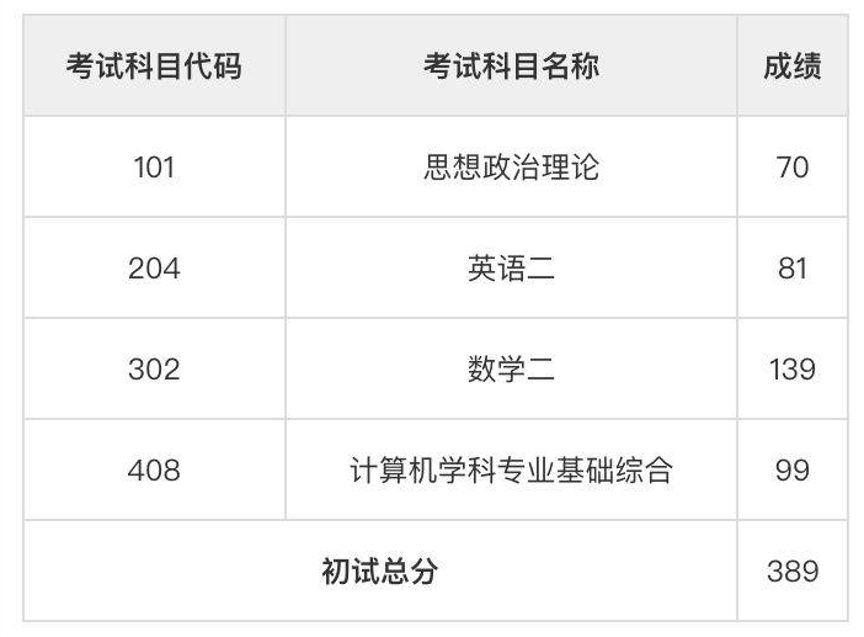
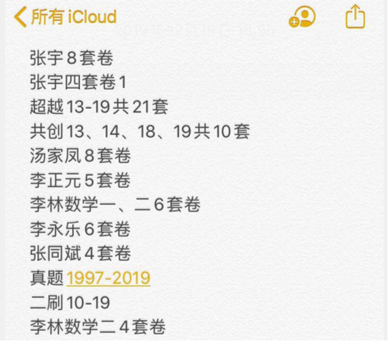
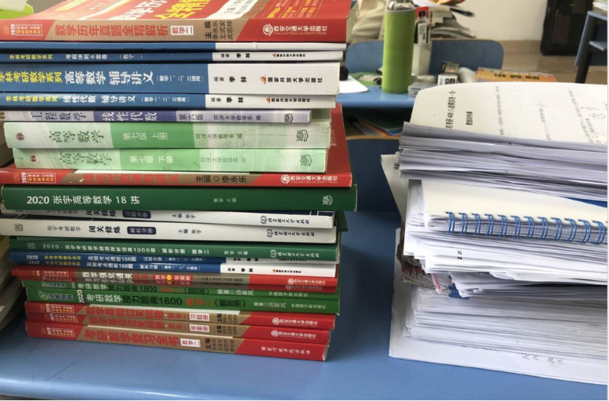

# 16-合工大数院-苏生-中国科学技术大学

## 基本背景

> 绩点排名：27/89
>
> 四级：521
>
> 六级：460
>
> 奖证：无
>
> 科研：无

## 考研结果

> 中科大软件学院大数据方向 

## 考研数学复习心得小谈

> 本人今年一战中科大软件工程，数学二考了139分，总分389，目前在准备复试中。别的科目考的一般，408尤其惨烈，数学算是我的优势科目，所以有些小的心得体会分享给大家做个参考。**切记，只是参考，有用的地方作个参考，觉得无用的地方跳过就好，适合自己的方法才是最好的。**

### 1、老师的选择（讲几个我看过的老师）

**先说高数部分：**

我复习数学是从高数课本开始的看的高昆仑老师，讲的面面俱到非常清楚，不过他讲的是高数课本部分，我估计大部分人基础比我好，这个老师的课可以跳过。

然后接下来的基础班和强化班都跟的张宇老师，张宇老师讲课蛮有趣而且今年张宇老师自己在课上也提到说：往年有很多学生说听完他的课不会做题。所以他今年在自己的课上也讲了不少例题（不知道是不是跟往年比起来算不算多），我感觉听完课刷题也挺好的。而且他今年强化班用的书《闭关修炼》，他全程在讲题，那本书上面难题非常多，而且类似题目总结到一起，我觉得作为强化班的用书挺不错的。

然后还有个老师叫方浩，那时候考研群里鼓推荐他的微分算子法我也去听了两节课，感觉要记的东西太多了... 就放弃了... 这个老师不做评价。

最后一个要讲的老师是汤加凤老师，我那时候做中值定理的题目太痛苦，又听人说汤老师中值定理讲得不错，就去听了。确实讲的不错，面面俱到，一个题型一个题型的给你讲。以此我推测汤老师别的部分的内容讲课大概也是这么讲的，一个题型一个题型的给你讲，个人不太喜欢...

**然后线代部分：**

无脑李永乐老师！听课建议开二倍数，他那本线性代数讲义必买！刷个几遍能做出考研中90%以上的题！（本人刷了三遍这个书，今年数二线代号称历史最难..侥幸我都答出来了）

### 2、习题册的选择

我刷了1800、1000、660、330、108、闭关修炼和复习全书…

汤加凤老师1800我个人感觉提高计算量还是不错的，题目偏简单适合打基础，最好在这时候能注意一下运算速度和运算正确率，做那种小题大概一个小时15-25道。

李永乐老师660必刷，高数部分的选择题对于抠概念的作用非常大... 我经常纠结半天... 线代部分不知道是我线性代数讲义刷多了还是怎么回事...感觉太简单了...那时候一个下午就把线代部分的题给做完了...

李永乐老师的330一般，看情况做吧，号称是强化篇，但是有点太简单了…也差不多一小时20道题目左右...

108后期归纳题型真的不错…题目挺少的三四天就能做完。

1000题我没怎么做，只做了张宇圈起来的重点题...（主要原因是我太菜了..做的太慢了就不做了，这条手动删掉你们假装没看见hhhh）但是考虑到今年题目这么难，加上张宇劝退八套卷那个卷子压中了好几个题，保不准接下来的出题方向会往张宇那个难度靠...可以做做，如果感觉难度太大可以适当放弃一些题目…题目总体是挺偏的

闭关修炼的话我暑假做强化用的，他这个书出的目的是和108差不多，归纳所有的题型，这点在上文提过，我觉得这本书不错。如果跟张宇老师的强化班的话，可以买一本。

然后复习全书（指李永乐那本），我是拿来查漏补缺用的…没有全刷，这书的用途是在做完真题以后，你就会知道自己哪里比较弱，就可以找一下相应的地方刷一下对应的题目。（比如数二就是物理应用、中值定理和数列极限会稍微难点）

**综上：基础阶段刷1800基础篇，强化阶段刷1800强化冲刺篇、660、330，闭关修炼的书，冲刺阶段可以做108这种归纳型的习题集和模拟卷。**

### 3、关于模拟卷方面（难度仅为本人直观感受，只作参考）

先说李林的四套卷和六套卷，出题方式和真题接近，不过李林老师预测20年考研数学不会难，所以他的试卷题目难度都偏低… 不过李林老师今年压中了一个题，当押题卷来看是成功的。我做下来的结果李六均分在140左右，李四的话接近满分... 四套卷就错了一个大题第二问。难度三星。

然后是张宇的劝退八套卷和四套卷，难度很高，计算量要求很大，有的题纯粹为了难而难...做完我骂骂咧咧的，不过最后考场线代押中了两个类似的题，真香，均分大概在130+左右。难度四星半。

汤加凤的八套卷，很简单不说了，号称计算量很大跟超越共创比起来就是个弟弟...而且每一年，题目都没有变化。难度一星。

李正元老师的400题（其实是五套模拟卷），证明题出的非常好，题目难度也非常高，跟张宇的难是不同层面的难，是思维上的难... 如果你们做模拟卷的时候，21年的还没出可以做20年的，因为我之前卷子买错了买了19的，后来比对了同学的20版，发现只是题目换了位置而已，内容没有变化。均分大概也在130+左右。难度四星半。

合工大超越卷！力推！九月份的时候我做了一个月的模拟卷，做了13-19的所有卷子...这卷子无论是思维角度还是计算量都特别难，对于提高效果很大，有时间可以多做几年的。均分大概130，也可能没到，太久了记不清了。难度四星半。

合工大共创卷，隶属于合工大名头下的另一个机构的卷子...我做了两三年，但是答案错误太多了...我对它没太大的好感。难度三星半。

张同斌老师押题卷，文都考研下的另一个老师...没什么好感，因为群里有人安利压中题了就去做了做..他还整了个就保存仨小时过后就删...结果给的答案有问题，我跟他反馈了，他还回我看他的答案就行了...无力吐槽...就不说了。难度两星。

李永乐老师的六套卷。今年数学二非常难，数学一和数学三好像还好。第一套是我做的所有模拟卷里的最低分，好像就100出头...前三套难度五星，后三套难度三星。

**推荐指数：合工大超越（强化）=李正元套卷（强化）=李林套卷（押题）>李永乐六套卷=合工大共创=张宇套卷>汤加凤套卷>张同斌套卷**

附上自己统计的情况，应该没讲漏：

### 4、考研时间安排

本人数学复习时间固定，下午2点-5点半...（建议安排三个小时以上时间学数学）。总结大概流程就是：3-5月打基础，6-7月强化，8月刷真题，9-12月刷模拟卷。以下都是大概时间：

2.25-3.15高昆仑高数课本班，做《张宇带你学》划的课后题

3.15-4.15 张宇基础班+1800高数基础篇，看一个章节的视频做一个章节

4.15-5.1 李永乐线性代数基础篇+1800高数基础篇

5.1-6.15 期中考试+实习+端午回家，没怎么复习

6.15-7.1 张宇19强化班+1800高数强化篇

7.1-8.1  张宇20强化视频（即闭关修炼）+李永乐线代强化+1800线代强化篇+1800高数线代冲刺篇+660

8.1-8.15 张宇1000题重点题+李永乐330

8.15-8.31 1997-2019数学真题+复习全书薄弱部分知识点的题，真题比较简单，1.5-2h可以做一套，一天可以做两套

9.1-9.30 2013-2019合工大超越卷，超越卷较难一天一套

10.1-11.31 各种老师模拟卷，如果10月份模拟卷还没出，可以买之前年份的，差距不大。

12.1-12.20 二刷10-19真题+李4+张4押题卷，有很多同学这个时候都不做题了。我建议最后几天可以做真题，保持做题手感。

上一个所有用到的数学书。李琳老师的讲义贪便宜买了结果没用上。

**最后讲一下考场上的心态变化**：试卷会提前发，可以看不能做，那个时候大概浏览了一下卷子，发现都有印象，顺便把线代两个选择题答案看出来了。然后前面都做得很顺，填空题有一个公式忘记了有一点紧张，随便编了个公式套。做完选填大概20分钟。今年大题第一题求极限，算了五分钟没算出来，心态有点崩溃，先做了第二题，然后把后面的题都给做完了，挺顺的，基本各种模拟卷里都有类似的题目。做太快了有个题目条件看错了...然后最后求得东西错了...然后再跳回来做第一题，换了个思路做出来了... 可惜第二个极限还是算错了... 这个时候看了一眼钟，发现才过去了两个小时... 然后就开始检查，还真发现了填空有个题负号忘记加了，挽回四分... 可惜那个条件看错的和极限算错的题目没检查出来就交卷了... 还有那个物理应用的填空题最后也没想起来公式... 还是挺可惜的，主要是自己计算能力不够了... 同学们引以为戒。

### 5、最后的最后一些小TIPS

* 常用公式还有一些小结论自己找个地方积累起来，别用别人发的那种，自己总结印象深刻，推荐电子版，方便增删修改，我是记在我的ipad上。那个时候积分公式记不住，我就每天来教室自己默写一遍，一个礼拜下来就记住了。

* 做完一个阶段的题一定要总结，不要盲目的刷题。刷题刷的多不总结也没用，比如最后的模拟卷，可以做一系列的就总结一次。

* 关于错题集，前期不用记，题目太多了，你记了也不看。推荐在做真题的时候开始记，用A4记，方便增加。一个模块一个模块的记，比如极限记一块，积分记一块。也不用所有的错题都记，有些题目出题角度比较好，自己凑巧做出来的也可以记，有些题目只是计算错了，可以不用管他。