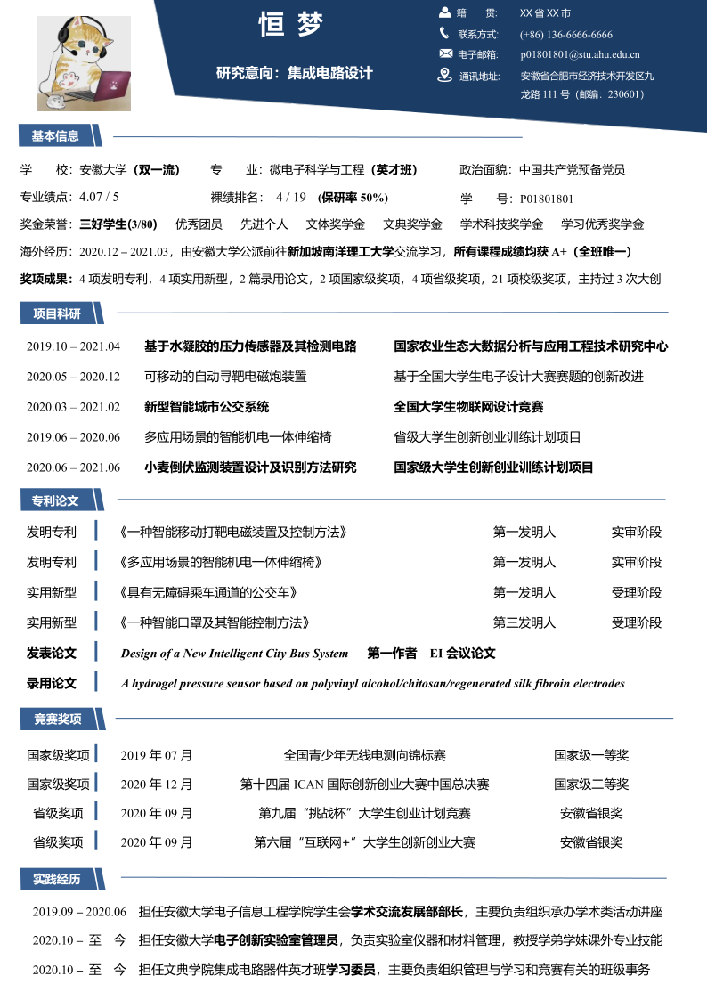
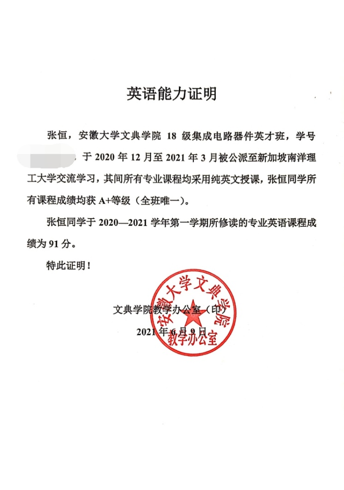

# 18-文典微电子-张恒-南京大学

## 基本背景

> 裸绩排名：4/19
>
> 绩点：4.06/5
>
> 四级：516
>
> 六级：8月28日才过，保研没有用上。。。。
>
> 奖证：见下文简历
>
> 科研：见下文简历
>

## 保研结果

> **最终录取学校：**
>
> 南京大学+电子科学与技术学院+直博
>
> **其他录取结果：**
>
> **夏令营入营高校：**
>
> 南京大学、中国科学院大学杭高院智能科学与技术学院（与南大夏令营时间冲突，最终放弃）；
>
> **预推免入营高校：**
>
> 东南大学、电子科技大学、浙江大学、中国科学与技术大学

保研是一场长跑，想要取得好的结果，需要从大一就开始布局规划。但是碍于篇幅限制，本篇经验帖就从夏令营前的时间点开始写起，如果大家有需要，我以后可以再专门写一篇关于大学规划的帖子。我也看了些其他同学在飞跃手册上发表的帖子，前人写过的内容我就不再赘述，此帖就仅从学校的选择、简历的制作方法及如何联系导师三个方面稍作补充。

## **一、学校的选择**

我最初拿到的是南京大学学硕的offer，但是我有读博的打算，在了解了组内的情况后我联系导师改成了直博（**Tip：**直博需谨慎，读博真的是一件很煎熬的事，如果对科研不是有十足的兴趣并且具备一定的创新思维，建议不要报直博。虽然我当时认真考虑了两个月，但是现在看来，我还是觉得当时做出直博的决定还是有些草率）。尽管当时听了很多学长学姐对保研的不同的建议，但是现在再回过头看看自己的保研历程，在这个过程中还是踩了很多的坑，其中主要的两点战略性错误如下：

* **对夏令营高校不够了解，前期做了很多无用功。**同时，在保研中一直纠结于自己的绩点排名处于劣势，忽略了自身的优势，导致很多学校不敢报名尝试，所以在夏令营中错过了很多机会。
* **没有尽早考虑清楚自己到底想要什么，在自己拿到非常不错的offer后却只能选择放弃。**所以大家要提前对保研做些了解，想清楚自己想要什么，结合自身情况做好规划，发挥自己的特长，并且勇于尝试，不打无准备的仗。

在保研面试过程中，老师对各种成果的认可度排名顺序是这样的：**论文（高水平）>成绩排名>海外经历>英语能力>专利>项目和科研经历>论文（低水平）>竞赛>学生工作及社会实践。**（以上仅为我的主观感受，**仅供参考**）

在保研之前大家可以在心里给导师学校等因素排个优先级顺序，我的排序是：导师人品>研究方向>学校整体实力>导师能力>学校专业能力>地域（**Tip：**这并不是标准答案，仅针对我个人的情况）。但这一点其实是在我填系统前才真正想清楚的，在此之前我根本没有考虑清楚自己想要什么，所以会在几所高校里反复纠结。其实在保研中对于学校和导师没有十全十美的选择，从中找到适合自己并且真正喜欢的才是最重要的。有位学长曾说了一句让我印象很深的话，在这里送给大家：

> “当你纠结的时候说明你面临的选择都有利弊，那么，不管你做出什么选择你都会后悔，既然后悔无可避免，那不如去做自己喜欢的事情。”

### 二、充分的材料

之前听到很多人问保研需要提前准备哪些材料，下面是我整理的材料清单：

* 简历（一页纸，中英文各一版）;
* 中英文自我介绍（2分钟和3分钟时常的各准备一版）、自我介绍PPT（3分钟和5分钟时长的各做一版，一般用中文就行）；
* 前5或前6学期的成绩单、排名证明；
* 获奖及科研成果证明材料、四六级证书；
* 学生证扫描件、身份证扫描件、专家推荐信、任职证明（如学生会、实验室助管等）。

这些材料都是可以提前准备的，同时需要把每一张证书分别准备**图片**和**PDF**两种格式，以应对不同学校的要求。

#### 关于简历

对于简历，大多数学校要求的都是一页A4纸，一般用中文即可，只有极少数学校要求英文简历（如上海科技大学）。

先附上我的个人简历给大家稍作参考，如图1所示。（简历中的个人信息我做了些处理，小猫咪的图片原本是证件照，恒梦代表姓名）

需要大家注意的是，简历在保研过程中起到十分重要的作用，会直接影响到老师对你的第一印象。我的第一版简历是在4月份完成的，但在此之后，我对简历一共推翻重做了12次，一直到填完推免系统才休止，现在大家看到的 是12.0版本。所以简历的制作是一项很耗费时间和精力的工作，需要大家提前准备。

由于简历十分重要，在此我将花部分篇幅向大家介绍一下简历制作过程中需要注意的一些关键点。

一份简历好坏的评判标准我认为有以下三点：①排版是否悦目；②重点是否突出；③内容是否凝练。

对于排版，每个人的审美都不太一样，在做好简历后可以先给身边同学看看，根据他们给出的意见择优修改。其次是简历中的重点如何突出的问题，可以采用排版、加粗、更换字体颜色等方法实现突出的效果。同时，要学会在简历中包装自己，尽可能地突出自己的优点，淡化自己的短板。下面举个我自己的例子：我的四级516分，六级在8月28日才通过，所以在夏令营和预推免阶段英语都是我的短板，为了弥补这项短板，我在简历里没有提到有关四六级的内容（如果只写四级成绩，老师极有可能会问为什么没有六级成绩，所以索性都不写），接着，我在简历中着重表现自己的海外学习经历，并刻意强调自己在南洋理工大学访学期间所有课程获得了A+等级，还是全班唯一，这样可以从侧面反映我的英语水平，弥补自己的短板。同时，为了提高一些高校的初审通过率，我还特地写了一份英语能力证明去院办找了老师帮忙盖章，如下图所示。在我保研的所有面试中，没有任何一位老师问过我的四六级成绩，也没有老师质疑过我的英语能力。这里并不是劝大家去欺骗老师，而是在简历中建议大家尽可能展现好的一面，在简历中淡化自己的短板。不过如果老师真的去问你的实际情况还是得实话实说。

对于简历的架构，大家可以根据自己的个人情况来编排。

需要注意的是，简历中不要在某一区域留白过多，但也不要写的满满当当，容易让导师找不到重点。

其次，在简历中尽量不要出现主观性的内容，例如：本人性格开朗、尊重师长，学习成绩优良，富有较强的科研创新能力。

以上主观性内容老师无从考证，所有人都可以这样写，这只会让老师觉得你是没有履历可写，完全是为了给简历凑字数，会降低简历的Level。

#### 关于科研竞赛

这时候可能有同学会问：**自己在大学除了学习没怎么参与课外活动和竞赛项目怎么办？**

我的答案是**从现在开始**有针对性地参与竞赛或者科研项目，这也是我一直以来拉着很多实验室学弟学妹去参与项目和比赛的原因，卷绩点对大家都没有好处，高校和导师会看排名但不怎么会看绩点，如果绩点很高而排名并不是特别靠前，有些老师反而会觉得是学校卷子出的简单。工科生需要多动手实践来巩固自己所学的知识，导师也会十分看重这一点。对于绩点能稳在3.8+的同学（并能拿到保研资格），建议多花些精力参与到比赛和项目中（注意：我并不是在否认绩点的重要性，绩点非常重要！！！但是保研er需要做的是找到一个**平衡点**，提升自己的整体实力，而非“两耳不闻窗外事，一心只读圣贤书”）。

在夏令营阶段，由于每个学校报名的学生都很多，研招办老师没办法做到仔细审核每位同学的报名材料，一般只会看排名。但是导师更看重的是学生的学术科研能力，因为每位导师每年都会招好几个学生，如果这些同学都没有科研经历的话，老师就需要手把手教，甚至连最基本的论文格式都需要帮学生去修改，花费很多精力。相反，若是在本科期间就有科研经历的同学，在研究生阶段甚至可以帮老师分担很多工作，如果你是老师，你会更倾向于选择什么样的学生呢？每年都会出现有人拿到了学校Offer却找不到愿意接收自己的导师的尴尬情况，对于已经临近保研，做项目已经来不及的同学，可以在简历中加入自己以前做过的课设，在每一项下面从课设的题目、内容、原理、总结四个方面简要介绍，可以让简历不至于显得十分空洞。

###  **三、合适的导师**

#### 导师选择

我认为选择导师最重要的是看导师的人品，如果遇到一位压榨学生的导师，研究生的日子可能每天都会有度日如年的感觉。下面介绍几种**了解导师人品的方法**：**首先，**如果有直系学长学姐认识，直接向他们了解当然是最好的选择。**其次，**如果没有直系学长学姐的了解渠道，大家可以去导师评价网和知乎上了解（但需要注意的是，网上的回答也不一定客观，也存在学生恶意抹黑导师的情况）。除了这两种方法外，我当时还用了**第三种方法**——在QQ的搜索栏通过关键字搜索所要报考学校和学院，在搜索出的众多群聊中，选择一个班群加入进去（最好加应届毕业班的群，具体什么样的群才是班群，需要你自己一个个凭感觉试），虽然一般情况下管理员都会拒绝，但是也会有很多不需要审核就可以加入的群聊。在加入群聊之后，随机加几位群里的人员之后就可以向他们了解一些导师的为人情况了（在添加好友留言里说明情况，态度诚恳点，只要别让人误认为你是做推销的，大多数人还是很愿意帮这个忙的；举个栗子：

> 学长/学姐您好！我是XX大学的XXX，我想报考贵校研究生，想向您了解一些情况可以吗？谢谢！）

这个故事告诉我们，只要脸皮够厚没有办不成的事（手动狗头）。

对于如何了解导师的学术水平，网上有很多帖子可以参考，我就不再赘述。下面再向学弟学妹们介绍一下联系导师的小技巧。

#### 联系导师

联系导师在保研过程中十分关键，可能大家都听到过许多不同的建议，有些人主张入营之后再联系导师，有些则是主张在报名夏令营之前就开始联系。我个人更倾向于后者的建议。在今年4月的时候，我看到科大保研交流群里有同学说一些同学在寒假的时候就已经开始联系导师了，有些导师的邮箱都已经被塞满了。我原本也是准备入营之后再联系导师的，但是听到这种消息我开始担心等到入营以后好的导师都没有名额了（有些学校事实上的确如此，复旦微电子的老师在6月的时候差不多都确定会招哪些学生了）， 于是我就开始试着提前联系导师，出乎我意料的是，我发出的邮件有近**80%的导师回复**，并给了我QQ/微信等联系方式方便进一步相互了解。后来我把这个方法告诉了身边的同学，都有比较好的效果（但是大多数同学起初会顾虑太多，例如担心导师不回复怎么办等）。所以大家要**勇于迈出第一步**。

给导师发一封邮件不会花费很多时间，不用去担心导师不回复这类的问题，老师就算不回复邮件对你后面的保研状况也不会产生影响，但是一旦确定导师之后，保研面试一般都会顺风顺水。即使你在保研面试中表现得并不是很好，导师如果在招生方面有较大权力的话可能会直接捞自己想要的学生。所以我建议**提前给导师发邮件**（但是有一定项目和科研经历的同学提前给导师发邮件效果会更加明显），原因我在上文也做了说明，导师不是特别在意成绩（当然绩点也不能太难看），而更倾向于招收本科期间有项目科研经历并做出一定成果的学生，对于这类学生的邮件导师回复的几率会大很多。

给导师发邮件时，**切忌**同时给同一课题组的多个老师发邮件，不然会让老师对你的印象大打折扣。我当时是每两天给一位老师发邮件，如果老师不回复则再去找下一位老师（如果是遇到特别喜欢的导师，即使导师不回复，可以尝试每隔两天再给导师发一遍邮件以表自己的诚心，这种方法亲测有效！）对于自己不是特别想去的学校建议大家还是不要提前联系导师，不然到拒导师的时候尴尬得都可以用脚抠出一座魔仙堡，而且有些导师在被鸽了之后甚至会对学生所在的学校有所成见，下一年减少招这所学校的学生的名额。

 

### 四、写在最后的话

过去的半年时光，是我在大学生涯里成长最快的一个阶段。保研带给了我很多感悟，它就像一面镜子，让我第一次全方面的审视自己，我从中看到了自己的优势所在，同时也清晰地看到自己与其他同学之间的差距，这些保研的副产物对我人生未来的规划起到了极为重要的作用。

最重要的是，在这个人生的十字路口，会有一群朋友陪你一起走过，不要把他们视为竞争对手，格局放大一些，在保研这件事上，你要相信合作的收益是要远大于竞争的。保研的路并不轻松，往往又会有很多崩溃的时刻，好好珍惜那些可以陪你一起熬到天亮的人~

最后祝大家都能成功上岸，每一份梦想都不会被辜负！

  
