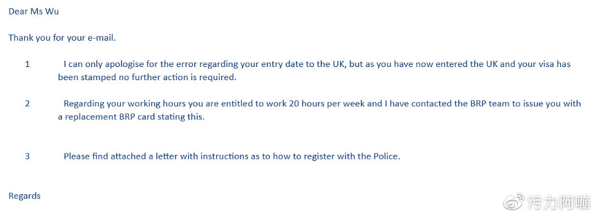
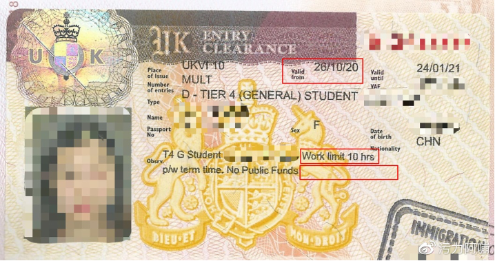

# 16-广电-Yuri-University of Bristol

> 编者按：此文不同于其他的留学申请经验贴，可以称得上是一部《人在囧途之英囧》，但对于所有准备出国的同学在出行前一些必要的注意事项检查和准备依然有很强的借鉴意义，故收录于此。

今天我回宿舍的时候看到门缝里塞进来一封信，我打开一看是我的BRP，差点变成大型泪崩现场。今天距离我到英国已经第51天了，我终于摆脱了一堆垃圾事，可以静下来写这篇“血泪史”，希望我的经历能够提醒正准备赴英留学的朋友们，

**划重点！出发之前务必检查清楚签证上的信息是否正确！！**好了，如果你没时间，那看到这里你就可以退出了，你只要记得出发之前检查签证个人信息就好啦。不过，如果你想知道我在机场到底经历了什么令所有得知此事的朋友甚至是机场职员都大呼“卧槽”的事情，那你可以花一点时间把我下面要写的可怕经历看完嘻嘻～

### 好了，我要开始了~

本人今年英硕新生一枚，这件事情要从我9.28傍晚到达广州白云机场准备换登机牌搭上经停阿姆斯特丹飞往伦敦的飞机开始说起。

我和我爸9.28一大早从家出发坐了5个小时动车到广州，又坐了2个小时地铁到白云机场，飞机是晚上00:05起飞的，经停阿姆斯特丹飞往伦敦，到了傍晚6点我开心地拿着我的护照去办登机牌，结果值机的工作人员突然告诉我我的签证要10.26才生效，也就是说我9.28是不能够前往英国的，我当场就懵了，因为我9.3就申请了签证，我在签证申请表格上写的出发日期是10.2，机场的工作人员也百思不得其解，但他们告诉我我当天肯定是走不了的了。我当时整个人一片混乱，赶紧打电话给了我的中介老师，老师跟我说可能是签证中心那边出了错，按照我填写的出发时间我的护照生效时间应该是9.26，也就是预计出发前的一星期。我把我的签证申请单给了白云机场国际出发厅的工作人员看了以后，他们告诉我这种情况以前也是有发生过的，但我当时只能选择要么第二天去签证中心重新报错，等待重新贴签，要么回家等签证生效再出发。他们说当晚8点会有大使馆的人来机场办公，我可以等到那个时候再问一下，但这种情况99%是走不了的。

我爸劝我和他一起搭当晚的飞机回家，因为他觉得这种事情回旋的余地不大，但我不甘心，非要等到大使馆的人来问个清楚，因为我当时觉得使馆马上就要放国庆假了，就算我去报错他们受理完再重新贴签也要等到国庆后了。于是我度过了人生中我以为最漫长的2个小时（因为后面还有更“漫长”的），这期间白云机场的工作人员也一直试图帮我与大使馆的人沟通（此处真的感谢白云机场国际出发厅的工作人员）。结果到了9点半，我才知道来的是欧洲领事馆的工作人员，英国领事馆的人不会来，我又一次被暴击了...

欧洲领事馆的工作人员是个很漂亮的小姐姐，她让我先不要着急，她可以试着帮我联系英国领事馆的人，然后我又心跳180等了一个半小时吧，欧洲使领馆的小姐姐过来告诉我说，英国使领馆的工作人员确认了我的签证是由于他们的失误印错了时间，他们已经帮我联系好了阿姆斯特丹机场和伦敦希斯罗机场，通知当地我的情况，只要我能够顺利搭上前后两程飞机，到了阿姆斯特丹和伦敦，当地都会放我过关，当然我也可以选择不去，重新申请签证报错重新贴签。于是我当场决定直接上飞机，老娘绝不重新贴签！！（我当时脑子可能有点问题）

于是我赶在11点15分办理了登机和托运，冲进了安检，由于过于兴奋，我连和我爸抱一下都忘记了...我深深记得给我办登机牌的工作人员知道了我的事以后感叹了一句：“这也行？”，然后一脸震惊地给我办了登机牌...我就这么坐上了飞往阿姆斯特丹的飞机。

到了阿姆斯特丹，我经过了12小时的飞行，又要赶两个小时以后从阿姆斯特丹飞往伦敦的飞机，整个人昏昏沉沉，到了荷兰时间早上8:10在登机口准备登机的时候，我...又被卡住了...

登机口的工作人员说我护照没有生效，他们不能放我走，我按照欧洲领事馆小姐姐教给我的跟他们说明了一下我的情况，并让他们有问题联系UKILO，结果登机口那边的工作人员打了一通电话以后跟我说：“不好意思我们没有接到任何有关你的情况的通知，所以我们不能放你走，并且我们没有权限联系UKILO，请你到transferdesk那边重新办理改签转机。”我当场傻掉，因为按照欧洲使领馆小姐姐说的，我如果不能成功登上这架飞机，我在英国可能就不能顺利入境，但我一点办法也没有，只能到转机柜台那里重新说明情况。

结果...转机柜台的工作人员告诉我，他们没办法联系UKILO，我只能选择要么自己联系到我说的英国领事馆的工作人员，要么买机票回中国。但问题来了，我根本联系不到那个英国领事馆的工作人员，因为在广州的时候我试图找欧洲领事馆小姐姐要英国领事馆工作人员的联系电话，但由于是个人保密信息，所以他们不能给我联系方式。于是我开始疯狂打电话，先后打给了英国驻中国领事馆、中国驻英国领事馆、中国驻荷兰领事馆、英国驻荷兰领事馆....打了几百块钱国际电话以后，要么就是不在工作时间，要么就是说我的情况他们没办法解决，在这期间，我爸妈根本不敢给我打电话，只能疯狂给我充话费555。我的中介告诉我，我或许可以试一下装可怜这一套，在转机台的工作人员面前哭一哭，说不定可以博得人家的同情放我过去，然后我试了，屁用都没有...

最后，这个事情是怎么解决的呢，是转机台的工作人员看到我到阿姆的飞机是南航的，给了我南航驻阿姆斯特丹分站的电话。我电话一打过去，是一个口齿非常伶俐，听起来就超级nice的小哥哥接的，他说已经知道我的事情了，并且跟我吐槽了最近签证办理量太大，已经出现过好几次这样的事情了，他说在我之前一个星期，有一个男生也遇到了和我一样的情况，这个男生最后是联系英国移民局解决的，他推荐我也试试看，这个小哥哥的出现简直就是我的救星，我一下就觉得事情可能有戏。于是我让转机台尝试联系英国移民局，果然，英国移民局有我的记录备案，他们告知了荷兰皇家航空我的情况，转机台终于同意放我走了。这个事情解决了以后，转机台的工作人员对我说：“Awesome, you're good now. ”我真的差点当场哭出来，于是我改签了荷兰当地时间下午15:30的飞机，等我改签完成的时候，和我一起到荷兰的所有同学都已经到伦敦了...

我真的完全无法形容我当时的心情，就你们自己体会一下吧，疫情之下戴了一路的口罩、手套还有护目镜，而且那时我已经将近快30小时没吃东西了（因为飞机上我睡了一路），事情解决以后我整个人突发低血糖，就觉得自己快晕倒了，迅速跑去阿姆机场的麦当劳吃了顿饭，这里插个题外话，阿姆机场的麦当劳的鸡肉汉堡是真的难吃。由于我被这一堆事情耗尽了精力，也没什么心情吃饭，随便塞了两口就吃不下了，对了，我在阿姆斯特丹机场总共呆了9个小时。在荷兰飞伦敦的路上，我一直在担心到了伦敦会不会再发生一次这样的事，万幸，我非常顺利地入境了英国。但是，等我过了边境的时候已经是晚上18:30了，我已经错过了我的校车，只能自己买National Express拖着两个加起来快60斤的箱子坐大巴到布里斯托了...

这个故事的前半段就结束了，我要说一下：中介真的有的时候可能太忙了会忘记帮我们检查签证，再加上我们也是第一次出国留学，没有这种经验，很容易不检查签证信息就出发了，因为谁能想到UKVI会出错！！！

**下面是故事更加狗血的后半段...**

到了布里斯托住进了宿舍后的第二天，我的中介告诉我我得把我的情况和学校的VisaTeam沟通一下，让他们出面联系移民局看是否需要重新贴签，因为还要警局注册，我也得和警局联系一下，于是我分别写邮件联系了学校和警局，他们都回复得很快而且态度很好，但万万没想到，我从两方分别得知了我的护照上还有两处错误！！！
首先，作为全日制留学生，护照上的Worktimelimit应该是20小时，但我的护照上写的是10小时；此外，由于在英国停留时间会超过6个月，必须到警局注册，注册的凭证就是签证上应该写有一句“Police Registration”，这句话我的签证上也没有。

于是，我一天之内又受到了两次暴击...

按照学校和警局的建议，我把三处错误汇总给了签证错误部门并且附上了我的护照扫描件和签证申请单，还有我和警局以及学校沟通的邮件截图（entryclearance.errors@fcdo.gov.uk这个签证报错部门的邮箱我放在这里，如果有同学也是入境英国之后发现签证有问题可以联系这个邮箱）。就一天的时间，我得到了签证报错部门的回复（可能是他们也觉得错得太离谱了所以回得快吧...），以下是他们的回复：

也就是说，虽然他们可以帮我把worktimelimit的错误报告给brp部门，让他们修改以后给我重新寄brp，也给了我一张证明让我在警局注册的时候出示，但并不能给我重新贴签。这也就意味着，在我隔离期结束后到10.26我的护照生效期间，我没有brp，也还没警局注册，我一旦被巡警查到，我就是非法移民，要么我就得跟警察把这段狗血经历再解释一遍...

事已至此那我也只能少带护照出门了，再一次万幸，直到我的护照生效我都没有被巡警查过，并且我前几天成功完成了警局注册（当然又是好一通解释），今天收到了BRP。

好了，这个又臭又长的故事终于讲完了，事儿就是这么个事儿，恶心也是真的恶心。我之所以今天才写下这篇文章是因为我今天才收到了BRP，一颗悬着的心终于放下来了，我现在是有身份的人了！！！

先感谢一些人，广州白云机场的工作人员，南航驻阿姆斯特丹分站的工作人员，在伦敦希斯罗机场知道了我的事情以后帮我推了两个小时箱子的William弟弟，深夜到了布里斯托下楼帮我拎箱子的Jason学长，知道了我的情况疯狂关心我一路上在线陪着我的朋友们YY、肥姐、Perry、阿灯、Richard，还有我爸妈，有你们的帮助和陪伴我真的一路上什么都不怕（不可能，我还是怕的hhh）！

我把这段奇幻的经历告诉大家是真的想提醒要出发的留学生们，一定仔细检查签证上的内容和你所有要携带的重要文件，很多时候我们可能真的是第一次所以不懂这些事情，但是不懂可以问，有我这个傻逼的事情作为前车之鉴，大家以后一定要谨慎一点！希望再也不会有人遇到这样的事情，球球了！！！

最后，放一张我签证的截图，你们可以看一下这个签证错得有多离谱（红框是错误的地方，空白的红框那里应该有Police Registration 字样），给我办签证的人怕不是工作到一半睡着了...

