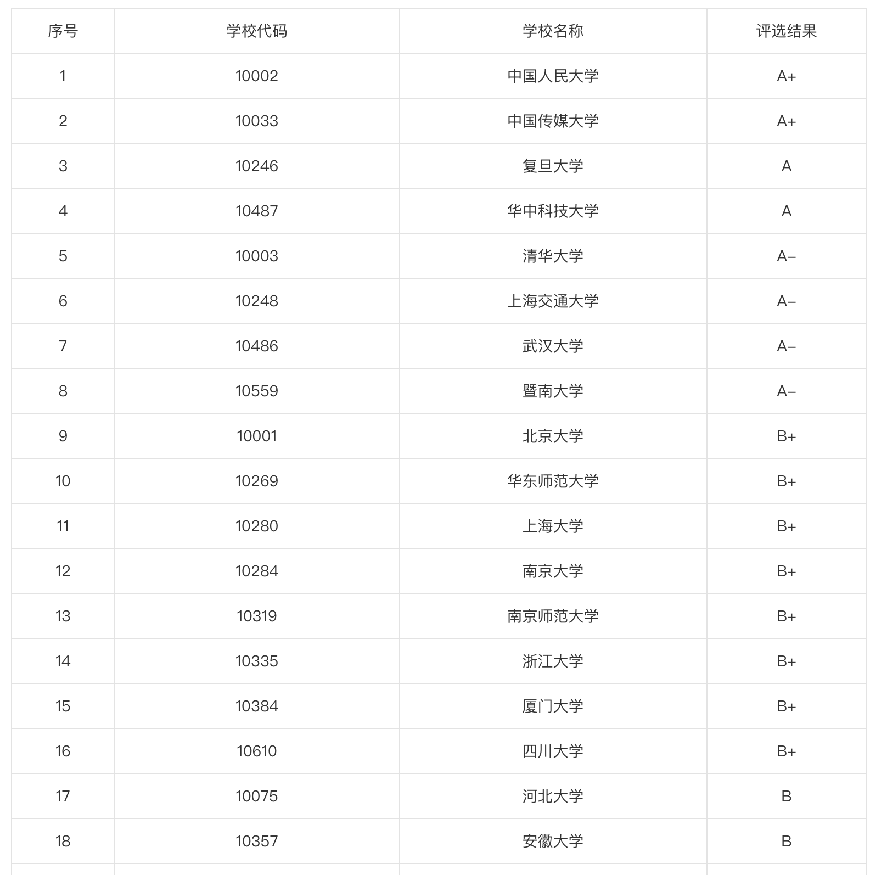

# 16-网媒-陈少宏-暨南大学

## 基本背景

> 前五学期排名：5/38
>
> 排名：班级第四

## 保研结果

> **夏令营阶段：**
>
> 报名：中国传媒大学（电视学院）；重庆大学；四川大学；中山大学；中国人民大学；南京大学；上海交通大学
>
> 通过初试：中国传媒大学；重庆大学（放弃参加）
>
> 参加夏令营：中国传媒大学（未获得“优营”）
>
> **预推免阶段：**
>
> 报名：暨南大学（MJC）；南京师范大学（MJC）；武汉大学（MJC）；华东师范大学（传播学学硕）；厦门大学（MJC）；南京大学（MJC）
>
> 初试通过：暨南大学；南京师范大学
>
> 复试通过：暨南大学；南京师范大学

**事先声明：**我是安徽大学新闻传播学院2016级本科生，本文仅供安大新传保研参考。另，本文撰写于2019年。

**我的目的：**学校和院系一直没有针对保研开展培训或者讲解，加之大家的人脉有限，所以保研路上总不是一帆风顺的，信息不对称、信息闭塞总是存在，有的人甚至到获得保研资格时还不清楚保研是怎么一回事，吃了不少不清楚情况的亏，做了不少不清楚情况的无用功。站在前人的肩膀上，结合自己保研路上产生的种种疑问和遇到的种种挫折，我完成了这篇文章，希望它可以为以后的学弟学妹解答尽可能多的疑问。

在开始正文之前，请允许我向大家推荐，我院优秀的毕业生——2015级新闻学的童碧君，写于18年9月的保研经验贴。她是那一届的年级第一，有过五所顶尖学校的面试经历，可以说非常干货了。

那么问题来了——我的这篇文章还有什么存在的意义呢——那当然是给童童那篇文章进行一些补充。毕竟童童是新闻班甚至年级第一，我是班级第四，相对来说，我写的可能更适合“下沉”用户。简单说，主要是三个方面的补充：

* 一是预推免方面，因为童童是夏令营被录取走的，所以在对预推免后后面的九推介绍不多；
* 二是学校方面，童童因为本身很优秀，去的基本都是顶尖学校，但我想大部分朋友应该达不到童童的级别……所以我选择了一些相对容易的学校进行介绍；
* 三是其他琐碎的补充，比如方法技巧、备考心态等等。

下面进入正文，先看目录：

> 一、保研及其途径
> 二、保研现状
> 三、保研的准备方向
> 四、保研的学校与专业
> 五、我的保研经历
> 六、保研的复习与复试方法
> 七、其他补充

## 一、保研及其步骤

### 1. 保研是什么

“保研”是俗称，保送去读研究生，正规来说是推免，全称推荐免试，也就是学校给名额，向外校推荐你这个学生不用参加12月底的考研（初试），直接参加外校的推免招生，招生的考核通常以笔试面试等形式开展。

保研一般根据大学前三年的班级排名划分名额，但如果在核心期刊发表论文、参加过国家级的科研项目，可以为自己提升名次。所以成绩是非常重要的，同时最好可以有相关的科研经历。

通常，9月份开学后，学校和各院系会开始推免工作，老师会公布班级排名，觉得自己有希望的都可以去报名推免，比如某班给10个推免名额，某人是第12名，他也可以尝试报名，因为可能前面的人会放弃，而且他手上如果有科研项目，也可能可以帮助他提升名次。

当你获得了推免资格，你就可以在9月22日后，登录教育部的推免系统进行注册，28日填报志愿，三个学校（请记住这两个时间，尤其9.28）。

**（1）保研一定有学上吗**——不一定。保研是让你有跳过考研的机会，自由投报想去的学校，到相应的学校参加他们的考核。虽然这个考核比考研简单多了，但仍可能因为自己准备不充分、实力不足，导致一一落选。如果到最终教育部系统开放，填报的志愿全部落选，那真的就失学了。当然，这种情况几乎不存在，因为首先能保研的人都具备一定的实力，其次大家也不会好高骛远，非要报最顶尖的学校而不顾自己的真实水平，并且如果本校的指标够，保研本校基本都能通过。

**（2）保研不是保送吗？怎么还有笔试面试？**其实保研已经比考研轻松太多太多了，等于是跳过考研的初试，直接进入复试。考研中的很多人在准备12月底初试的过程中就顶不住放弃了，很多人12月底的初试会无法通过，甚至很多人通过12月底的初试，却没能通过第二年3、4月的复试。无论是考研还是保研，复试都会有面试，有的学校还有笔试。而初试，对于考研来说，就是12月底的那场考试；对于保研来说，就是对你提交的个人信息的筛选。准备大半年参加一场通过率可能不过10%的考试和用一两天整理一份自己的材料投递给各个学校，哪一个容易呢？保研的复试，是那个学校老师了解你的最根本途径。

### 2. 保研的途径

保研常见的途径有三种，先后是夏令营、预推免和“九推”，往往越往后机会越少。并不是每个学校都有这三个途径，这三个途径之间没有必然关系，对各个学校来说，人招够就行了，比如中山大学今年改革，只通过夏令营录取推免生，不设置预推免和九推；中国传媒大学往年只有夏令营和九推，今年也开了预推免；华中科技大学往年只有九推，今年也开了预推面……下面分别介绍一下这三个途径。至于当中的细节问题，比如面试会问什么问题，我会在第五部分“我和同级战友的保研经历”中涉及。

**（1）夏令营：**是保研的第一次机会，各个学校会把很大一部分推免名额放在夏令营上。它们从4、5月开始陆续发布通知，也有通知发得很迟的，比如中传今年大概7月8日才发通知，那时候很多学校的夏令营都结束了。大部分学校都在6月底至7月底之间完成夏令营，每个夏令营通常2-3天，考核的形式主要是笔试和面试，面试包括中文面试和英文面试，老师根据你的表现打分并排名，然后评“优秀营员”。如果你拿到了“优秀营员”的称号，那么恭喜你，如果你在9月份获得了推免资格，只要在28号填了这个学校的志愿，对方就会立刻通过你的申请，你就是那个学校的硕士研究生了。

夏令营的特点：很多学校会给予路费、食宿等方面的报销（今年的中传、人大等校不予报销）；夏令营形式较多，比如学术交流、外出参观等（也有学校很硬核，几乎啥也不弄只有考核，比如中传）；成绩只看前五学期，此时保研名额还没确定；可以海投；通过难度较低。

**（2）预推免：**是保研的第二次机会，它和“九推”的区别在于，举行的时间一个在9.28之前，一个在9.28之后。大部分学校会在8月底9月初发布有关“预推免”“预接收”的通知，在9月中下旬、9.28之前举行。此时各个学校需要学生确定具备保研资格，而不像夏令营“预计可以获得推免资格”。预推免的形式类似夏令营，只是少了学术交流等环节，直接考核；有的学校没有笔试，比如今年的华中科技大学和南京师范大学，但面试是每个学校必备的，只是有的学校没有英语面试，比如今年的华中科技大学。当你通过了预推免，被对方接受。那么同样，在28号系统开放志愿之后，填这个学校，对方就会立刻通过，你就可以继续念书了。

预推免的特点：全程自费；不整虚的，只有考核；需要确定获得推免资格；可以海投；通过难度较高。

**（3）九推：**也就是9月28日推免系统志愿填报，这是最原始的途径，你先填志愿，对方通知你去他的学校复试，通过了，你就是他的人了。而前面两个途径都是各个学校为了抢人，陆续开展起来的。九推最有风险，因为各个学校的推免生名额，经过前两轮的筛选已经所剩无几，并且，不像前两个可以海投，推免系统只能填报三个志愿，当然如果申请发过去对方不要你，你还可以再填；如果三个都挂了，那就真的无学可上了。所以大部分人都会选择通过夏令营和预推免成功走掉，保险一点——因而也有人说，九推也是个捡漏的机会，因为一些名校还剩一点名额，但没人敢报名了，此时去了就捡漏了。这只能说，需要勇气和实力——如果真的对某一学校执念很深，并且认为自己具备和一切对手掰手腕的实力，那就大胆去尝试吧！

九推的特点：全程自费；只有考核；先填志愿再去考试，风险和机会并存；只有三个志愿。

## 二、保研现状

### 1. 整体趋势

之前官方发布的数据，18年考研（也就是刚毕业的15级）人数大概比15年快翻了一番。这里需要给低年级学弟学妹科普一下，考研是极端定向的，复习前要提前确定想去的学校、学院、专业、甚至方向，进而开展针对性的复习；而现在各个高校的新闻传播的各个专业的报录比（报考和录取）比例大多是20:1到30:1之间，我见过最激烈的，是南京师范大学老师介绍的，他们去年专硕只有19个统招（考研）名额，却报名了900多人，差不多50:1啊！然而，各个高校的研究生指标却越来越倾向推免生，比如，暨南大学去年推免生的学硕和专硕指标分别36和70人，今年变成了48和75人。也就是说，考研的人越来越多，但留给考研者的名额越来越少。所以，保研比考研容易太多，如果想读研，一定要重视前三年的学习成绩和科研能力的培养。此外，名校的推免名额也越来越照顾自己本校的学生，典型代表是南大，名单差不多一半都是南大自己人。

### 2. 我院近年情况

我们院每年大概有36个保研名额，分到各个专业，大概是新闻8-9人，广电和广告各7-8人，编辑和网媒5人左右，推免率大约13%。从推免去向来看，985不是很多，大部分去了211。名校来说，中传每年都有3-5人，人大每年1人左右，今年没有，南大每年1人左右，武大也有3-5人，因为他夏令营默认班级第一都能去参加……而复旦是我们的死穴——建院至今无人保到复旦。

从今年夏令营来看，我们院情况不太理想，中传优营4人是不错的战果，但人大、南大、中山等985名校，不仅入营的名额较前几年都少了很多，最终也几乎无人拿到优营。

## 三、保研的准备方向

保研让人焦头烂额的，除了复习，就是无休止的材料的准备。保研与考研有一点不同的就是，考研者专心对一个学校的一个专业复习就行，保研因为报了多个学校，需要针对各个学校和专业的特点进行复习和材料的准备。毫不夸张地说，就那单薄的A4纸，我这么个菜鸡都花了至少200元去打印，更不要说大神们了。简单来说，保研有两个准备的方向，就是表和里。

### 1. 表——通过初试的敲门砖

很多人（比如我）在初试就挂了——投了很多学校，学校只审核了材料，就把人pass了，就是因为的“表”不够。那么，有哪些“表”呢？

* 前五/六学期成绩与排名：这是最根本、最重要的东西，你想，排名那一栏，1/80和5/40，差距得多大？夏令营阶段，很多学校都对排名有严格要求，比如南大要求前10%。少壮不努力，保研徒伤悲。认真做好每一次课堂作业，课堂上积极互动，相信你可以凭实力拿到好成绩。成绩单和排名证明根据各个学校需要，到院办和教务处盖章。
* 本科学校和专业：这没办法了，咱也无法改变，好在我校和我院面子够大了，在新闻传播学当中算是很不错的211高校了，大部分名校也会给一些机会到我院。
* 科研能力：最重要的加分项，什么在当过什么部长、主席，都不如发过一篇核心期刊、做过一次省级、国家级科研项目来得有水平。学校招研究生毕竟是以学术为本，这一部分，发表的文章、大创、暑实、哪怕是平时课程作业的论文练习（润色一下也可以花钱投普通期刊，未发表也ok），能写就写，但要注意两个问题——一是不要给自己挖坑，自己是划水的就不要写高大上，因为所有问题当中，老师最容易问的问题就是你的论文和科研项目。二是要充分了解自己的作品，比如为什么想到这个选题、过程中有什么问题、有什么缺陷等等。
* 个人陈述：有的学校的初审会要求学生提交个人陈述，有点像自我介绍，但重心应当放在自己已有的学术科研经历，或者专业学习与实践经历，以及未来研究生阶段的研究学习规划，越细越好，比如研究的方向，我写的是品牌公关和舆情分析，打算学习Python等方面。个人兴趣爱好、做过什么学生干部，一笔带过。
* 英语水平：研究生另一项特别重要的基本素质，就是英语。四六级或者托福雅思的成绩是每个学校必填的，夏令营阶段，大部分学校的要求是四级至少500分或六级425分，达不到就不能报名。

以上几个方面，可以说是每个人的抛门砖，如果你是班级第一，同时手上握有多项科研成果，并且英语底子好，并清除叙述了自己的科研经历和未来规划，大部分学校都会很乐意让你去参加复试，除非少数“看脸”的学校看不起我校和我院。

### 2. 里——参加复试的硬本领

获得初试资格肯定不够，是骡子是马还得拉出来溜溜。你平时的积累如何，笔试面试一试便知。这就需要平时多加巩固，看书、看论文、关注学术和业界前沿，有自己的理论框架和成熟且富有逻辑的观点，并且别落下英语的表达。对新闻传播专业而言，推免的笔试和面试的题目大都比较开放，比如谈谈看法、说说影响、指出建议等等。但这不代表不需要准备。拿我自己来说，暨大的笔试我引用了超多习总的论述；在南师大问我问题的时候，我随口用彭兰传统媒体“移动化、社交化、智能化”转型的观点来回答；暨大问我的时候，我又随口说了福柯的“全景式监狱”，老师露出了姨母笑。可能低年级的学弟学妹还没听说过这些，所以平时看到就记一下，记到就是赚到！

## 四、保研的学校与专业

### 1. 保研的学校

首先要想清楚，你最想去哪个学校，985还是211，双一流还是北上广。下图是2017年第四次学科评估中，新闻传播学的排名。

这里指出几个点：有的学校等级不高，但其实名声早已在外，比如中山大学、南京大学、甚至已经是A级的复旦大学（新传早有“北人大南复旦”的说法），也有一些后起之秀，大家可以关注，因为它们近两年的发展很快，在明年的第五次学科评估当中很有可能再进一步，比如暨南大学、南京师范大学、安徽大学，尤其是我校的新传，上次评B时还没有博士点，现在有了，说不定就B+了呢？此外，区位也需要考虑，比如北京的学校大多靠拢央媒，去了之后很明显可以感觉到他们的研究方向和毕业后的工作去向。

### 2. 保研的专业

研究生主要分为学术硕士和专业硕士。学术硕士常见的学校分为新闻学、传播学、广播电视学、广告学等专业，每个专业下还会细分方向，学制往往三年，以学术研究为主要培养方向，通常要求发表期刊论文，学费普遍8000一年。专业硕士在我们新传称“新闻与传播硕士”（MJC，Master of Journalism＆Communication），仅此一个专业，底下会细分方向，学制往往两年，侧重实践，但也需要学术功底，通常要求有一段时间的业界实习，学费至少10000一年，有的甚至两三万。保研不是一定要去自己本科的专业，比如我网络与新媒体，研究生有这个专业或者方向的学校还真不多。在一级学科（新闻传播学）下，根据自己的兴趣和特长，大家可以都去尝试。但如果你的兴趣不在新传，或者是夏令营阶段，也可以尝试跨一级学科，但最好和我们专业相关，比如社会学、心理学甚至艺术硕士等等，不过这就需要比较扎实的提前准备了。

## 五、我的保研经历

> 安全原因删减此处部分文字，可自行想其他办法获取此处完整内容

这一部分介绍我自己7到9月的保研过程。秉持传播故事化的原则，这部分可能会有趣一些，干货可能不如前面那么多，但身临其境的话，也可以有很多收获。

同时，这一部分也又臭又长，不想看故事也可以直接跳到第六部分。

这里会涉及到的学校有：中国传媒大学（电视学院）、南京师范大学、暨南大学。如果不满足于这些学校，可以去看童童的那篇文章（涉及到了中国传媒大学（新闻学院）、中国人民大学、南京大学、武汉大学、中山大学），或者去问问其他学长学姐。

### 1. 夏令营阶段：

**报名：**中国传媒大学（电视学院）、重庆大学、四川大学、中山大学、中国人民大学、南京大学、上海交通大学
通过初试：中国传媒大学、重庆大学（放弃参加）

**参加夏令营：**中国传媒大学（未获得“优营”）

前五学期我排名5/38，也没什么拿得出手的论文和项目，因而被很多名校拒绝了。重大太远了还不报销，并且我看到它强调学生要有诚意地去，我就放弃了。而当收到中传通知的时候真的欣喜若狂。

中国传媒大学是我高中以来最想去的学校，很遗憾，却是我没有任何经验、去参加的第一所学校，抱憾而归。

今年是中传第三年搞夏令营，但好像也是第一年完全不报销，所以我很心痛，我去了一趟北京花了两千多。电视学院每年都会招很多人，可以说是海选，中传在夏令营也确实不会特别在意学生的本科院校的好坏，重点还是看个人的能力和潜质。我报的是学硕，广播电视学专业，视听媒体理论与实践方向。

我们第一天上午报到，做心理测试，下午是党委书记曾祥敏老师进行宣讲，大部分是在介绍他们的国际新闻班，但介绍到对接国内外各种业界和学姐大咖时，真的特别心动，是最理想的传媒类大学！接着晚上就是笔试。

第二天全天面试，我是倒数第12个。面试形式是先自我介绍，然后中英文各有四张纸条，随机抽一张，中文题目直接回答，英文先朗读纸条上的一段内容，老师再根据内容提问。上午张雪纯专硕面完，告诉我她的考场老师挺温柔，不会的题目还可以换题。下午我到楼下，看见卞亚茜傻愣愣地站在外面，说自己英语挂了，因为朗读完之后，老师问了她对其中一个单词的理解，她恰巧不认识这个单词，尴尬一阵后，就被老师请出去了。她和我报的是同一专业和方向，我和她面对同一群老师，可能抽到同样的题目。

接下来重点来了（怎么和童童的经历略有相像）。当我坐在门口、下下个就是我时，学姐提醒大家把准备好的材料一次放好，我发现她提到的第一份材料自己没带！我慌了，让学姐帮我调一下面试顺序，我立刻带着U盘去打印。我火速奔跑来回，还把U盘落在打印店。回来之后，大汗淋漓，学姐再次提醒大家材料，我发现她说的第二份材料我也没带！我已经在崩溃边缘快哭了，因为这份材料是需要安徽大学教务处盖章的，我放在的宾馆，而我的宾馆恰巧很远，走路来回需要40分钟。我问学姐还有多少人没面试，她说8人，一个人五分钟，于是我打车来回，赶上了倒数第3个。

说个插曲，我打车来回路上，翻到了前一晚的群记录，学姐发了通知，我在准备自我介绍，没有看到，一方面怪自己粗心，一方面又责怪大家水群把消息水上去了。同时注意到，学姐给了一个自我介绍的模板，要求大家自我介绍必须按照模板进行——我再度崩溃，我就是因为准备自己写的自我介绍才没看到通知，结果现在又要按照给的模板重新准备？于是在出租车上的十分钟，我现场准备新的自我介绍。

进入到考场，五个瘫倒的老师瞬间精神抖擞：“终于来男生了！”我假笑着开始自我介绍，但当我介绍到三分之一时，一个女老师打断了我：“你说的这些我们都能从简历上看到，直接抽题吧。”我一万个问号？？？？都知道干嘛还给我模板去准备？直接看简历不就行了吗！我消消气，抽题，接着又是一万只草泥马，因为那张纸条上只有四个字——新闻游戏。这是一个后来我问了一圈考研的、保研的人都没听说过的、其实很平常很基础的概念，当时我就一个念头——名词解释？？？这啥啊？？？沉默许久，老师问我是不是不知道这个东西，我说我只听说过“传播游戏”，于是老师让我谈谈“传播游戏”，我就结合理论和现在的互联网发展谈了一分钟左右。接着是英语抽题，此刻的我已经完全崩溃，读英语的时候磕磕巴巴，而且根本没去管我读的内容是什么意思，隐约记得有356，有spender，接着吴敏苏老师就问我问题，我只听懂一个“rich”。我哑口无言，连pardon都说不出口，傻傻地看着卡片，试图从当中寻找信息。老师好像有点不悦：“你看什么卡片，上面又没有答案！”我直接坦白，我没太懂这段话的意思，老师问我哪个单词不认识啊，我随口说了一个spender，她声音更大了，“spend总该认识吧？”我说知道，消费花费，她又补刀：“我加个er你就不认识了啊？”这时另一位男老师也补刀：“那你这个六级是怎么考这个分的啊？”我汗流浃背：“我听力和写作不太好，就阅读拿分。”老师们开始露出笑容，为难地说：“既然不知道，你就出去吧，喊下一个同学进来。”还顺便问了我生源地，我真希望没有害了安徽大学的学生。

好了，走出那个门后的半个多月里，我夜夜失眠，每天到凌晨三四点才能睡着，一闭眼就是那些画面，还有“我加个er你就不认识了啊”“那你这个六级是怎么考这个分的”的声音在不断环绕。

### 2. 预推免准备阶段：

7月24日电视学院结果出来之后，广电班的三个人都被录了，我果不其然地落选，于是发下狠心，九月还要再来中传雪耻！一场为期两个月的复习大战拉开了序幕……

7月27日，我从家回到宿舍，屋里只剩我一个人。我制定了详细的复习计划，从7月28日开始实行。

我每天7:15起床，洗漱好去桂园食堂吃早饭，每天都是两块钱锅贴和一碗辣糊汤，回来大约8:30，打开手机的Forest，开始一上午的学习。先拿着新东方的恋练有词开始读单词和例句。读完一个list，大约半小时，开始看新闻理论的《新闻学概论》，一直到中午12:00。去桂园食堂吃午饭，毛豆烧鸡+海带烧肉，三毛钱米饭，12:40左右回到宿舍，12:50开空调上床午睡，13:50起床。

14:00，下午场开始。先是读恋练有词新的list（每天早上是复习前一天下午的list），接着是传播学，看《大众传播理论：范式与流派》，一直到18:00，去桂园食堂吃饭，一样的操作。

19:00，晚场开始，还是新闻理论，一直到22:00。打热水洗澡。因为厕所地漏堵塞，每次洗完澡，还要用扫帚簸箕扫水。

睡前泡脚，看看公众号的文章，23:30睡觉。

后来的日子，新闻理论看完了，我又看新闻史，挑的都是中传的考研推荐书目。到八月底的时候，理论书籍都看完了，我开始看论文和公众号的业务前沿归纳和分析。

后来一想，如果我在夏令营之前这么复习，说不定我已经是中传的优营了。

“可惜没如果。”——林俊杰

### 3. 预推免阶段：

**报名：**暨南大学（MJC）、南京师范大学（MJC）、武汉大学（MJC）、华东师范大学（传播学学硕）、厦门大学（MJC）、南京大学（MJC）

**初试通过：**暨南大学、南京师范大学

**复试通过：**暨南大学、南京师范大学

这一阶段让我最痛苦的地方，就是中传今年突开预推免，并且和我第二想去的暨南大学时间完全冲撞，我必须作出选择。想到中传的名额所剩无几，暨大的机会大把大把，求稳心最终战胜了我的博胜心，我忍痛放弃了自己想了四年的中传，专心备考暨大。

同样，这段时间填写材料也够烦人的。各个学校的预推免系统五花八门，有的系统真的很不友好，填写起来特别麻烦，尤其是华中科技大学！！！不仅不能临时保存信息、必须一口气全部填完，而且必须填完上一页才能看下一页有什么要填的！！！无法预知你需要为它准备什么材料！因为我把华科大报名截止时间当成了9月15日（其实是9月5日截止），因此我错过了他的预推免……因为排名更新，需要重新打印成绩单和排名证明并去盖章，加上还要上课，所以九月份前半段时间，复习效率低了下来。直到接近学校的复试，效率才重新提升。

这段时间我的一个重要变化，就是调整了自己的专业方向——学硕改专硕。因为觉得自己的性格和特长适合专硕，学硕所需要的素养自己还差得很多，加上自己未来的职业规划，我决定改报专硕。这也是很痛苦的，因为整个暑期我都是按照学硕的要求去复习的，所以现在我还要拎起来专硕的一些内容，比如新闻实务，暨大就要考新闻评论。

#### （1）南京师范大学

南师大是9月12日发短信告诉我过了初审的，19日上午我坐高铁到南京报到，下午就在候考。南师大没有笔试，只有面试。我们学校去了六七个人，其中只有我和李玉婷报了MJC。

面试开始之前，骆正林老师给我们介绍了一下南师大和新传的情况。这个老师让我对他和这个学院很有好感，因为他很亲切随和，和我一样喜欢谈一个组织的历史由来和文化积淀，正视自己学院在各个高校中所处的位置，也多次表达了对我们报考他们许愿的感谢、以及如果被录取可以最终选择南师大的殷切希望。他还提到，今年报名南师大预推免的大约有300人，所以竞争还是挺激烈的。

南师大面试比较随意，除了有五张字条写着五道中文题目需要抽取一个回答（和中传一样），其他没有固定形式——英语可能不要求你说，说了也不一定是同一个话题，可能会和你中文聊天、也可能不会……

李玉婷先去面的，她没有被要求说英文，仅仅自我介绍了一句就被要求抽题，然后剩下两三分钟就是和她聊天，甚至有老师看她是运动员，还问她多高？？？

整个面试过程大概就三分钟，和做梦一样。第二天我就收到了通过复试的通知。

学硕可能要求严格一些，我们院去的好几个女生都没通过——往年基本都可以通过的，今年南京的两所学校（另一是南大）对我们好像都挺严格。

#### （2）暨南大学

暨南大学是海选，报名初试的基本都通过了。我21号飞去广州，22号上午报到，23号上午笔试，24号全天面试，我是在下午。让我诧异的是，去参加复试的三百多学生，大多来自双非学校（非211、985或非双一流）甚至理工院校，仅有个别几个来自中山大学、中国传媒大学这样的名校。后来一想，虽然暨大新传评级A-很靠前，但学校毕竟不是985，名校学生保研估计都想冲985吧。

笔试2小时，有三套卷子，学硕四个专业一套，专硕一套，艺硕一套。形式都是三道论述题和一道评论题。注意，往年都是五道论述选三道，暨大考研的题目也是多选三，一直是一个亮点，但今年回归必选题了。

面试在第二天，上午学硕，下午专硕和艺硕。

总的来说，暨大的面试还是很轻松的，老师不会给你压力，而且可以谈自己的空间也更多。

## 六、保研的复习与复试方法

### （一）保研的复习方法

#### 1. 战略层面

* **信息搜集，精准备考：**跟童童说的一样，保研是一个长期的信息战，从夏令营的通知发布，到咨询你认识那个学校的学长学姐相关的考试形式和侧重点、查阅相关老师的论文等等，信息的搜集至关重要。每个学校都会有自己的特点，针对学校的特点和考核的形式和内容，提前做好信息搜集，精准、有针对性地进行复习。比如中传的电视学院这几年比较重视传统媒体的转型，以及视听媒体尤其短视频的发展，那么相关的论文、业界的最新动态就一定要关注，他们的笔试是分析纪录片，那么咱们罗锋老师的纪录片课就一定要选。
* **考研模式，施压模考：**虽说保研比考研轻松，但也不能太飘了，在参加正式的复试之前，最好给自己模拟笔试面试的情景，自查自己的缺陷。比如了解近年考研真题、保研复试真题，每天练英语口语等等。日积月累，模式化被训练出来不说，真正考试时，压力也会小很多——很多人其实都败在临场紧张上，比如我。
* **自我包装，自信会考：**举个例子，我在田径队带大家拍过《偶像运动员》，策划过《“追新”二十载》的微信新闻专题，那不能只是这么说，要适度包装一下，比如，“打造田径队媒体属性，强调互动与宣传同步，讲好田径故事，传播好田径声音”。每个能保研的人都不会是一无是处的，只是包装形式的问题。具体如何包装，需要针对具体的学校和自己的特色去进行。如果出口就是理论化、术语化的内容，即便自己确实没什么拿得出手的东西，也会让老师印象深刻。

#### 2. 战术层面

* **关注考研公众号：**常见的比如“拖鞋哥新传考研”“新传考研小小班”“爱传播”“传播学考研必读”等等，不仅要看各个知识要点的梳理总结，更要看一些答题的套路，比如我在暨大笔试前一天才知道论述题应该怎么答，此前我一直以为就是单纯地写一篇评论性的文章。不过公众号不易关注过多，信息冗余也不是好事。当然，如果你资金充足，也可以在公众号上报个保研辅导班，备考的指导和给予的材料还是很系统全面的。
* **三本教材书 + 一本课外著作**：不是一定要读这些书，但读了会更加踏实。长期来说，还是要多看书的。我记得14级的杨航学长——保研人大后和我们说，当时去的很多学生都是985的，但是自己书看得多，复试的表现就比其他人更优异。新闻传播学的理论笼统来说就是三个大的基础方向——新闻理论、新闻史、传播学，也就是我所说的三本（类）教材书，可以各挑一本来看，巩固一下基础知识。新闻理论的知名教材如李良荣的《新闻学概论》、杨保军的《新闻理论教程》、陈力丹的《新闻理论十讲》等。新闻史分中国和外国，方汉奇（人大）、袁军哈艳秋李磊（中传）的中、外新闻事业教程都可以，书名各不相同，搜关键字就行，我院蒋含平老师编的这本中外新闻史也很好。传播学可以选郭庆光的《传播学教程》或者胡正荣《传播学总论》，有时间还可以提升自己看一看刘海龙的《大众传播理论：范式与流派》。不过，推免阶段，理论类书籍其实不用看过于细致，因为极少考到，基本都是开放性题目，只需要掌握框架，基本可以面对考试。此外，最好看一些经典著作，因为面试时老师也会问你有没有看过课外书，比如我在暨大就被问到了，我说的是尼葛洛庞帝的《数字化生存》，谈了一下书的大致内容，以及对当今信息与数字时代可借鉴指导的意义。尽量别谈《娱乐至死》《乌合之众》等等，因为都被谈烂了……但如果没看过别的，那就谈吧！深入一些！
* **关注热点：**保研的笔试和面试，问的最多的不是传统的理论知识，而是传统的理论知识在现在的发展，或者是当下的热点事件和热点事物，传统理论的新发展比如“议程设置的三层以及现在的应用”，热点事件比如香港暴力事件引发出的网络民族主义、ZAO引发的互联网隐私信息安全等等，热点事物比如5G的应用、县级融媒体这一年的发展等等。
* **靠拢政治：**这是新闻传播学界与业界的趋势，新时代新环境必须如此。如何靠拢呢？比如关注中央最近有没有新的媒体建设动态，习总有关新闻舆论宣传工作的重点论述。马克思主义新闻观大家都知道这几年很热，但究竟会怎么考呢？一定会结合当下的传播形式去考，比如国际传播、国内的舆论引导等等。学有余力的话，可以背一些马克思或者习总的论述，笔试或者面试顺口说几句，也是加分点，比如新闻舆论工作的职责使命48字，其实不多，且整齐对仗，背了就是加分点！
* **每日口语不能断：**绝大部分学校都会有英语面试，英面不要求你表达出自己多么丰富的学术经历，而是看你的发音和表达技巧。哪怕老师让你谈一谈你的科研项目，你用纯正的口音和地道的词语表达，告诉老师你没有什么项目，也比揣着一堆科研项目却说不出来一个单词要强一百倍。这就需要每天的练习。拿我自己来说，我在经历了中传英面的巨大尴尬之后，每天背单词，读英语文章，到后期背诵英文自我介绍，让我在预推免阶段的英语面试打了个翻身仗。其实口语占比分数不高，往往只有10%到20%，但就怕两个——一怕中英文面试在同一场，老师把对你英文很垃圾的印象代入到了中文面试；二怕自己心态炸裂，影响到之后的发挥。

### （二）保研的复试方法

其实现在说这个有点早了，大家不妨到明年夏令营之前多去问问学长学姐。不过在这里可以分享一些常见的方法。

#### 1. 笔试

答题要有逻辑和条例，比如我的文章看到现在，你应该注意到了我的分点，一、（一）1.（1），这都是论文的写作标准，在答题时如果能展现你的逻辑和严谨，一定是加分项。字迹一定要端正，说实话，现在写字好看的人真的不多，大部分只能说不丑。如果字迹好看，也会夺人眼球。此外，我还是那句话，一些金句可以背一下，能套用是最好的，比如科恩的“新闻媒介在告诉我们‘怎么想’方面并不成功， 但是在告诉我们‘想什么’方面却非常成功”，比如习总的“团结稳定鼓劲，正面宣传为主”等等。

#### 2. 面试

穿着得体，发型发色尽量不要夸张，面试你的人会有很多老教师，刻板印象或者说认知基模真的会有。如果自己有个性，适当体现，不要与老师发生争执。自我介绍时，记得与每个老师都有目光交流，因为我们容易只盯着那个叫我们进行自我介绍的老师去说话，忽略了边上其他的老师。如果问到传统理论，那一定要回答三个方面——历史的来源、当下的发展、辩证地看待。如果问到热点，也一定是三个方面——基本的介绍、对新传的意义、辩证地看待。同时，如果可以引经据典，那再好不过了，这也就需要平时的积累——多看书籍和论文。

## 七、其他补充

### 1. 保研or not

我们班一共五个保研名额，我前4、5学期的排名都是班里第5，所以一直提心吊胆，甚至想过放弃保研，直接考研或者找工作。保研线边上的朋友，一定要想清楚两个问题。一，自己是否想读研，想的话，保研的难度要小得多，不到万不得已不要选择放弃保研去考研。除非你有勇气、实力和对某一专业或学校有特别的执念，比如15网媒的第一丁传敏学姐，放弃保研跨考计算机，成功了。二，如果想找工作，那想想没有研究生的学历，自己有哪些优势可以在未来三年赶上刚毕业的研究生。就我认识的找工作的朋友来看，找工作不难，找到好工作很难，真正去工作时更难。

### 2. 选课

为了有保研资格，很多人会选择刷高分素质课，或者只选给分高的老师的课。虽然是一种办法，但不推荐。分数确实重要，但最重要的还是学力。举个例子，你通过各种素质课成功激进保研行列，但在参加笔试面试时，你可以用素质课的知识来答题吗？在给分都差不多的情况下，精品课带给你的意义绝对非同凡响，比如，如果你选了罗锋老师的纪录片课，中传电视学院的笔试基本就不会有问题。从另一个角度想，辛辛苦苦刷分只为一个保研资格，却不具备冲击名校的实力，没有知识积淀、也没有科研项目，如果踏踏实实上最有意义的课，考研都可能考到更好的学校。

### 3. 保研队友

同年级、同班的保研者一定是自己的队友，而不要看做是对手。在外校的竞争中，固然存在名次的冲突，但如果我们院的保研者一条心，合作带来的效益绝对比自顾自的要多得多。我们16级保研者有一个群，大家都会在群里共享信息，比如最近的通知、自己的复试经验、准备过程中遇到的问题等等。之前一位科大的学长给我们提出了很多建议，其中有一条，是参加夏令营时，如果优秀的学生成功入围多个夏令营，但存在时间冲突不得不放弃，那么可以选择在放弃个别学校时，举荐自己院系的另一同学代替自己的名额。这个方法今年第一次尝试，真的有学校考虑了推荐。如果以后继续发展，说不定真的可以造福成绩稍后的同学。

### 4. 学硕与专硕

很多人纠结于报学硕还是专硕，其实学硕和专硕没有高低之分，仅仅是培养方向不同。学硕可以直接深造到博士，毕业后大多是学术研究者，也可以从事企事业单位的工作。专硕不能直博，只能考博，更侧重实践培养，大多都是两年毕业后直接工作了。学硕更需要真正有科研能力和科研兴趣的人，如果连书都看不进去，可能真的需要思考自己适不适合学硕，甚至适不适合读研！如果想读，就努力把书看进去，多去接触学术论文、多去思考学术的问题、多去表达自己独立的、有批判性的观点，而不是同义反复地向前人的观点致敬，学者若都如此，学术则无法前进——学硕和专硕都是这样。

### 5. 搭建学科知识体系框架

很多人复习很久，还不清楚新闻传播学科到底要复习什么东西。我去中传之前，一直抱着一本刘海龙的《大众传播理论：范式与流派》仔仔细细地看，忽视了其他方面，导致我看的东西一点没用上，问我的东西我一点不知道。简单来说，新闻传播分理论和实践，理论包括新闻学和传播学，其中新闻学又分新闻史、新闻理论和新闻实务（采访、编辑、评论等），传播学的复习角度又有传播学派、传播学历史等多个角度。实践部分主要是要关注论文和新闻资讯，关注学界最新的研究方向（比如这几年的媒介融合）和业界最新的制度的、技术的等各方面的创新（比如今年的5G）。但复习很多，最重要的还是要有自己的批判意识，对每一个过去的理论、现在的事物，都持有“杠精”精神，发现当中存在的问题，思考改善甚至颠覆的途径。

> 到这里，文章基本结束。
>
> 过来人总喜欢给后人劝解，后人总不能完全理解过来人的意思。只能多费一些口舌，希望后面的学弟学妹尽可能多地get到我们的意思，尽早做好准备，不要像我一样，忧愁了大三一年，一个暑假掉了无数头发，反复叹息“年少不知绩点贵”“我为什么没有国奖”“早知道参加那个项目了”。
>
> 我还是那句话——不留遗憾。我是留有遗憾的，因为我努力了，只是努力迟了。我相信自己可以更好的，只是努力迟了。你们还有时间和机会，加油吧！