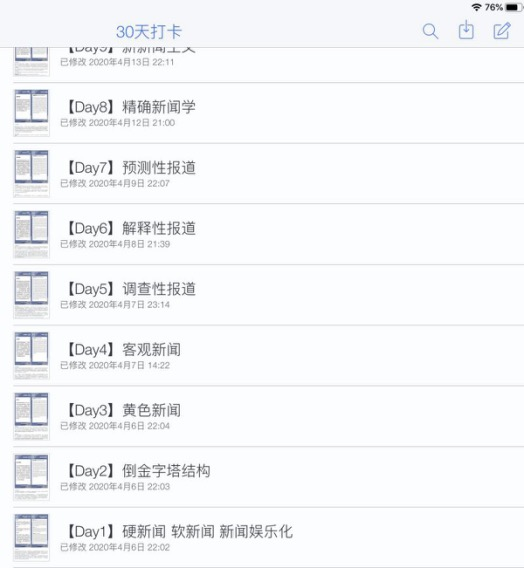

# 17-广告-章毓婧-厦门大学    

## 基本背景

> 综合排名：1/53
>
> 绩点：4.13/5
>
> 四级：582
>
> 六级：591
>
> 奖证：国家奖学金；计算机设计大赛国二省一；One Show中华青年创意奖铜奖；各类广告赛事奖项若干 
>
> 科研：在《科技传播》期刊发表了一篇论文；主持2019年国家级大学生创新创业训练项目；参与2020年省级大学生创新创业训练项目；参与我院老师申报的课题

## 保研结果

> 最终录取学校：厦门大学广告学
>
> 其他录取结果：
>
> * **夏令营优秀营员:**
>   * 四川大学广告与媒介经济；中南大学新闻与传播专硕；山东大学新闻传播学；暨南大学新闻与传播专硕；中国科学技术大学新闻传播学；厦门大学广告学
> * **预推免offer:**
>   * 厦门大学广告学
> * **被刷:**
>   * 武汉大学广告学（未拿到优营）

## 学习方法

由于本人是拖延症懒癌十级选手，所以在3月到6月最早的北大汇丰和南大夏令营开始这个时间段内，我一直处于一种很松散且零碎的学习状态，就导致夏令营前期我十分焦虑和慌张，大家千万不要学我！

在这几个月里，我主要是在看一些新传的基础教科书，例如《新闻理论十讲》《新闻学概论》《传播学教程》《大众传播理论：范式与流派》《大众传播研究方法》，虽然有一些没有看完，但是这个过程相当于拾起我们大一大二遗忘的专业课内容，也可以给自己梳理一个大致的框架，这些内容我个人觉得不用背诵，理解就好，做到“心中有数”。

然后我记得四月份的时候，我参与了小小班的“30天打卡计划”，师兄师姐每天会在群里发布打卡词条的卡片，进行讲解并留下思考问题。这个计划对我来说最好的就是利用了碎片时间进行学习，就算当天没有学习也不至于一天都一无所获，而且词条卡片是中英文对照，也相当于为保研的英语面试做点准备。除此之外，我就是利用玩手机的闲暇时间看看考研保研公众号的推送，比如一些热点合集、传播学理论梳理总结、新传名词解释等等。

夏令营结束之后已经有了一些保底的学校，而我想要冲刺的院校都集中在预推免阶段，所以我想着这段时间得好好静下心来“抱抱佛脚”。大概从八月中下旬开始，回到学校生活开始规律起来，我就基本每天从早上九点去图书馆呆到晚上九点，中间给自己留了一些午休、吃饭和休息时间。这一个月左右的时间，想要再看基础教科书是收效很低的，而且夏令营的经验告诉我，保研院校的面试基本上不会考察特别基础的内容，他们的提问方式都是很灵活、跟当下热点紧密结合的，所以我就决定利用了小小班整理的热点专题材料，根据重点的专题内容来阅读论文，形成自己的思考。

这段时间，我先是跟着小小班的课把《范式与流派》和《大众传播研究方法》认真梳理了一遍，然后快速阅读了《广告学概论》《网络传播概论》《当代广告学》，见缝插针地看了两三本新传“课外书”，其余时间就是先阅读重点专题论文并跟着课程进行学习和总结。

除此之外，我还整理了一份面试自测题。这个自测题包括四个部分，首先是我根据自己的和其他同学的夏令营经验，再结合往届学长学姐的经历和简历总结了一些保研面试高频问题，其次是自己简历很有可能被针对问到的问题，第三是根据小小班热点专题设置的一些时事问题，最后是一些英文问题。有了这份自测题，我会简单整理一个回答提纲，这样在面试中被问到我就可以做到胸有成竹，即使有一些新的问题，我也能快速get同类规律而不会显得手忙脚乱。虽然预推免阶段我的简历大部分时间都没有通过冲刺top院校的初筛，我的准备也基本上没有派上用场，但是总体来说这是我效率最高、最有收获的阶段。

## 院校经验

因为我本身是一个非常热爱广告学的学生，所以我研究生的目标也是想继续深耕广告学领域，因此我在院校选择上就更看重该校广告学的综合实力，地域和985 211问题就不在我首位考虑的范围内。就在夏令营开始前不久，我才确定我的目标为中国传媒大学广告学院，但有趣就是你不知道在保研过程中会有怎样的突发情况，也许你的梦校一夜之间就可以改变，是机缘和巧合成就了最终圆满的结果。

### 1. 四川大学夏令营

川大夏令营安排了一些学术讲座，但可能因为是文学与新闻学院，比较看重的是文学方面，所以讲座也是跟文学专业相关的一些内容。我申请的广告与媒介经济专业面试的时候先让我进行自我介绍，之后院长就cue了我在系统里填报的意愿导师来对我进行提问，针对我的大创问了我关于数字人文方面的内容。我当时特别慌，脑子一片空白，对这个领域一点都不了解，只好闲扯了一些内容，老师好像就并不是特别的满意，他觉得我有一点答非所问，之后我又补充了一些内容，他就没有继续再问下去了。然后院长问了我关于未来研究兴趣、计划和研究方法的一些问题，最后还问了我读过什么书。我当时感觉特别糟糕，觉得第一个夏令营就出师不利，结果最后居然是综合第二的成绩拿到了优秀营员，可能是因为最后一道题我答了关于符号学方面的书，恰好院长和另外一个老师都是研究符号学的，可能就比较幸运。

### 2. 中南大学夏令营

中南大学面试的过程比较中规中矩，先是进行一段中英文的自我介绍，然后抽题环节我抽到了关于短视频发展的一个问题，我就简单的回答了一下。可能是因为我对短视频持有一些略微偏向负面的态度，所以老师就追问了一下。之后就是根据我的简历问了让我简单概括一下论文的研究结果。

### 3. 武汉大学夏令营

武大当时我是下午的第一个的英语面试，先进行一段英文自我介绍，刚说了几句话就被老师就打断了，然后对我提了三个问题，一个是课外活动是否有必要，二是你觉得基础教育是否有必要，三是你觉得上大学是成功的唯一途径吗。其实这几个问题就还好，不算特别的难回答。别的同学好像被问到过机器人可以取代教师吗这样的问题，就感觉武大的英语面试问题还是比较具有社会性思考的题目。专业面试的那天是先进行了自我介绍，之后有一个抽题环节，我抽到了程序化购买，这是一个比较偏广告的名词解释。我刚好是在面试之前看了这个内容，就把它大致的说了一下。说完之后老师就问了我关于大创的问题。其实总体来说我感觉答的还可以，最后我的背景基础分和英语面试分也都很高，但是就是不知道为什么专业面试的分低的离谱，导致最后差了0.1分没有获得优秀营员，也挺遗憾的，不过这也可能是“塞翁失马，焉知非福”吧。

### 4. **山东大学夏令营**

山东大学的新闻传播学给我感觉是比较传统的，但是他们的院长和老师都非常的有激情，热情澎湃，因为他们在短短几年时间内进步非快，可能未来发展潜力也会很大。山大的考核方式是做PPT进行一个自我介绍，在5-10分钟左右。我在PPT里边放了一些个人情况，以及未来的研究兴趣和方向，是关于直播带货的，所以老师在提问的时候，就问了我关于只薇娅直播的一些问题。紧接着后面又问了大学对我影响最深的一本书，我就说了我在广告学入门的书，整个面试的过程也就是比较中规中矩的。

### 5. 暨南大学夏令营

暨南的夏令营办的也特别的认真，他们办了一个传媒领袖讲习班，有一些非常著名的国内外新闻传播学大牛来研讨相关问题，还设置了可以跟老师们近距离的沟通和交流的环节（LT老师真的非常幽默可爱）。暨南大学新闻传播学院给我的感觉是研究方向很前沿很新颖，我当时就对一位老师提到的广告音乐非常感兴趣。然后恰好第二天专业面试的时候自我介绍完，被老师直接用英文来提问我未来的研究兴趣，我就提到了广告音乐以及听过讲座之后受到的受到的启发和感想。之后另外一个老师又用中文问我参与的一个项目，最后就问了一些通过了哪些学校啊，对暨南大学印象怎么样啊，会不会来暨南啊这一类家常话题，整个氛围就很轻松愉快。听别的同学说早上早一点面试的同学好像会被问到英文名词解释的题，比如说议程设置之类的，可能到后面老师就会针对情况调整问题的难度吧。

### 6. 中国科学技术大学夏令营

中科大真的是一个非常壕的学校，给我们寄了一个夏令营的大礼包，虽然因为疫情没有办法线下举行，但是还是给我们发了夏令营的营服，还有书包、手绘地图、本子、笔之类的周边，超级nice。然后科大夏令营的整个过程也非常的充实，有云游科大，还有一些导师讲座介绍新传和理工科如何碰撞产生火花，还把营员分为了小组进行了集体自我介绍以及才艺展示。

最后一天的面试先是进行自我介绍，老师根据简历问了我的广告设计是偏电脑还是绘画和大创的内容，因为我是在最后面试的，之前和我一起做大创的同学在前面已经面试过了，所以老师再再次看到相同的大创内容就很惊讶，发现三个人都来科大面试了。后面就开始跟我唠起了家常，比如问我们是怎么认识的呀等等。科大给我的整体感觉非常轻松，老师们都特别的和蔼可亲，也很幽默。

### 7. 厦门大学夏令营&预推免

厦大的夏令营可以说跟科大很像，也是非常非常的用心，给我留下的印象很深。厦大的夏令营首先一入营就要大家在群里自行组队寻找同伴，因为后面会有破冰游戏环节和各个小组的展示环节。第一天开始是让每一个专业的系主任都来介绍一下专业特色及师资力量，让大家对于厦大新闻传播学院有一个整体的了解和认识。

接着第二天和第三天举办了三场圆桌论坛和硕士生导师恳谈会，这个圆桌论坛的设置真的非常用心，老师们都在一个录制棚里畅聊，围绕主题进行思维的碰撞，然后我作为观看者和参与者也深受启发。在圆桌论坛中老师们都是自由发言讨论，并不是提前写好了演讲或者制作好了PPT的讲座形式，就让我感觉到一种开放包容的学术环境。这三场圆桌论坛也是分别针对三个不同的专业所设置的，这样既“术业有专攻”又具有整体性没有割裂感，不管选择什么专业的同学都可以倾听、理解和感受。恳谈会基本上是一对一或者是一对多的面对面交流，可以非常近距离的和自己感兴趣的老师进行沟通和交流，了解他们的研究方向和性格特点，让我感觉非常好，我也正是通过恳谈会认识了一位非常有“眼缘”的老师。第四天是进行一个学长学姐的答疑解惑的环节，还有就是云游厦大的直播。就可以直观地感受厦大校园的美，而且因为校园太大还是兵分三路进行直播的。

但是厦大夏令营的考核并不是面试或者笔试，而是有三个“作业”：第一是三选一的题目，分别针对新闻学、广告学和传播学三个不同专业的学生，三题任选一题作答即可，新闻学和传播学是要撰写研究计划，广告学则是让我们选择五位广告系的老师，根据他们的性格特点、培养学生的风格，结合自己的兴趣爱好，点评一番，谈一谈导师期望等等，就是很灵活有趣的题目；第二个是根据三场圆桌论坛选一个自己感兴趣的撰写感想；最后一个就是撰写一下夏令营期间的整体感悟。因为厦大夏令营往年是都是只招收985院校的学生，去年可能因为疫情放松了一些，所以我才有幸能够进入到夏令营当中去，在此之前，根据往届经验，我是从未想过能够进入厦大的。所以在这种机缘巧合之下，又认识了非常喜欢的老师，感受了厦大非常好的学术氛围和校园环境，我的梦校一夜之间就发生了改变。

预推免的时候，厦大分为了专业面试、英语面试和思想道德考核。英语面试提问了我常用的社交软件，让我简单介绍一下。然后专业面试不需要自我介绍，问了我非常广告的题目，让我为厦大一百周年校庆做一个策划。因为这几个题目都不是特别难，也在我的专业范围内，所以我个人感觉答的还不错，最后也是顺利的去到了厦大。

## 个人经验总结

* 首先我觉得大家在夏令营之前一定要好好利用起来三到六月这几个月的学习时间，因为这可能是你往后仅有的能够系统学习的时间了。因为在夏令营开始之后，不停的准备简历、个人陈述、面试等等，你是没有时间再进行完整的学习了。而夏令营到预推免期间时间也比较短，不能够很好的做到知识点全覆盖。

* 其次要对自己想去的院校有一个比较清楚的规划，比如目标院校、保底院校、冲刺院校等等。虽然后期有可能还会变化，但是这样在前期的复习中会更有目的性和方向性。

* 还有一个就是在学习过程中我们的确需要钻研，但是也不需要对一些细枝末节太过于纠结，因为我们保研和考研的情况可能有所不同，保研期间你面试的过程可能也就短短几分钟。如何在短短几分钟内让老师感受到你的能力，就是我觉得要在复习过程中提高ROI“投资回报率”，就是在专业课学习的基础上结合热点，学会根据语境的变化灵活变通。

* 关于英语面试的话，大家现在也可以找到自己的英语学习小组，固定时间进行一些英语的对话练习，我当时就是没有进行这样的准备。虽然有的学校并没有英语面试，但有备无患嘛，谁也不想因为英语薄弱与梦校失之交臂。而且这也是一种锻炼和提升，至少能够让你在面试的时候不再紧张，能够自信的开口说。

* 还有我在复习当中面临过的问题就是关注的考研保研公众号过多，有被“花花世界迷了眼”的感觉，不知道该看哪一个。我觉得大家可以前期就选择好自己非常喜欢非常对胃口的两三个公众号，跟着他们进行一些热点追踪和知识点的梳理，有的放矢，把其他的公众号作为简单的补充，否则有可能就不知道重点是什么，在碎片的信息当中迷失了自己。

> 拿我番茄TODO的壁纸作为结尾吧，“很疲惫的时候，再坚持一下，一切都值得。”