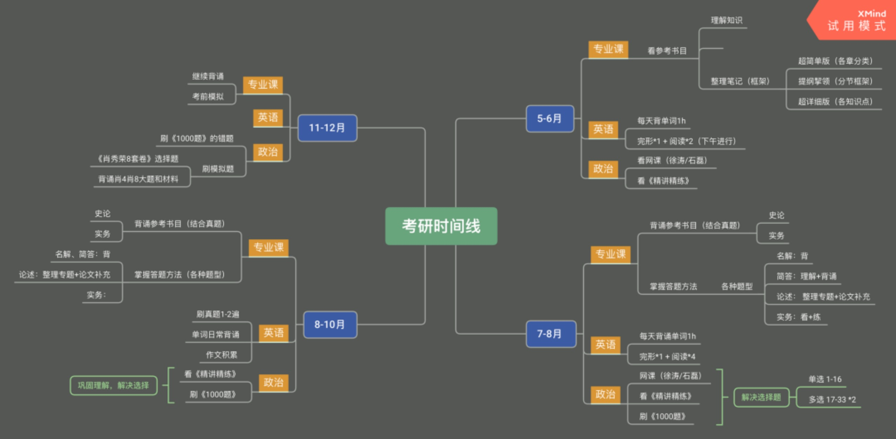
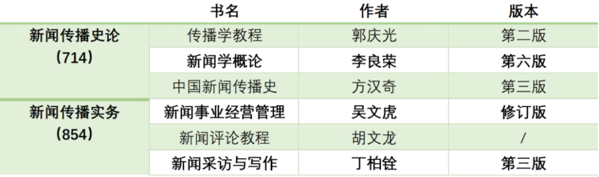
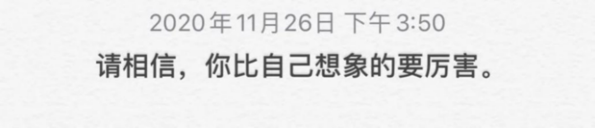

# 17-广电-阿泽-湖南大学

Hello大家好！我是阿泽。先说一下我的情况吧~

一战，报考湖南大学学硕，初试成绩392，政治76，英语73，专业课一130，专业课二113。

接下来我们要明确的是，整个考研初试过程中，在哪些时间节点做哪些事。

## Step1 择校

**择校是一件必须深思熟虑的事。**我身边有好多小伙伴由于各种主客观原因中途换了学校，这其实非常影响心态和状态。

因为每个院校的参考书目多多少少都会有些区别，所以最直接的影响就是：你比你的竞争对手们少了很多复习时间，而且到后期的时候你会经常拿这件事怀疑自己。

所以，经过反复比较和综合考虑选择一所你最向往的学校，就不要动摇了。

 如果你心中已经有一个你向往已久非考不可的院校跳过这一步即可。

*如果没有，建议大家这样做：*

1、网上搜索报考学科的第四轮（即将第五轮）的学科评估排名表；
2、衡量自身实力后，在各个层级选择1-2个自己心仪的学校，收集信息；
3、综合比较城市、院校、学费、住宿条件等一切你关心的要素后，确定1-2个报考院校和报考方向（学硕/专硕）；
4、择校完成后，到该院校官网或询问往届学长学姐获取参考书目，搜集近年的真题，了解出题风格。

## Step2 备考

您有一份考研时间线，请注意查收~

（以上时间节点可根据个人复习进度和学习情况调整）

知道大体的时间线后，就是逐一攻破。

在我看来考研就像打游戏一样，只要知道每个关卡需要做哪些事，剩下的就是练习和坚持。

### 1. 专业课

（湖大学硕参考书目）

* 专业课一

714卷的主要题型是：**名词解释（6\*5）+简答题（3\*15）+论述（3\*25）**

**新闻传播史论的三本书非常重要！需要反复背诵。**因为714卷主要是在这三本书上出题，名词解释可能会有一道超纲题（中新史部分），但绝大部分的分值都是认真背书就可以拿到的。所以！背这三本书的时候一定不能偷懒，要扎扎实实。

这三本书到考前我总共背了8遍，要能做到每个知识点都**熟记于心**。

* 专业课二

854卷的主要题型是：**名词解释（5\*5）+简答（3\*15）+消息改写（1\*40）+媒经管案例题（1\*40）**

新闻传播实务的三本书相较而言比较易懂，一般来说通读一遍后就可以开始背诵了。

但《新闻事业经营管理》这本书大家在阅读的时候一定会觉得很晦涩，我备考的时候读完这本书头都大了，瞬间想弃考（bushi）但只要理清楚重难点以及考点，就没有那么难啦~

实务的话，在后期需要多加练习，平时可以多看看《人民日报》《光明日报》等的消息和时评板块，关注一些评论类的公众号，先从模仿开始，一步一步来。

* 时间规划和复习建议

**『从完成择校 - 5月』**

这个阶段我一直在看书，我的阅读顺序是《传播学教程》→《新闻学概论》→《中国新闻传播史》→《新闻事业经营管理》→《新闻评论教程》→《新闻采访与写作》。

其中传播学和新闻学我看了3遍，中新史看了2遍，实务的三本书各阅读一遍。建议是把参考书目仔细地阅读2-3遍。（每个人的理解能力和吸收能力都不一样，不要过于看重次数，而是看理解程度）

这一阶段主要是接触这个学科，入门。当你觉得对书目的理解没有什么问题后，**可以尝试按照自己的逻辑整理一份框架**，帮助后期理解和背诵。

**『5月 - 6月』**

看书看得快、吸收得比较好的小伙伴这个阶段可以开始背书了，背书就是按照前面整理出的框架，从章-节-知识点，逐个拿下，不要着急，背书是一个很痛苦的过程，但俗话说“基础不牢，地动山摇”。

我刚开始背书的时候也贼焦虑，因为总是记不住，但是其实大家都是一样的。只要找到适合自己的背书方法，就会越背越快乐！

史论的三本书我到考前一共背诵了8遍。但在我看来，第一遍是最重要的。第一遍背诵的时候我背得很慢，用了超过一个月的时间，但我发现第一遍如果记得很牢，后面会容易很多。还有，希望大家第一遍背诵的时候不要偷懒，因为所有偷过的懒后面都是要还的。

**『7月 - 8月』**

这段时间需要继续背书，但是需要**结合报考院校近几年的真题，有针对性地背诵**。同时还需要开始接触实务，练习答题，积累素材。

建议可以用一个半天的时间，整理一份关于近十年真题的考点考频统计，这样背诵起来会更有方向。

比如经过整理，我发现中新史第六、七、八章是出题老师的“宠儿”，而传播学则第十章考得最多，几乎每一个点都考过，854卷更是有很多重复考的知识点。

这一阶段也要开始背诵实务的三本书了，我实务的背诵开始得比较晚，到后期明显感觉时间不够用，所以建议大家8月就开始背诵854的三本参考书，会更稳妥。

关于实务练习，包括但不限于消息改写、报道策划。这个部分可以在7月左右关注一下阿飞新传考研公众号，每周都会更新练习材料，按要求提交后会有公益批改~也可以和研友们搭伙练习互相批改。总之就是多练。

**『8月 - 10月』**

继续背书，继续练题，这个阶段就是在原有的基础上升华，不断扩充知识库。同时10月开始需要有计划地整理热点专题了~

关于热点专题的整理，首先要先梳理出有哪些专题，再去知网上搜索相关论文，梳理一类题的答题逻辑，摘录答题语料，积累案例，自己整理一份专题的答题模板，这份模板很大概率在复试的时候仍会用到。

同时保持实务的练习，尽量做到一周两篇以上的练习频率。

这一阶段有很多同学会放弃会犹疑，所以我们更要调整好心态，不要轻易地被身边人影响，安心做自己的事就好。

**『11月 - 12月』**

冲刺阶段，不仅需要“输入”，还需要“输出”，这段时间需要进行考前模拟，查漏补缺，重点突破。

除了正式的模拟以外，自己也要每周拿出一天的时间进行全真模拟。我是在每周日，利用历年的真题，掐好时间，闭卷练习。

这个过程是非常有帮助的，不仅可以帮我们提高答题速度，还可以增加答题手感，在“思考”和“输出”的过程中，我们脑中的知识点会更加深刻。

以及，每一次模拟后的反思可以帮助调整我们下一周的复习策略，使学习更高效更有针对性。

 

### 2. 公共课

* 英语

**『单词』**

单词需要从现在开始，一直背到考前一天。不要偷懒！！单词是基础，不认识单词，啥都白扯。

我是用APP背单词的，扇贝、不背、墨墨换着用，背完一轮换一个APP。

当然，也有同学喜欢用纸质书的，身边用的比较多的有恋练有词和红宝书。这个完全可以根据个人喜好来选择。
**PS：我在背单词的过程中是没有看视频的。个人感觉有点浪费时间，当然这个也因人而异，选择适合自己的方法就可以啦。**

**『阅读』**

这里说的阅读主要是指那四篇，这是大头要抓牢。阅读有技巧，但不要唯技巧论，技巧只是帮助你提高做题的速度和正确率。
阅读我看了唐迟老师和陈佳凝老师的课，也有很多人推荐唐静老师。看完课后最重要的是多练多实践。

**『翻译』**

翻译其实是很看基础的东西。单词背会了，学一学怎么拆分句子、划分意群，剩下的就是练习了。

关于练习，两种方式。一是跟某个机构的每日一句活动，最好有解析和点评的那种。二是自己找一些真题的手译材料，每天练习。

我在后期听了宋逸轩老师的课，老师讲的很细致，不同基础的同学应该都能学到东西。配合老师讲的技巧再多加练习。能够坚持做到以上几点的同学翻译绝对不是大问题。

**『作文』**

**作文最关键的是要自己总结出一套各种类型话题全都能打的模版（划重点！！非常重要！！）**
这个主要在9-10月开始，不需要开始太早，也不能太晚。

作文重在自己积累，基础一般的同学可以留意看到的好词好句，专门拿个小本子记录下来，反复翻阅；基础比较不错的同学就注重句型的变换就好啦。

我没背王江涛老师的作文（实在太多了，用的人也多，就算考到也不敢照着写）

最后是看了刘晓艳老师和石雷鹏老师的作文课，主要还是自己多练，可以拿2010-2021年的真题，每一篇都尝试用整理好的模板写一遍，再调整完善模板。

**『七选五+完形填空』**

这两个部分我是放在一起学习的。大概在10-11月，我开始练习这一部分的内容。

七选五和完形填空我都听了刘晓燕老师的课，七选五还听了唐迟，完形填空听了宋逸轩。我个人认为，七选五晓燕老师讲的好，完形填空宋逸轩老师讲得更系统和普适。

这个部分真的不用太担心，说得实在一点，因为它占分比较少，所以大家不要费太多的时间在这个上面，考研时间很有限，要做一些性价比高的事。

举个栗子，我最后完形填空还剩四道题没来得及做，全部选了一个选项（但我并不是倡导大家这样做，有时间的前提下当然认真做得分更高啦）我只是想说在复习时间很紧张的情况下要学会有所取舍，分清主次，大家懂我的意思吧～

**在这里我多说一句，不要刷模拟题！！！好好利用好真题，留出最近三年的用作冲刺阶段的全真模拟。**

* 政治

政治坦白讲我准备得挺早的。从5月末就开始看涛仔的课了，配合核心考案做笔记，整理知识点。同时买了肖大大的1000题，每节课听完之后再刷对应的题。

建议大家在刷题的时候，每一章拿一张A4纸，不要在题目上标记，方便后期反复刷，刷英语真题的时候也建议用这种方法。最后1000题我刷了3遍，后期主要针对错题进行刷题。

看完课刷完一轮题后我买了腿姐的背诵手册，配合腿姐的技巧班食用。这时开始有意识地背诵一些不熟悉的知识点。比如我历史不好，对时间很不敏感，就在史纲部分多费一些心思。

我会在每天晚饭后散步的时候和研友互相抽背，这其实是个很快乐的过程，比自己一个人背诵要有趣的多，而且记得也更牢。当然前提是你的研友比较可靠，不会彼此浪费时间。

**提醒大家要提前预订肖四和肖八**（早买早发货，早到手早刷题，早刷题早背诵）时间允许的话，可以多做一些老师的模拟卷，我在12月的时候做了徐涛8套卷+腿姐4套卷+王吉3套卷。这个可以根据自己的情况选择，千万不要贪多求全，精力如果实在不够用，那把1000题+肖4肖8吃透也完全够用。
最后，肖爷爷永远的神！

 

### 3. 关于报班

这一点也是因人而异，对于许多跨考的同学来说，报班是个不错的选择，会在复习时更有方向，可以少走一些弯路。

本科阶段的学习积累了一些知识，但我还是报了班。虽然报班的时候学长了解了我的学习情况后说我不需要报班，但我认为报班不仅是能更全面更系统地学习，更重要的是那份“陪伴感”，让我心里很踏实。

但不管报班与否，自己的努力和付出才是最重要的。因为最后到考场答题的还是你自己，不要盲从，选择最适合自己的才是最好的。

### 4. 关于研友

要找能彼此帮助、有效学习的研友。线上、线下皆可。 最好找一个报考同一所学校的小伙伴，学硕找专硕，专硕找学硕。建立百度云群，可以资源互享。

### 5. 关于学习安排

我是从3月开始备考的，3-4月的日学习时间在8-10h左右。

5月开始到暑假前每天稳定在10h左右。

说来惭愧，暑假是考研备考最好的时间段，但我这一阶段的学习效果反而没那么好，大多数时间都浪费了。

9月初回到学校开始恢复正常的学习状态，基本在12h左右。

最后11-12月冲刺阶段，日学习时长保持在12h+。

**比起学习时间来说，学习效率更重要**，但设想一下，你的竞争对手每天学10小时，你每天只学3小时，这个差距还是很大的。

我们都知道，量变引起质变，没有足够的“量”，恐怕也很难产生“质”。

但并不是要求大家都做苦行僧，要学会自我调节，比如每周拿出一天时间做自己喜欢的事，放松过后才能更好地学习。

偶尔某一天不想学习，也可以给自己放个假。当然如果你说你一周7天5天都不想学习，那我就要骂你了！（超凶.jpg）

### 6. 一些碎碎念

其实我在无数个辗转反侧失眠的夜里，都想了很多鸡汤，想着如果我最后做到了，一定要把这些话写出来。

结果就是每次早上醒来又都忘了。

言归正传，首先要叮嘱大家的就是——**考研再重要也没有健康重要**！一定要在保证身体健康作息规律的前提下再去好好学习高效学习。考研期间我头发反而变多了你敢信？

其次，要做好**每日每周每月计划**，把学习任务量化，这样可以随时回顾和调整，不至于在备考过程中丢失方向。列计划也是一门学问，一定要**量力而行，不可贪多**，否则一旦完不成会很打击信心。计划要**在实践中不断调整**，最后找到一个自己最舒服的学习状态坚持下去。

最后，**考研真的没有很多人吹嘘的那么累**（不是凡尔赛）我是一个心态很差的人，但是在考研的过程中我心态几乎没有崩过，虽然偶尔也会自我怀疑，但大多数时候都是开开心心的。

一个原因是家人朋友给了我很多爱和鼓励，学长学姐们也给予了很多帮助和陪伴。

另一个原因是，**那种知晓目标在哪里，只需要朝着它一步一个脚印走过去的感觉，真的很踏实。**

所以看到这儿的宝贝们你们也不要怕！**干就完事儿了！**

> 最后的最后，我想把一直告诉自己的一句话告诉你。

共勉♥