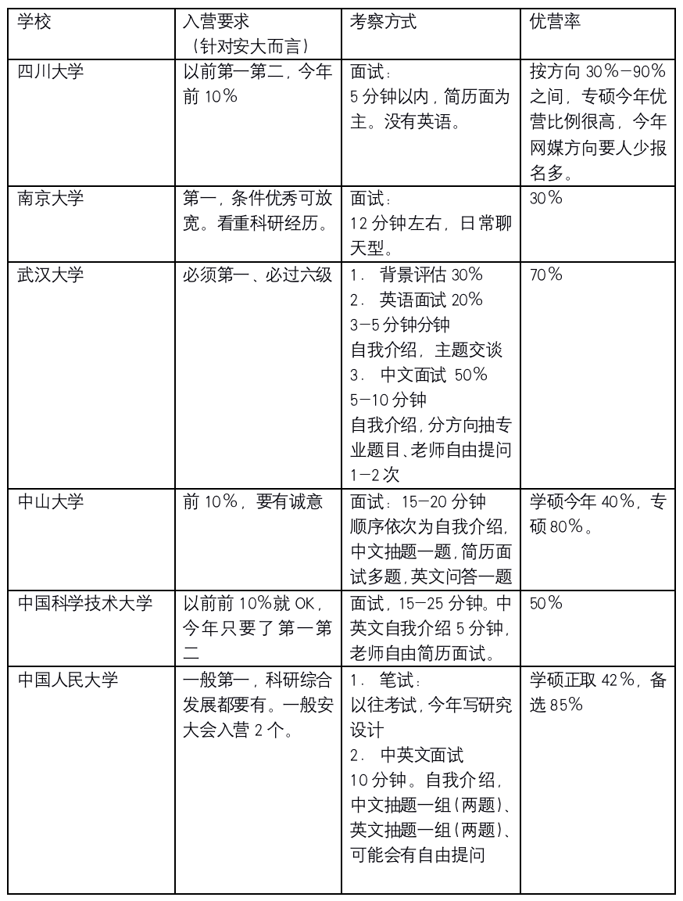

# 17-网媒-曹时雨-中国人民大学

> 朋友们大家好，我是来自安徽大学新闻传播学院的曹时雨，保研至中国人民大学传播学硕。个人基本情况是GPA：1/38，国普论文一篇项目若干、没有太大含金量的奖项若干、通过六级但是不高。我的优势是擅长搜集分析信息、有一定的科研基础，同时做到了综合发展。缺点是六级不高、没有太大的亮点。以下是我的保研经验，希望对你有所帮助哦。

## 保研结果

> 最终录取学校：中国人民大学传播学学硕
>
> 其他录取结果：
>
> * **获得offer:**
>   * 四川大学传播学；南京大学（不分方向）；武汉大学网络传播学硕；中山大学新闻传播学学硕；中国人民大学传播学学硕（正取）
> * **被刷**:
>   * 清华大学夏令营

## 保研心得

### 1. 上篇：准备篇

* 绩点和排名

排名不仅决定了你能不能保研，还决定了对方学校要不要你。对于普通211的学生来说，第一和第二是比较有竞争力的名次，甚至有学校只要第一。GPA是一个持久战，还是要靠一点点的努力，我这方面一直还不错，始终稳定在第一。

学习方法上我建议**多保持思考、课后适当拓展**，不要为了字数而字数，那种虚无的努力不会增长你真实的水平，学到东西了成绩自然就有了。关于刷绩点，我个人是比较反感的，但要是你们班同学都去刷了我觉得你也可以去选高分课，但是要**注意不要贪多嚼不烂**吧。

* 科研

科研包括科研项目、科研培训和科研成果。科研项目分为跟着老师做课题、学生科研项目（主要是大创和挑战杯）和能够培养科研能力的项目（最常见的是各种调研）。科研培训不常见，有的学校会有一些科研训练班什么的，一些交换项目里的科研课程也可以计入。科研成果主要是论文。这其中，**大创我建议是一定要做的**，既是一个科研方面的材料，同时也确实能够培养你的科研能力。和老师做项目既要看老师和你熟不熟，也要看你自身有没有底子。所以科研项目建议**大二下大三**上着手去做。

* 竞赛、荣誉和实习

竞赛荣誉和科研一样，是必不可少的经历，他佐证了你专业水平和综合发展能力。平时可以多关注一些比赛，有关于新闻类的、广告类的、纪录片微电影类的都可以去试一试啦，可以像学长学姐们请教一下经验，也可以看一下往年的竞争情况。竞赛大一就可以去尝试了。大二结束要是已经有了国奖，大三会比较省事。

实习的话学硕不是必须项，专硕最好要有哦。而且建议有**作品意识**，最后也可以打造一个作品集附在简历上。

* 英语

英语其实挺重要的，六级是必要的材料，而且保研面试也经常涉及英语。但是我一开始没有这个意识，所以六级也没有认真准备。建议大家认真准备六级，新传这边**普新建议500，国新550**。要想成为加分项需要600。雅思不是必须的，六级低分如果考试来不及可以考虑考个雅思。英语比赛获奖也算是英语水平的证明，同时也是奖项。

* 收集信息

大三的寒假基本已经定型了，这时候建议收集信息确认好推免时候的定位与计划。保研也算是“信息战”，有两个信息是必须的，一个是对**“自身情况的了解”**，包括评估个人材料（还可以查漏补缺）和了解本校学长学姐的保研情况，另外一个是**“对方情况的了解”**，至少要了解目标院校的筛选基本要求、考察形式和具体偏好。知己知彼之后就可以确定保研的定位和计划，也可以有**针对性地复习**（特定的教材、老师的论文）。

* 整理材料

大三下开学后只剩两项工作了：复习和准备材料。复习就是基本知识、热点和特定学校有针对性地复习，这里主要讲一下整理材料。很多同学对这件事情没有概念，其实它出奇的麻烦！！！第一要做个人陈述和简历，个人陈述就是一个叙述性的文章，简历多概括和数据，**一定要好好做**，因为对方学校又不了解你，老师审查材料和面试时候就看你交上去的东西。建议先准备好一个1500字的个人陈述，到时候根据字数要求删减即可。第二个是各种基本证明材料，主要是成绩单、排名、各种证明之类的，受疫情影响当时更麻烦了，建议提前把各种可能的材料准备好，多打印几份，送到学院和教务处盖章（欲哭无泪）。第三个是自己的获奖材料，没有奖状认可度会大打折扣，所以这个要提前准备好。最后是推荐信，一般要求副教授以上，准备两三封就绰绰有余了，如果有熟悉的老师给你写当然更好了。

### 2. 推免篇

推免分为三种，依次为夏令营、预推免、和九推（今年是十推），不了解的建议自行检索一下哦，有关于三者的区分资料还是相当多的。由于我夏令营期间就已经取得了想要的成果，所以就没有参加预推免和九推啦，所以主要给大家介绍一下我夏令营的经验。我根据之前确定的目标，依次投递了六所学校的新传，都入营了。下面这张表格是各学校的基本情况：

具体讲一下我的经历吧：

* 四川大学（6月上旬）

川大应该是夏令营最早的学校之一了，也是我保研推免的初体验，所以我印象还是非常深刻的。由于疫情影响，材料准备起来比较麻烦，所以我最后一天晚上才上传的材料，网站中途还崩溃了o(╥﹏╥)o 。所以大家材料一定要提前准备好！！！ 一开始特别担心川大不要我，毕竟去年只有两个学姐入营（外加六级低心虚），后来入营通知发了加群，文学和新传加在一起300多人，感觉我们院保研快一半的都在群里了。

川大流程就是入营外加介绍一天，然后面试一天。也许大概可能还有设备测试？面试时分方向进行的，战线也比较长（人那么多），川大的方向真的特别多：新闻学、传播学、网络传播、符号学、编辑出版学、新闻与传播专硕、出版专硕……但是每个方向录取指标都不多，传播学5个网媒3个，但是他俩报名的人都特别多，真的是重灾区。**大家报名的时候要根据自身情况合理选择专业**。

考核的内容方面传播学没有英文，听说别的方向有个别人被问到了？按以往的经验贴来看可能是因为**自我介绍用的是英文，据说是加分项**。中文内容就是自我介绍加简历面，不抽题。但是我偏偏就是被老师直接提问了知识点，问我了发展传播学。另外问了我论文操作化的问题。最后是几乎每个人都被问到的经典问题：你还报了哪些学校。我建议大家准备一下这个问题，可以合理作答但是不要直接撒谎老师会不高兴的。几天后结果出来了我获得了传播第一名，我当时正在我家楼下买咖啡，简直太高兴了，一蹦一跳地回家了！！感觉至少自己不会失学了，外加上川大优秀的住宿环境（双人间小客厅健身房了解一下）和食堂，我非常地心动。

* 南京大学（6月上旬）

南京大学的通知是所有学校中最早的，四月底还是五月初就发通知了。我对南大新传也非常景仰（放在了冲刺里），果断报了名。后来我和院里两位广电的同学一起入营了。南大夏令营非常轻松，收获也很多。要是线下办的话可能还有自助餐、山庄住宿、篝火晚会、看电影和老狐狸见面会（太可惜了）。今年就是听讲座和面试。讲座是这么多学校中我觉得最好的！学界业界都有涉足。

以往会有一个笔试，主要是一些人文社科综合知识的考察，题目非常开放，不会让你无话可说。今年没有了笔试，面试也从无领导小组讨论改成了个人面试。没有英文，一分钟自我介绍结束后老师会和你聊天，老师不会主动问理论知识哦，但你要是提到了老师还是会追问的。整个面试氛围非常得和善。最后我也拿到了优秀营员，南大还把证书寄到了家里。

* 武汉大学（6月中旬）

武汉大学是我准备的重点，（可能只是了解得比较多），它也是分方向报名，新闻、传播、数字媒体，底下还有相当多的小方向，我报名的是传播学里的“网络传播”，也是报名人数最多的。武汉大学的**背景评估细则**我还是没有摸清楚，它大致会根据学校排名给一个基础分数，然后如果有哪一个部分突出，会加分，我最后的背景评估是63，达到了我的预期（平均分只有52）。

武大夏令营是三天，但是第三条好像只有闭幕式，不去也许也行？面试网传1组是先英文再中文。英文面试是外语学院的老师，只会就一个主题提问，大多就是问问你怎么看。只要英语不是完全说不过去老师是不会为难你的，大家基本都是80+。专业面试的题目说实话很考验运气，里面有基础概念、有最新的现象、也有具体的问答。我被问到了一个我不知道的概念“内容社交”，我根据内容和社交的关系答了一点，自由问答我被问了用过的量化研究方法。由于抽题答得不好，我当时感觉我要凉了。好在结果非常好（事实上证明老师还是很仁慈的，**不要求你一定要会一个概念，而是考察你知识的整体储备**）。

* 中山大学（6月中旬）

认识我的人几乎都知道中山大学是我的最爱，所以我个人简介做的非常用心，老师们的论文和研究方向我也认真地准备了。中山大学的流程就是学院简介、简短的讲座和中英文混合面试。面试时间结束以后我才发现非常长，我面了大概有20分钟还要多。

虽然我简历里面处处Q老师们的研究方向，自我介绍里也有很多特意留下疑问的点，但可能是我太明显了吧，有关的问题一个都没有被问到？我抽到的中文题目是一个喜欢的社会科学理论，这个还是比较简单的，听说有同学抽到了新闻史（害怕.jpg）。我这个题几乎说了有10分钟了，从我为什么喜欢这个社会学的理论，到它和新闻传播学的交集、再到它和我科研经历的关系。最后被老师打断了，一个老师说感受到了我的热情，然后大家都笑了。后面中文自由问答居然问了我写在角落里的互联网+医疗健康。英文题目是和未来学业有关的。

老师说由于太难取舍，所以优营发得比较迟，似乎是第三天傍晚才公布结果。在老师发表一段煽情言论后，要到公布优秀营员环节了，我都心都提到了嗓子眼，然后第一个居然就是我！！！真的太开心了，这么多年的梦想感觉总算有了回音。

* 中国科学技术大学 （6月下旬）

科大在我家门口，所以我报了它，给我们邮寄了纪念品，针不戳，我可喜欢科大的牛牛了，在书包上挂了有一段时间。它的战线特别长，好像有五天？有才艺展示和“云参观”活动。具体内容原谅我出去玩了，所以不太清楚（惨痛教训是我差点错过了面试！！！）。面试自我介绍有5分钟，问答也特别久，我被问了有七八个问题，比较细致，**科大是我参加的唯一一个会根据成绩单问问题的学校**。

* 中国人民大学 （6月下旬）

人大是我冲刺的院校，因为已经有了很多offer外加我觉得我铁定没戏，于是就没有太在意。能够入营我就已经觉得相当不可思议了。人大夏令营一向短平快，学院介绍和老师简短讲座后就是考核，今年笔试改成了研究设计。然后面试先会有一个等候会议室，快到的时候会叫号再次入场，我一进去就看到了杨保军老师坐在中间，但是是旁边的老师进行面试指引，先是自我介绍，然后是中文抽题，可以换题，有一分钟准备时间。题目是成组的，也就是要换都得换，所以不到万不得已还是别换吧。我一道题是马新观，另外一道题目是名著。显然我都没有准备过。英文题两道一道生活题，一道专业题。我抽到的生活题是food，我听成了book，还反问了老师。结果英文面试又把老师逗乐了，我怀疑我适合去做喜剧演员……

> 人大结束后我就和好朋友去杭州玩了，喝喜茶的时候收到了正取的喜讯，喜大普奔完结散花啦~ 大家也要加油哦！