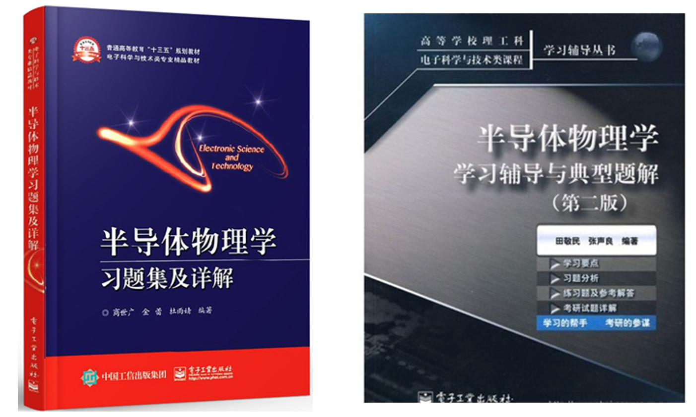
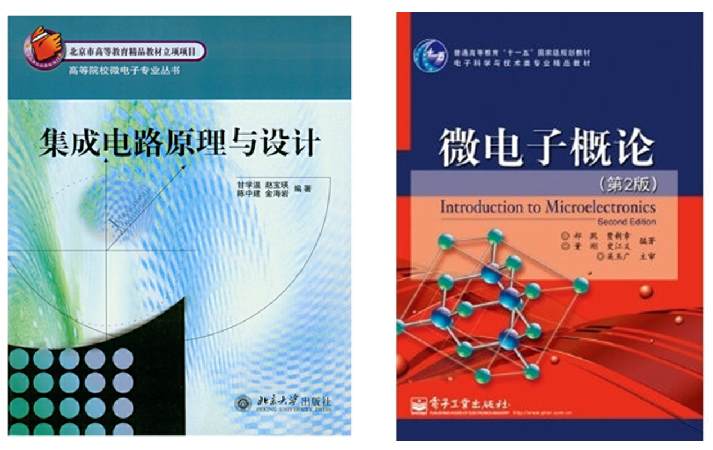

# 17-微电子-张小凡-中国科学院大学微电子学院

## 一、前言

大三的同学大部分都是会面对升学还是工作的问题的，我当时是非常坚定的选择升学，首先是觉得本科我所学到东西不足以支持我更好的走下去，也感觉到读研究生就像要读我们要读高中要读大学一样是必须读的了，最终是觉得考研的竞争一年比一年大了，担心以后觉得工作不顺心再去考研面临挑战更大了。

选择考研同样需要一定的勇气，因为考研也会有可能失败，有三分之二的人可能考研失败。我觉得失败的原因有这么两个，第一是自己选择的学校与自己能力不相符，盲目的追求那些名校且竞争激烈的的专业，没能很好的评价自身的能力。第二个就是不能持之以恒，三天打鱼两天晒网，考研是一个需要坚持的事情，不能轻易的松懈，因为一旦松懈了要回到曾经专注的状态会很难，要做到一鼓作气。

那如何选择和自己实力相符的学校呢，我觉得尽量选择一些先前有学长上岸的学校，因为同为安大学生，其实水平相差不会非常大的，已经有学长上岸说明对于我们来说也不是不可能。有的同学复习比较早，觉得自己各科复习的非常顺利，那可以冲击一些名气大竞争激烈的学校和专业，当然这样很冒险。如何做到持之以恒呢，我觉得应该是前松后紧，准备特别早的同学，前期可以多看看网课，稍微刷刷题目，不用过于紧张，将每天复习的时间慢慢增加，比如后一个月比前一个月每天复习时间多一个小时或者半个小时，每天如一日一直到考研结束。当然也需要适当放松，一个月放松个两天，月中一天月末一天，选择一些自己喜欢的事做一做。利用好假期，主要是暑假，暑假非常重要，一定要将暑假的每一天充分利用起来，因为这两个月不用上课，学校不会有各种琐事和烦人的事情，这两个月是最高效的时间段。下半年主要是国庆中秋节，这两个节日要坚持和平时一样，不要回家或者出去玩，因为考研难免会遇到一些事情耽误，比如生病、体测、学校拍毕业证照片等等，我们的时间应该留给这些无法避免的事情，只能压缩一些放松的时间了。

## 二、学校选择

因为我是微电子专业的，所以当时选学校主要考虑的是9所示范性微电子学院，当时主要考虑的是东南大学和中科院微电子学院，但是东南928考的是数模电，数模电是我大二学的已经忘了很多了，加上是两本书所以觉得有点吃力，我就选择了中科院的804，中科院有两种选择一个856数模电一个804半导体物理，半导体物理当时大三上刚刚学完，大三下正好在学半导体器件，所以觉得很熟悉，加上中科院还有15级的直系学长，也给了我很多帮助，所以我很早决定考中科院，在学校的选择上面也没有很多的纠结。

## 三、数学学习

我考的数学一，数学考的不高，刚刚及格，但是我看在最后大家成绩当中排在中间，说明有一半人数学都不及格，如果数学分数高会有很大优势。我寒假在家断断续续的找了些数学网课看了看，最后选择一直跟汤家凤的数学，因为他讲的很基础。如果准备早的同学还是建议把几个主流老师的看看，然后选择一个适合自己的老师跟下去。我当时就买了一本李正元的复习全书，没有买别的复习资料，线性代数买了李永乐的线代辅导书，也是全程跟的李永乐，概率论跟的余丙森，我觉得余丙森讲的不行，最后考试也主要失分失在概率论上面。现在觉得当时刷的题太少了，到后面觉得自己后劲不足，我到8月15号左右把复习全书刷到了三重积分那里，把线代和概率论过了一遍。到学校有期末考试然后还有一些其他的事情耽搁了大概3个星期左右，等到国庆节结束了之后我买了真题卷子，我没有照着卷子刷题，而是按照题型写的，感觉这也是当时的一个错误选择，当时应该定时刷的，这样不仅效率高而且也让自己适应了考试节奏。真题大概复习了一个月左右之后就是写模拟题了，写模拟题感觉错的很多，特别是写张宇的卷子，张宇的卷子觉得太难了。后面也是觉得数学复习最差的，没能达到自己的预期，数学一定要每天都写，我中间耽误了一段时间，导致有些东西有些遗忘，还有我觉得我的题刷少了，前期题刷少了，导致自己基础没打牢靠，后面写题就出现各种问题，比如有些方法用在了不能用的地方自己不知道，有些公式不记得，有些公式限定条件搞不清或用错了，这都是前面练习不够导致的，不能光看课不练习，一定要二者结合来。我的数学一天大概4个多小时复习，我觉得数学应该比其他科目的时间应该更多一点。

## 四、英语学习

中科院学硕考的英语一，专硕考英语二，我考的英语二，我暑假时候想考学硕所以买了英语一的资料，后面因为学硕名额减少了，我就选了专硕，英语二比英语一要简单一些。我前期我是看了刘晓燕讲的语法课，我觉得讲的挺好的，语法对写作和翻译还是有帮助的，我还听了一些单词课，我觉得完全没必要，还不如找个背单词APP每天背一点单词，听课之余就一直刷英语一的真题，第一遍大概一篇阅读理解错两个左右。后面换英语二后感觉做英语二的题很轻松，所以考英语二的话，前期还是建议做英语一的真题，到考试前做英语二的卷子基本都能考70分了。国庆过后我就买了王江涛的作文，每天早上背作文一个小时，每种类型作文都背一下，之后我写作文的时候觉得这个方法很正确，因为自己储备了很多句子，写的时候不至于无话可写，英语一天大概3个小时左右。

## 五、专业课学习

中科院的半导体物理用的教材是刘恩科主编的，考到12章，当时我们学校半导体物理上到第九章，后面三章没有上，不过后面三章主要可能出计算题的是霍尔效应，其他的主要是简答题或者名词解释所以不用太担心。专业课是从7月开始的，我找了西电柴长春和复旦蒋玉龙的课听的，这两个讲的都是挺不错的，听课同时我也整理了可能考名词解释和简答题的地方这些东西边记边背，到8月15号左右课听完了。我买了本田敬民的半导体物理的习题集来做，据说题目类型很全，一直做到国庆。国庆七天我把课本上的需要掌握的公式全部自己独立推导了一遍，我觉得掌握这些公式推导对我后面做题有很大的帮助，因为这不仅有利于记忆公式，而且对简答题理解很有帮助，之后我又买了本商世广主编的习题集，后面把这本习题集每一题都做了一遍，这个习题集上的简答题很全，名词解释不是很全，但是一些主要的名词都在上面，所以偏门的名词解释要靠自己找了，这上面计算题非常经典，都是其他学校的考研真题。11月份我就每天花一个小时背名词解释和简答题了，然后就是写真题，真题都可以在网上买到的。真题做完了就继续做买的两本习题集，把还不会的标记，然后反复做不会的题，最后我的半导体物理考的还不错，我的半导体一天时间和数学差不多。下面两个图是我用的两本习题集的封面。

## 六、政治学习

我在暑假的时候就只听徐涛的课，徐涛的课很适合理科生听，有助于理解，完全可以开倍速看，到国庆前我已经把基础课听完了，我就每天刷1000题，建议先不要在书上写，用一张纸写，把1000题大概刷个两遍。到11月左右我就每天晚上背背读读风中劲草，这样我觉得对写选择题有些帮助，有些东西记住对做选择题有帮助的，后面各个老师都开始出模拟题了，把市面上所有的卷子的选择题都刷一遍，把这些题刷完感觉一般选择题都能到35分左右，然后肖四出了我就只背肖四，我没有背肖八，21年肖四把大题几乎都押中了，所以大家政治都在70分左右，政治我觉得和大家拉不开差距的，政治按部就班来就行了，我政治大概一天3个小时左右。

## 七、复试面试

有些同学刚开始准备考研的时候，总是很担心复试，我觉得没有必要，只有把初试考好才是对复试最有利的，初试的时候不要太担心复试。复试一般要准备个英文自我介绍，一定要利用好寒假，把自我介绍给背熟，自我介绍模板网上有很多，主要要把自己大学期间的学习成绩，比赛，证书给介绍到，寒假不要完全玩掉了，练练自己的听力和口语，这样有利于英语问答，不要太担心自己的专业知识部分，一般面试的专业知识部分不会太难的，相反我们应该把一些基础的专业知识复习好，不然简单的回答不出来会很减分的，复试非常重基础，真的有不会的要把自己的理解讲出来，尽量向相关的自己记得的地方说，这样会挽回些损失，其实大家的水平都差不多，不用担心别人比你好，自信一点积极回答问题，面试分不会太低的。对集成电路和微电子专业同学面试介绍这两本书，特别是微电子概论被称为复试神书。

