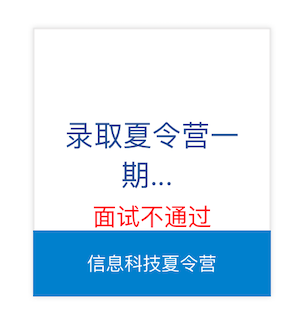
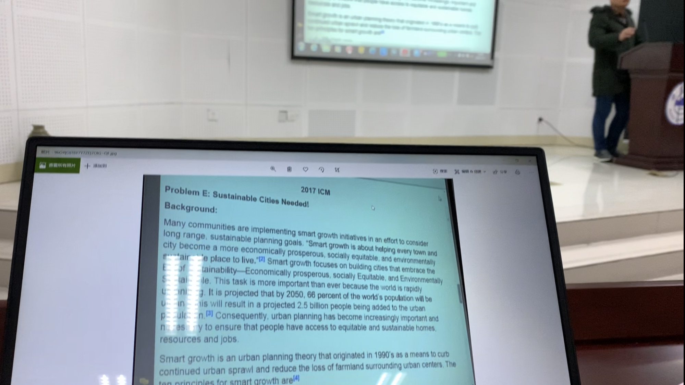

# 17-电子-莫笑海-中国科学院声学研究所

## 基本背景

> 三年绩点排名：18/124
>
> 综合排名：10/124
>
> 绩点：3.71/5
>
> 四级：454
>
> 六级：455
>
> 奖证：数学建模国赛省一等奖；大创省级合格结项；学习优秀一等奖学金；安徽省运动会二等奖
>
> 科研：无科研成果；面试时说的更多的是自己做的一个项目、课程设计

## 保研结果

> 最终录取学校：中国科学院声学研究所+声学+超声技术中心
>
> 其他录取结果：
>
> * **获得Offer:**
>   * 上海科技大学（参加的夏令营，10推时获offer）+电子科学与技术；
> * **获得面试机会后放弃:**
>   * 中科大科学岛+光机所（算是拿了半个offer）；空天院；上海微系统；
> * **被刷**:
>   * 中科大+23系+面试被刷；东南+生医工+简历被刷（排名不够）；哈工大本部+简历被刷；哈工大（深圳）+简历被刷；同济+简历被刷 . . . 

## 保研心得

### 1. 我的时间节点安排

首先要说明的是，疫情原因，2020年夏令营与预推免都较往年有所推迟，9月推免也变成了“10推”，2021年推免，大家要较之提前准备。（例如推免系统填报时间往年为9月28日；2020年为10月12日）

5月底开始关注方向与导师，加入各种夏令营群（官方与非官方）；

6月初询问了几位保研学长学姐他们的保研道路，为我的报名提供参考，同时在这期间潜水在多个夏令营群中（官方群），获得了不少信息；

6月下旬浪了不少日子，导致在6月30日晚上截止日期前才提交了上海科大的夏令营申请；同时在6月提交了中科大的夏令营申请；

7月2日收到了上海科大的入营通知，居然7月8号就面试，有了DDL才有动力，这几天我在慌的一批的情况下疯狂看专业课知识点、上知乎看上海科大面试经验，最终在面试中获得惨败；

此后的日子，我汲取面试失败的经验，继续紧张地准备中科大23系7月21号的面试；中科大面试过后感觉良好，谁曾想居然又被刷了，查询网站上红色的“面试不通过”五个大字看着让人痛苦；

由于我夏令营就投递了这两所学校，所以我的夏令营之旅就此告一段落（对比发现我投的还是太少了）；期末考试因为疫情的原因推迟到了8月中旬开学，我短暂的总结了面试失败的各种问题后，开始了期末考试的复习；

8月15号回到大半年踏足的寝室，寝室的一切布置还是冬天的样子，梅雨季节导致的一只发霉的枕头我碰都不敢碰；第二天就要期末考试（大学最后一战）了，寝室等考完再打扫吧；

9月在校学习效率也高了许多，吸取夏令营的经验，预推免我开始了海投战略；

9月是收获的季节。18日下午，暖暖的太阳被寝室的窗帘拒之门外，外边军训着，

室友们都出门复习去了，寝室独我一人。隐隐约约觉得中科院的录取通知快出来了，但困意又促使我爬上床，躺在床上大脑胡思乱想着。过了许久微信突然传出了消息提示音，我飞速下床查看，那是推免复试录取名单~ 悬着几个月的心终于有了依托~

### 2. 每个时间节点里，我的具体行动

我写下这句话时，是2020年11月9日，中国疫情早已平稳，而国外的一些国家依然水深火热。反观这快过去的2020年，疫情留下的踪迹无处不在，对我的影响也不得而知。习惯了多年正常发展的生活，却不知，变化才是常态啊。

2020年1月17日，腊月23。刚哥上课一如既往的幽默，和队友轮流早起占座一如既往的寒冷、困倦。好在今天结束了数学建模美赛的最后一次培训课程，一切都按照着常理发展，而我，也准备回家过年了。

除夕春节期间，情况急转直下，村口大喇叭叫嚣着禁止聚集，口罩逐渐供不应求，谣言也在此期间盛行。现在回想那段时光，zf总体做的还是很棒的，泪目。

在家的学习效率很低，本想着混一混，延期一个月开学回学校再认真准备保研事宜也不迟，没想到等来了几轮线上网课、延期考试的通知。颓废寒假生活的最大色彩便是与父母在一起的时光了吧，这或许是近年、将来几年，我与父母待的最久的一段时间了。

希望以上几段“日记&感想”没有冒犯到大家。时间来到了5月末，我关注的“保研前辈”等公众号开始推送各类消息了，加入的“中科大信息科技夏令营官方交流群”群内也活跃无比。这都督促着我需要快点开始保研准备了。值得一提的是，中科大是最早举办夏令营活动的高校之一，官方交流群内的“官方人士”给大家的答疑也比较热情，夏令营的活动、纪念品也十分丰富。通过中科大夏令营，可以一窥各个高校夏令营的流程，推荐电院的各位保研同学都加入信息科技夏令营官方交流群（群号每年都不一样，自己多多关注），潜水看看消息也是不错的。当然，推荐加群不代表推荐所有人都报名科大夏令营。对于我院电子信息工程专业来说，科大6系夏令营**一般**只收专业前三名（我这一年还补录了一人，总共四人；专业前三指绩点排名前三，此时综合排名还未出来）参加面试。科大23系也同样对本科同专业的报名同学有人数限制。所以同专业报名科大的同学尽量互通消息，排名靠前却不想去科大的同学可以把夏令营名额留给后面的人等等。

咱们院同学想去中科大，除了本部，还有两个选择：科学岛与先研院。各有利弊我在此就不多说了。值得一提的是建议别报名苏州医工所，此所**貌似**不收电子专业的同学（苏州医工所是啥？等你到了夏令营的时候就知道了）。

6月由学长得知了上海科技大学也不错，了解一番之后也发现确实有我喜欢的专业，便报名了。上海科大是13年左右成立的新学校，老师们绝大多数都是海归，实力还是很强的，官网也做的很好看（逃）。上海科大的夏令营报名系统做的也很人性化，不像中科大的报名系统，没他人指导或根据指南（指南等见第四大部分**资源分享**）来填写，大概率会填的有问题（进行报名系统的填报教学或许是中科大夏令营交流群的主要作用...）。6月30日报名了上海科大夏令营，两天后收到入营通知：8号面试。以目前的视角来看，从收到入营通知开始直到面试之前的6天时间，我的面试准备的是不OK的，下面我以一个过来的人视角，以面试考察要点为导向向大家说说我对推免面试准备的看法（下面的看法是通用的，不针对上海科大）。**一家之言，仅供参考**：

> 首先，推免面试主要包含这四大方面：英语、科研/项目/比赛、专业课知识、开放性问题。
>
> 1.对于专业课知识的考查来说：不同于大家平时的卷面考试，面试难以考察大家的计算、公式推导等能力，更多考察的是大家对概念的深刻理解与辨析。例如对于信号与系统、DIP这两门课，面试可以问你傅里叶变换、拉普拉斯变换与Z变换之间的关系，问你FIR与IIR滤波器的关系，问你如何设计低通滤波器，问你FFT为什么快等。而不会叫你计算一个复杂的系统函数之类。由此，大家可以把握住专业课面试的要点（一般推免面试20分钟左右，时间原因，专业课问题不会问太多，问3个问题算是平均个数吧，不要把太多的时间花在复习专业课上）。
>
> 2.科研/项目/比赛：我认为这三项十分类似，就放在一起来说了。面试时老师会拿到你的简历，而你的简历上最好包含这一块的内容，这是面试考察的一个方面，也是将老师的话题从送命的专业课问题转移到自己擅长的、熟悉的领域的重要措施（虽然这大块内容回答的不好依旧送命）。这大块内容十分“定制化”，老师根据不同的简历内容，询问的内容也会完全不一样，同学被问到的问题大概能不会在你这被重复，但这块的问题依旧有一些共通的性质：比如你在简历里面写了一个科研项目，那么你就要知道你想解决什么问题，为什么要用你的这种方法，你的方法有啥特点，与哪些方法进行了对比，研究的问题有什么难点，怎么处理解决的，结果有什么意义。。。总体来看这些问题就是写论文Introduction的思路。除了这些问题，如果你的科研项目里面出现了英文或英文缩写，你还要熟练记住其英文含义和全称。对于比赛来说，你要理清你在比赛中承担的工作，所做的内容，所用的方法的原理，与此方法相关的知识点等（我简历里面写了数学建模，但是各次面试都没被问过。。。）。
>
>  3.英语：这或许是大家都十分头大的模块，但也是可以准备准备，有所提升的。不多废话了，直接列出一些常见的英文问题吧：
>
> >**自我介绍**1分钟/3分钟/5分钟，3分钟比较通用一些
> >
> >**为什么选择我们学校/为什么选择我们专业/对申请专业有何了解**，这个问题一定要好好思考啊，要有自己真实的见解，而不是盲目随大流或者海投一些学校，否则吃亏的是自己
> >
> >介绍家乡/介绍家庭/介绍本科学校/介绍自己的专业
> >
> >读研规划/毕业之后的规划/为啥要读研
> >
> >喜欢什么课程/书
> >
> >兴趣爱好/特长/缺点，特长最好回答与读研相关的内容
> >
> >你觉得科研工作者应该具有哪些素质
> >
> >科研，学习，项目中，遇到过什么困难，如何解决的
>
> 除问问题之外，还有一些英文面试形式如看段落进行口头朗读并翻译、听听力并复述等。
>
> 4.开放性问题：这一块的问题难就难在出其不意，老师所问的问题可能你从来就没有考虑过，如果答不出来或者答的不满意，还是很拉分的。对于这块的问题，总的来说，还是要多思考、多了解吧。多想想自己各种选择的“为什么”，简历里面内容的“为什么”：为什么申请这个专业、项目里面为什么用这个方法，等等。另一方面，你需要对所申请的专业/导师有了解：多读读相关专业的论文、相关导师的论文，如果有与自己申请专业相关的前沿宣讲会或者视频，一定要好好了解了解，这或许就是面试的点！有关开放性问题，下文聊到中科院声学所面试的时候详细说～
>
> 最后一句话：以上看法都只是起到抛砖引玉的作用，完全无法涵盖所有面试要点，同志还需要靠自己的努力鸭！

最终上海科大夏令营没被录取，原因是：准备不充分，面试时很简单的概念问题都回答错了；远程面试杂音有点重，英文问题让老师pardon了两次还是没听懂；开放性问题没有好好准备，卡壳卡了半天，场面一度十分尴尬。。。

后来得知上海科大硕士就业或许认可度不高，其优势的未来道路是继续科研、出国等。本着为自己多一条出路的看法，也不再可惜没被录取（酸葡萄哈哈哈）。

7月中下旬，我参加了中科大的夏令营面试，本想着面试通过了我就躺平结束保研了，可是生活却还是决定让我继续奋斗下去，中科大23系夏令营也没过。

有关中科大夏令营的收获或经验等，都写在上文的四大点里面了，在此也不作过多的介绍～

9月，报名了中科院声学所的预推免，面试前一天有网络测试（远程面试，测试网络通常性以及熟悉面试流程）。夹在身后三脚架上第二机位的手机滑落在了地上，摔出了“骨骼”。后过头来看结果，这或许就是“破财得好运”吧。

9月中科院声学所面试，巧的是主面试官就是我心仪的那个老师。更巧的是（我后来了解到）老师也看上了我。我由此获得了推免岁月的第一个offer。

声学所面试感悟：

### 3. 小Tips/干货

针对推免期间的同学：

* 
* 
* 
* 面试结束，获得offer之前，没必要在知乎等地方搜索这个院校怎么怎么样，来考虑自己愿不愿意去。因为你很可能就被刷了，徒徒浪费时间。

针对即将面对保研的同学，该如何准备？：

* 心态等 与同学对比更显压力之大

* 第一次面试成功率会稍底，，，知道自己的不足，改进，多面试，，

* 

* 早联系导师，

针对目前大二的同学：

* 

* 

### 4. 资源分享

* [中科大夏令营/预推免系统填报指南2020年版]()

* 

### 5. 文书怎么优化，简历怎么写？

# 未完待续。 。 。
