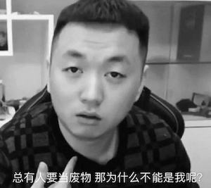

# 17-电子-莫笑海-中国科学院声学研究所

## 基本背景

> 三年绩点排名：18/124
>
> 综合排名：10/124
>
> 绩点：3.71/5
>
> 四级：454
>
> 六级：455
>
> 奖证：数学建模国赛省一等奖；大创省级合格结项；学习优秀一等奖学金；安徽省运动会二等奖
>
> 科研：无科研成果；面试时说的更多的是自己做的课程设计以及一个项目

## 保研结果

> 最终录取学校：中国科学院声学研究所+声学+超声技术中心
>
> 其他录取结果：
>
> * **获得Offer:**
>   * 上海科技大学（参加的夏令营，10推时获offer）+电子科学与技术；
> * **获得面试机会后放弃:**
>   * 中科大科学岛+光机所（算是拿了半个offer）；空天院；上海微系统；山大 . . .
> * **被刷**:
>   * 中科大+23系+面试被刷；东南+生医工+简历被刷（排名不够）；哈工大本部+简历被刷；哈工大（深圳）+简历被刷；同济+简历被刷 . . . 

## 保研心得-我的半年推免时光

> 作为一个“保研过来人”，我经历过大三下学期推免准备期的迷茫，不知道夏令营、预推免等该如何准备，踩了不少的坑。也曾在面试时被“送命题”乱了阵脚，最终被刷。那么，推免不同阶段的“流程”是什么样的？面试又都有哪些要点与注意事项？本文将以我自己为例，向即将进入保研申请阶段的各位大三同学介绍我推免的半年时光里发生的事与感悟，让大家熟悉推免的大致流程与时间节点；同时向大家介绍面试时被问问题的四大方面、各种干货，帮助大家更好地准备面试、去往心仪的大学深造。希望大家有所收获。

### 1. 我的时间节点安排概要

首先要说明的是，疫情原因，2020年夏令营与预推免都较往年有所推迟，9月推免也变成了“10推”，2021年推免，大家要较之提前准备。（例如推免系统填报时间往年为9月28日；2020年为10月12日）

5月底开始关注方向与导师，加入各种夏令营群（官方与非官方）；

6月初询问了几位保研学长学姐他们的保研道路，为我的报名提供参考，同时在这期间潜水在多个夏令营群中（官方群），获得了不少信息；

6月下旬浪了不少日子，导致在6月30日晚上截止日期前才提交了上海科大的夏令营申请；同时在6月提交了中科大的夏令营申请；

7月2日收到了上海科大的入营通知，居然7月8号就面试，有了DDL才有动力，这几天我在慌的一批的情况下疯狂看专业课知识点、上知乎看上海科大面试经验，最终在面试中获得惨败；

此后的日子，我汲取面试失败的经验，继续紧张地准备中科大23系7月21号的面试；中科大面试过后感觉良好，谁曾想居然又被刷了，查询结果的网站上红色的“面试不通过”五个大字看着让人痛苦；

由于我夏令营就投递了这两所学校，所以我的夏令营之旅就此告一段落（对比发现我投的还是太少了）；期末考试因为疫情的原因推迟到了8月中旬开学，我短暂的总结了面试失败的各种问题后，开始了期末考试的复习；

8月15号回到大半年踏足的寝室，寝室的一切布置还是冬天的样子，梅雨季节导致的一只发霉的枕头我碰都不敢碰；第二天就要期末考试（大学最后一战）了，寝室等考完再打扫吧；

9月在校学习效率也高了许多，吸取夏令营报名太少而没拿到offer吃了亏的经验，预推免我开始了海投战略；

9月是收获的季节。18日下午，暖暖的太阳被寝室的窗帘拒之门外，室友们都出门复习去了，寝室独我一人。隐隐约约觉得中科院的录取通知快出来了，但困意又促使我爬上床，躺在床上大脑胡思乱想着。过了许久微信突然传出了消息提示音，我飞速下床查看，那是推免复试录取名单~ 悬着几个月的心终于有了依托~

### 2. 每个时间节点里，我的具体行动（本部分还包含面试干货）

我写下这句话时，是2020年11月9日，中国疫情早已平稳，而国外的一些国家依然水深火热。反观这快过去的2020年，疫情留下的踪迹无处不在，对我的影响也不得而知。习惯了多年正常发展的生活，却不知，变化才是常态啊。

2020年1月17日，腊月23。刚哥上课一如既往的幽默，和队友轮流早起占座一如既往的寒冷、困倦。好在今天结束了数学建模美赛的最后一次培训课程，一切都按照着常理发展，而我，也准备回家过年了。

除夕春节期间，情况急转直下，村口大喇叭叫嚣着禁止聚集，口罩逐渐供不应求，谣言也在此期间盛行。现在回想那段时光，zf总体做的还是很棒的，泪目。

在家的学习效率很低，本想着混一混，延期一个月开学回学校再认真准备保研事宜也不迟，没想到等来了几轮线上网课、延期考试的通知。颓废寒假生活的最大色彩便是与父母在一起的时光了吧，这或许是近年、将来几年，我与父母待的最久的一段时间了。

希望以上几段“日记&感想”没有冒犯到大家。时间来到了5月末，我关注的“保研前辈”等公众号开始推送各类消息了，加入的“中科大信息科技夏令营官方交流群”群内也活跃无比。这都督促着我需要快点开始保研准备了。值得一提的是，中科大是最早举办夏令营活动的高校之一，官方交流群内的“官方人士”给大家的答疑也比较热情，夏令营的活动、纪念品也十分丰富。通过中科大夏令营，可以一窥各个高校夏令营的流程，推荐电院的各位保研同学都加入信息科技夏令营官方交流群（群号每年都不一样，自己多多关注），潜水看看消息也是不错的。当然，推荐加群不代表推荐所有人都报名科大夏令营。对于我院电子信息工程专业来说，科大6系夏令营**一般**只收专业前三名（我这一年还补录了一人，总共四人；专业前三指绩点排名前三，此时综合排名还未出来）参加面试。科大23系也同样对本科同专业的报名同学有人数限制。所以同专业报名科大的同学尽量互通消息，排名靠前却不想去科大的同学可以把夏令营名额留给后面的人等等。

咱们院同学想去中科大，除了本部，还有两个选择：科学岛与先研院。各有利弊我在此就不多说了。值得一提的是建议别报名苏州医工所，浪费了报名机会，此所**貌似**不收电子专业这样跨专业的同学（苏州医工所是啥？等你到了夏令营的时候就知道了）。

6月由学长得知了上海科技大学也不错，了解一番之后也发现确实有我喜欢的专业，便报名了。上海科大是13年左右成立的新学校，老师们绝大多数都是海归，实力还是很强的，官网也做的很好看（逃）。上海科大的夏令营报名系统做的也很人性化，不像中科大的报名系统，没他人指导或根据指南（指南等见第四大部分**资源分享**）来填写，大概率会填的有问题（进行报名系统的填报教学或许是中科大夏令营交流群的主要作用...）。6月30日报名了上海科大夏令营，两天后收到入营通知：8号面试。以目前的视角来看，从收到入营通知开始直到面试之前的6天时间，我的面试准备的是不OK的，下面我以一个过来的人视角，以面试考察要点为导向向大家说说我对推免面试准备的看法（下面的看法是通用的，不针对上海科大）。一家之言，仅供参考：

> 首先，**推免面试主要包含这四大方面**：英语、科研/项目/比赛、专业课知识、开放性问题。
>
> 1.对于专业课知识的考查来说：不同于大家平时的卷面考试，面试难以考察大家的计算、公式推导等能力，更多考察的是大家对概念的深刻理解与辨析。例如对于信号与系统、DIP这两门课，面试可以问你傅里叶变换、拉普拉斯变换与Z变换之间的关系，问你DSP这门课讲了些啥，问你FIR与IIR滤波器的关系/优缺点，问你如何设计低通滤波器，问你线性卷积和循环卷积的关系，问你FFT为什么快等。而不会叫你计算一个复杂的系统函数之类。由此，大家可以把握住专业课面试的要点（一般推免面试20分钟左右，时间原因，专业课问题不会问太多，问3个问题算是平均个数吧，相对不要把过多的时间花在复习专业课上）。
>
> 2.科研/项目/比赛：我认为这三项十分类似，就放在一起来说了。面试时老师会拿到你的简历，而你的简历上最好包含这一块的内容，这是面试考察的一个方面，也是将老师的话题从送命的专业课问题转移到自己擅长的、熟悉的领域的重要措施（虽然这大块内容回答的不好依旧送命）。这大块内容十分“定制化”，老师根据不同的简历内容，询问的内容也会完全不一样，同学被问到的问题大概率不会在你这被重复，但这块的问题依旧有一些共通的性质：比如你在简历里面写了一个科研项目，那么你就要知道：
>
> * 你想解决什么问题
> * 为什么要用你的这种方法
> * 你的方法有啥特点
> * 你的方法解决这个问题的步骤是什么
> * 与哪些现有方法进行了对比，你的方法效果相比咋样
> * 研究的问题有什么难点，怎么处理解决的
> * 结果有什么意义
> * 做这个项目有啥收获。。。
>
> 总体来看这些问题就是写论文Introduction的思路。除了这些问题，如果你的科研项目里面出现了英文或英文缩写，你还要熟练记住其英文含义和全称。对于比赛来说，你要理清你在比赛中承担的工作，所做的内容，所用的方法的原理，与此方法相关的知识点等（我简历里面写了数学建模，但是各次面试都没被问过。。。）。
>
>  3.英语：这或许是大家都十分头大的模块，但也是可以准备准备，有所提升的。不多废话了，直接列出一些常见的英文问题吧：
>
> * **自我介绍**1分钟/3分钟/5分钟（3分钟比较通用一些）
> * **为什么选择我们学校/为什么选择我们专业/对申请专业有何了解**（这个问题一定要好好思考啊，要有自己真实的见解，而不是盲目随大流或者海投一些学校，否则吃亏的是自己）
> * 介绍家乡/介绍家庭/介绍本科学校/介绍自己的专业
> * **读研规划/毕业之后的规划/为啥要读研**
> * 喜欢什么课程/书
> * 兴趣爱好/特长/缺点（特长最好回答与读研相关的内容）
> * 你觉得科研工作者应该具有哪些素质
> * 科研，学习，项目中，遇到过什么困难，如何解决的
>
> 除问问题之外，还有一些英文面试形式如看段落进行口头朗读并翻译、听听力并复述等。
>
> 4.开放性问题：这一块的问题难就难在出其不意，老师所问的问题可能你从来就没有考虑过，如果答不出来或者答的不满意，还是很拉分的。对于这块的问题，总的来说，还是要多思考、多了解吧。多想想自己各种选择的“为什么”，简历里面内容的“为什么”：为什么申请这个专业、项目里面为什么用这个方法，等等。另一方面，你需要对所申请的专业/导师有了解：多读读相关专业的论文、相关导师的论文，如果有与自己申请专业相关的前沿宣讲会或者视频，一定要好好了解了解，这或许就是面试的点！有关开放性问题，下文聊到中科院声学所面试的时候详细说～
>
> 更多要人命的开放性问题：[宝洁八大问](https://zhuanlan.zhihu.com/p/27963266)
>
> 最后一句话：以上看法都只是起到抛砖引玉的作用，完全无法涵盖所有面试要点，同志还需要靠自己的努力鸭！

最终上海科大夏令营没被录取，原因是：准备不充分，面试时很简单的概念问题都回答错了；远程面试杂音有点重，英文问题让老师pardon了两次还是没听懂；开放性问题没有好好准备，卡壳卡了半天，场面一度十分尴尬。。。

后来得知上海科大硕士就业或许认可度不高，其优势的未来道路是继续科研、出国等。本着为自己多一条出路的看法，也不再可惜没被录取（酸葡萄哈哈哈）。

7月中下旬，我参加了中科大的夏令营面试，本想着面试通过了我就躺平结束保研了，可是生活却还是决定让我继续奋斗下去，中科大23系夏令营也没过。

有关中科大夏令营的收获或经验等，都包含在上文的四大点里面了，在此也不作过多的介绍～

9月，报名了中科院声学所的预推免，面试前一天有网络测试（远程面试，测试网络通常性以及熟悉面试流程）。夹在身后三脚架上第二机位的手机滑落在了地上，摔出了“骨骼”。后过头来看结果，这或许就是“破财得好运”吧。

9月中科院声学所面试，巧的是主面试官就是我心仪的那个老师。更巧的是（我后来了解到）老师也看上了我。我由此获得了推免岁月的第一个offer。

> 声学所面试感悟/开放性问题的准备：声学所我参加的是预推免，相较之夏令营多样的活动，预推免就只有一个短暂的线上答疑会了。好在老师们给了我们夏令营宣讲会（宣讲会主要包含声学所的各方面情况介绍、各实验室的介绍、专业前沿知识讲座等）的视频下载链接。作为一个并不是十分了解声学所各实验室的我，这些视频是信息密度极大的。
>
> 声学所的面试包含[多个方面](http://www.ioa.cas.cn/yjsjy/zs/zstz/202009/t20200917_5698685.html)，如综合素质（成绩、科研情况、工作业绩、学习能力、创新精神、**团队精神**、沟通交流能力、其他潜质）、专业能力面试考核（专业知识的掌握程度，对知识灵活运用的程度专业实验技能、**对本学科发展动态的了解**、在本专业领域发展的潜力等）、外语水平测试、思想政治品德考核。其中我发现我在“本学科发展动态的了解”这块并不太熟悉，便认真看了老师们提供的宣讲会视频，其中一个前沿知识讲座我在面试前认认真真看了四五遍并进行了一定的思考。面试进行PPT介绍时，我详细介绍了这方面的内容，没想到老师很感兴趣，整个面试就基本在问这块的内容了/捂脸。
> 
> 声学所的经历也印证了一句话：多了解自己所申请的方向，是很重要的。

9月之后的日子就过的轻松多了，也由此可见手中有一个offer对个人心态的影响。与此同时，我也收到了其他一些院校发来的面试邮件（9月初没offer时海投的结果）与offer。权衡之下，还是声学所更适合我，其他院校的面试/offer我也就都回绝了（为啥呢？原因还是很多的，就不一一说明了。**对于局外人从某一个维度考虑得出的结论，与事件经历者的看法必然存在差别，而局外人此时也不必judge事件经历者，适合自己的才是最好的。**比如你考虑着，你觉得科大比声学所好，那我就应该去科大，这或许就是一个典型的错误吧，而类似的思维与事件在保研期间，在保研er们之间，经常出现）。

10月12日凌晨，填报了国家推免系统，12日上午收到了拟录取通知。我的保研长跑来到了终点。

凡是过往，皆为序章。

### 3. 一些避坑指南

以上介绍了我的保研半年时光发生的事、感悟、面试经验，总体按时间排序较为连贯。而下面的内容是一些细的碎的小Tips。

针对推免期间的同学：

* 夏令营报名前就要写好简历、个人陈述、未来规划等，并不断修改完善，可以找老师学长学姐们询问修改意见。
* 同学之间多多互相帮助，争取保研名额你们需要互相竞争，但推免阶段你们没有太强的竞争关系o(*￣▽￣*)o
* 成绩单上分高的课程要稍微注意一下，我有同学面试信号方向，但因为他电磁场和微波分很高，全程被问这些内容（我也不是很确定电磁场分高和面试被问有没有因果关系，但是是有这样的情况出现的）
* 简历里写的任何内容都需要烂熟于心，因为老师会根据简历内容来进行各种提问。
* 简历里面最好写一些科研/项目/比赛相关的内容，如果真没有，把课设改进润色一下写进去也是OK滴（前提是课设做的足够优秀！大一大二的同学可以对此早做准备）。
* 没科研，也不想去找导师做科研了怎么办？可以自己去GitHub上[找些项目做](https://www.bilibili.com/video/BV1yJ411S7Wu)。
* 多关注院校、学院官网，那里有各种一手信息。各种保研公众号也可以关注一波。
* 很多保研公众号有散播焦虑的问题，只有你们焦虑了他们才好卖文书、面试经验、模拟面试之类。资料学长学姐们都有，我也有不少。面试经验也不需要通过这些付费内容获取（我个人的意见），自己去报名一个有把握的学校参加一下夏令营就知道了（还可以顺便出去玩玩）。
* 一定要注意了解心仪导师的人品，同时也可以适当了解导师、实验室的其他一些信息。相信你有能力找到心仪导师手下的学生并与其交流。导师推荐网等网站也有一些导师信息。
* 尽早联系导师，会有优势。
* 夏令营推荐大家都报名几个来熟悉面试流程，一般自己的第一场面试会表现的差一点。如果觉得自己菜，那就报名热度不那么强的高校。
* 尽早拿到保底offer以求心安。同学们都有offer而自己没有时，压力是巨大的（来自承受过2个月这种压力的我）。不过大家也不要着急，心态放稳，到了推免后期实在没拿到offer也不要太慌，总会有学上的，多多关注各方面信息，主动一点。
* 面试一所学校/专业之前，一定要多多了解这个学校/专业/导师，想明白申请这个学校/专业/导师的理由。申请的这个方向的相关知识也需要了解，例如申请水声信号处理相关方向，就要去看看《水声学原理》这本书的绪论，以及各章开头的论述部分，这些都有可能是面试问点。
* 夏令营/预推免申请要注意梯度，别全去冲C9、东南、成电等学校的热门专业。
* 面试结束，获得offer之前，没必要在知乎等地方搜索这个院校怎么怎么样，自己愿不愿意去。因为你很可能就被刷了，徒浪费时间/滑稽。
* 我有一些不错的资料（听懂掌声）。

针对即将面对保研的同学/大一大二同学（既然低年级的你也来看了这篇分享，那当然也要给你点干货😏）：

* 综合排名出来的很晚，夏令营和预推免基本都用不上。排名比较靠前的同学不要太刻意去追求加分与综合排名**本身**。
* **有志者事竟成**：这句俗语在17电子专业得到完美印证；保研边缘也有反超的机会，大一在大家心中树立起来形象的“大佬”未必能坚持到最后。
* 如果大一第一学期绩点能进班级前10%，后面你继续前进的“惯性”会很强，《东南大学生存指南》中的“桥段 ccc 沈俊羽”也说过[类似的话](https://www.yuque.com/wangzonghui-jujm4/telvdb/af9imr)）。
* **学有余力的**同学可以跟导师做科研，学术导师活动积极参加。
* 绩点还是很重要的，课程要好好学。好学校申请会卡绩点（前5%，10%这种）。
* 因为保研加分的影响而获得/失去保研名额的人并不多（**调查样本仅限于我本班**）。17电子班17个保研名额，因为保研加分被挤出去的人**貌似**就1-3人，大家不必太慌（但并不是说各类比赛不重要，各种比赛、科研是你面试的重要加分项）。
* 课程学的再好，过个半年也会忘记大半。学习课程知识带来的隐性的思维、解决问题等能力的提升，才是更重要的。
* 人与人是不同的，保研其实挺累的，还有很多其他闪耀的道路可以走，还有很多美好的事物等待你去发现，找到自己适合的、开心的路最重要！
* 要有追求有思想，不要浑浑噩噩度过美好的大学时光，看到这的你请立志做个现实生活充实者！

### 4. 小尾巴

* 看完以上内容如还有疑惑的点，可以私下联系我，我是17电子莫笑海。同时也欢迎大家申请声学所，一起来长城脚下雁栖湖畔的国科大、中关村的声学所玩儿～
* 声明：本人对本文所说的任何内容不负任何责任，请保持自己的主见。感谢阅读。
* [彩蛋](本Wiki创建者的一点故事.md)

---------

2021.3.7更新：

今天看见两篇好文章，引用两个片段：

> 绝大多数人在日常发表的观点和建议都是主要站在自己知识储备和环境影响下得出的，我们需要学会有自己的判断能力，并不是说别人的观点和建议就一定不好，但是有些东西不一定适合你。我个人认为自己经常在文章里面输出强观点性的东西，但是很多内容也只是我在当下场景的认知，可能以后经过某些事情的影响也可能转变观念。
>
> 我会常常自我思考一些东西，但是百度谷歌不到满意的答案，然后有时候突然发现再看的一本书里面早早就已经写好答案以及更深一层的思考，让我想起「吾尝终日而思矣，不如须臾之所学也」。阅读和学习一些著作可以让我窥探到一些伟人的思考方式和知识底蕴，可以更加深入地学习并解决问题，包括但不仅限于计算机的领域。
>
> 平时看书太慢挺令人苦恼，从一个点我会想到一些别的问题，然后去搜索找到一些信息之后时间很快就过去了，虽然在未来我也遇到过对应的问题出现并且恰好解决的情况，但是这样让我的学习和阅读速度大大降低。还有很多外界因素和信息流的干扰，没有能好好专注于某件事情，尽管我从小就很难稍长一点时间的专注（除非 😰 DeadLine），还是需要转变状态。
>
> [引用来源](https://blog.cugxuan.cn/2021/01/17/Mood/record/2020-record/#认知与思考)

> 校招总是会令人焦虑的，跟朋友聊聊天，想办法舒缓一下。校招只是你从学校毕业的一个转折，今后的路还长，有趣的事情还很多，好好生活，好好学习，祝大家都能找到满意的工作！
>
> [引用来源](https://sspai.com/post/64458)