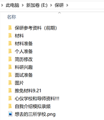
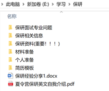
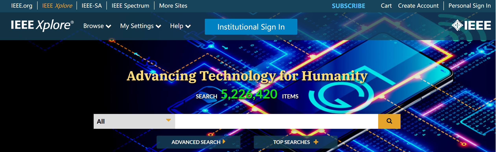

# 17-通信-陈锦莎-中国科学技术大学

选择比努力重要!

在保研这段历程中，请把这几个字刻进骨髓里。

>个人基本情况介绍：
>
>三年绩点排名：3/102  3.93/5.0
>
>综合排名：1/102   4.09/5.0
>
>四级：531
>
>六级：515
>
>奖证：国家级大创合格结项（第二负责人)；国家励志奖学金；三好学生等
>
>科研：无科研成果；面试时说的更多的是课程设计和大创项目
>

**保研结果：中国科学技术大学+生物医学工程（23系）**

可能有些人会觉得，我这个保研结果不太理想，我自己也觉得，但就像我强调的，选择比努力重要，这是血的教训，希望有幸看到我这篇文章的小伙伴们谨记。

并且我现在的导师很好，我很开心，也许这就是命运吧。

前言：学姐这篇文档乱且杂，想到什么写什么，如果觉得读得头疼，还请见谅。

## 目录

[TOC]

## 准备工作

### 信息获取

> 微信公众号：后保研HBY；保研夏令营；保研；保研人；保研夏令营；保研岛；保研论坛；
>
> 网站：保研论坛 https://www.eeban.com/
>
> 导师信息：导师评价网、导师推荐网（好像现在这两个地方都访问不了了）
>
> 百度、知乎、CSDN、微博（保研超话）

### 材料准备

> 按重要性排序：个人简历（中英文）、成绩单、四六级证书、奖项证书、论文等

注：都要准备好pdf文件。下图是我准备过的材料。

材料多的可能你自己都理不清楚。

### 专业课复习+英文复习

专业课就复习基本概念，做到大纲清楚，概念清楚

主要是三个方面：数学、专业课、英语

### 一些干货

#### 工具类

1. 图片转pdf：http://www.pdfdo.com/image-to-pdf.aspx
2. pdf合并：http://www.pdfdo.com/pdf-merge.aspx（应该基本上关于pdf的一些常规处理这个网站都能搞定）
3. pdf压缩：https://smallpdf.com/cn/compress-pdf

#### 翻译

挑了几个我用着觉得还可以的，排名不分先后

1. 彩云小译：https://fanyi.caiyunapp.com/#/

2. 翻译狗：http://www.fanyigou.com/

3. 网易有道词典、百度翻译

4. 欧陆词典（ipad用很好）

其实我觉得网易有道翻译的还挺准的，但我有时候不放心，就会每个网站都翻译一下，再对比，选最优解

#### 找文献

1. 中国知网
2. 百度学术（能找到的基本都能找到，还会提供pdf下载路径）
3. IEEE Xplore：https://ieeexplore.ieee.org/Xplore/home.jsp

​	选Institutional Sign In，输入学校英文，校外访问

4. 百度

#### 找电子书pdf

1. 百度、知乎、CSDN
2. 全国图书馆参考咨询联盟：http://www.ucdrs.superlib.net/（不提供pdf，只能告诉你这本书的pdf到底存不存在）

注：有些电子书资源比较难找，是需要一定花费的，毕竟资源收集不易

## 学校情况

报了那些学校就不说了，毕竟2020年由于疫情，基本上想去的好一点的985都报了，不是985的，由于地域因素，比如上海、深圳，也报名了一些学校。(常态，勿喷)

下面我就按时间点说一下吧。

#### 电子科技大学--信息与通信工程学院

>从大一开始憧憬保研成电，但结果是我与成电无缘无份。
>
>从寒假2020年2月份开始准备简历，一直到6月份开始看成电老师的论文，非常真诚的给老师发邮件；一直到保研结束都没有老师回过我。自己总结原因是：科研能力不突出，但选择的老师都是大牛，且比较火的老师。当然后面也选了研究方向比较冷门的老师，均无回复。
>
>至此，把我对成电的一腔热忱熄灭在2020年的夏天。

#### 上海科技大学--信息学院+信息与通信工程

> **面试时间：2020年7月20日**
>
> 【英文自我介绍老师要求一分钟，讲了两分钟；然后问是要报计算机吗，回答不是；问排名第三为什么填的是有可能拿到推免资格；第一个概率问题（概率论）；第二个问通信系统的基本组成；然后根据调制问相干解调和非相干解调；信源编码和信道编码，除了这两种，还有加密、解密；数学相关，线性相关和非线性相关；问纠错、检错的原理；监督码元英文。】
>
> **结果：面试通过，7.31号受邀去上海参加了一天开放日活动；7.31号下午收到获得优营邮件。要求8月7日前回执，未回执，放弃。**
>
> 因为上科大是第一个给我伸出了橄榄枝的学校，因此我怀有感激之心，并且上科大的一切都很好（主观意见），从招生办的老师，课题组的老师到学校的设备，师资力量都很好，真的特别有诚意。
>
> 上科大都是年轻有为的老师，除了要拿到优营以外，要选到好的老师，还必须通过老师的考核，都是真正有科研实力的人。

> 7.28日收到**南方科技大学+生物医学工程系**入营通知。

#### 东南大学--网络安全学院

>**面试时间：2020年8月2日**
>
>【2分钟英文自我介绍，然后问项目，问了好多项目怎么实现的问题，未准备充分，没回答好。
>
>英文问题问的监督学习。】
>
>**结果：排名居中，处于待定状态。**

#### 中科院声学所+网络新媒体实验室

> **面试时间：2020年8月25日**
>
> 【先5分钟自我介绍PPT汇报，然后问对直博、硕博连读、学硕、专硕的看法。回答：目前暂时不考虑直博和硕博连读，报的是专硕。
>
> 学过移动通信吧，说一下一代到四代通信系统区别。回答了多址方式和典型系统。
>
> 说一下交换机和路由器的区别。不会。哭
>
> 学过什么语言。回答：大学学过C语言，最近在自学python。那你说一下静态函数吧。没听懂。不会。哭
>
> 项目问题：五个类别的准确率是多少。
>
> 英语问题：What's your favorite subject?】
>
> **结果：未通过**

> 2020年9月11日收到**中国科学院计算机网络信息中心**复试通知，机考+面试，放弃

> 2020年9月16日**哈尔滨工业大学深圳校区**，老师微信视频面试通过，【问了项目问题和线代、概率论的知识点】，老师表示能通过复试就要我，但招生办审核没过，凄惨。已经老师聊好了，但招生办没给过（投了三次，夏令营1次+预推免2次）

> 9.18收到**中国科学院空间应用中心-电子室**复试通知，放弃

#### 南京大学+电子科学与工程学院

> **面试时间：2020年9月22日**
>
> 【英文自我介绍，英文基本问题（遇到口语最好的老师，问的问题很简单，但用的词汇有点难，不容易第一时间反应过来）】
>
> 【项目问题；单片机初始化的问题，比较偏硬件】
>
> **结果：未通过**

#### 华南理工大学+电子信息工程学院

> **面试时间：2020年10月5日**
>
> 【翻译很难，读得还可以，翻译得一塌糊涂。英语问题：为什么选我们学校？研究生规划？时间到了就没说完。然后PPT自我介绍。然后问题，19岁，是跳级了吗？项目问题？电赛问题？排名第一，为什么申请表上写的排名第三？】
>
> 最得心应手的一场面试。
>
> 结果：复试成绩很好，有几个老师主动找我了，但由于已经和科大老师说好了，且想去方向的老师已经没有名额了，遂放弃。
>
> 

#### 中国科学技术大学+生物医学工程

>**面试时间：2020年10月9日**
>
>其实在九月份就已经去中科大见过老师了，老师也确定会给我留一个名额，但面试时间一直没出，因此一直感觉命悬一线。这个面试可以说是走一个过程，基本都会录取，但还是很正式的。
>
>【面试问题：英文问题：英文自我介绍，一篇英文文章朗读+翻译，几个英文基本问题：你最喜欢的课程；三年后你会做什么；项目问题：大创相关，电赛相关，模电相关，正反馈和负反馈区别，老师还挺为难人的，问到哑口无言。】

整个保研过程，可以说是奋斗到填系统前的最后一刻了。

2020年10月12日09：07分接受中国科学技术大学的待录取通知。至此，我的保研历程结束。

