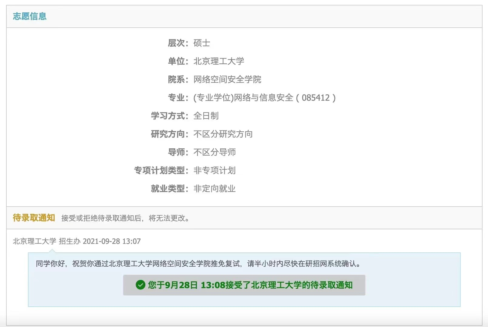

# 18-电子-李子琛-北京理工大学

## 基本背景

> 三年绩点排名：15/123
>
> 综合排名：13/123
>
> 综合分：88.93
>
> 四级：592（2019.06）
>
> 六级：493（2019.12）
>
> 奖证：省级大创合格结项（非专业相关）；数学建模国赛省一、美赛M奖；英语竞赛二等奖；「正大杯」省二
>
> 科研：无成果
>

## 保研结果

> **最终录取学校：**
>
> 北京理工大学+网络与信息安全（电磁仿真与天线方向）
>
> **其他录取结果：**
>
> **获得Offer:**
>
> 南京航空航天大学+信息与通信工程；
>
> 湖南大学+模式识别与智能系统（联系的老师愿意留名额，但最后院里面试放弃，算半个offer吧）
>
> **获得面试机会后放弃:**
>
> 中科院深圳先进技术研究院+医工所+电子信息；电子科技大学+电子信息；华中科技大学+电子科学与技术；武汉大学+电磁场与微波技术
>
> **被刷：**
>
> 中国科学技术大学+生物医学工程（系里面试通过但无老师接收）；
>
> 西安电子科技大学+电子信息+面试被刷；
>
> 西北工业大学+电子科学与技术+面试被刷；
>
> 夏令营阶段西交、北理工、川大、南大、东南简历被刷；
>
> 预推免阶段华工、北理工信号与图像研究所简历被刷

## 前言 

前些日子拿着打印好的表单去理工楼签字盖章，偶然在走廊边瞥到今年电院转专业考试的成绩公示表，实在感叹后生可畏。单单高等数学一项，90分以上不胜枚举，大于等于95分者也有好几位。尤想两年之前，自己以「61+67」的成绩擦边被学院接收，配合上3.43/5的第一学年裸绩，若不是庚子大疫的线上学期「因祸得福」，恐怕大概率压根没有争取推免名额的机会吧。

已经顺利拿到心仪专业的转入资格之后，不少同学想必都「摩拳擦掌」，意图在随后的两年中扎根新环境，做出一番成就。作为一名具备转专业背景的保研上岸人，纵使「能力一般、水平有限」，还是衷心希望下文内容能够达成两个小目标：

**其一，让转专业的孩子们少走一些学业方面的不必要弯路；**

**其二，为层次相近的后辈们提供些参考，或能帮助明确自己的后续方向。**

## **科研/竞赛**篇

无论从校内推免资格获得（综合素质加分）还是院校复试、争取最终offer的角度看，研究经历和竞赛经历的重要性都不言而喻。尤其研究经历，每每都是面试过程中老师们最为关注的点，且报考愈好的学校，对这方面的要求也会相应愈高。为此，大家最好能从**二年级时候**就着手做些准备，例如参与院内老师课题、申报并认真完成大创项目等等。

当然，转专业学生参与上述工作，不得不说有些先天的劣势：本身就得补修大一年级的专业课，再加上「人生地不熟」，融入最基本的班集体甚至都需要很长时间，这种情况下参与学术科技活动在精力和心理上都是挑战。然而考虑到后续的竞争力，还是鼓励大家勇于「毛遂自荐」——学术导师计划是一条路，此外也不妨直接邮件联系院里其他的心仪老师。得体地表达出自己愿意学习和承担工作的意向，很多老师都会愿意将本科生纳入门下的。

进入老师课题组和专业实验室之后，大家也不需要有多沉重的思想包袱，算法和程序这些能学一点是一点、能做多少算多少，有成果产出当然求之不得，没有也无伤大雅。比较好的情况是后续能分到一个属于自己的小项目，有几个月到一年的时间去完成，起承转合都极其完整；如若不能的话，即便是做一些外围的工作，拼合起来依旧是一段非常宝贵的经历。从我的个人情况出发，一个遗憾就是直到大三才勉强算参与到本专业相关的实际课题，时间已经相当仓促了；大创则是和其他院的熟人一起做的，跟电子信息没多少关系，对自己的推免也很难说有什么帮助。

研究经历之外，另一个比较受关注的加分项自然就是学科竞赛。专业类的大型比赛包括挑战杯、互联网+、iCAN、创青春等等，共同的特点是门槛高、准备周期长，好处则是可以直接当做项目进行介绍。此外还有比较大的一块是数学建模，相对而言参赛门槛不高，同时获大奖的难度也相对最小；缺点则在于很多题目做起来跟本专业没什么关联，从而哪怕是211院校的老师也很少对它们抱有兴趣。

自今年（2022届，2018级）开始，学院内的推免政策文件出现了一个极大的变化：往届省级比赛、省级大创这类的加分统统不复存在，而且哪怕是国家级的竞赛也不允许多项累加。有鉴于这样的情况，基本可以推断在未来一段时间数学建模会变得愈发火爆，尤其是寒假期间的美赛。付出100美元/队的报名费，身为前两位完成人一旦获奖便可放心拿到推免加分，再何况只需所在队伍得奖就可以申评学术科技奖学金，起步3000元/队的奖励，想想看还等什么呢（狗头）。

从数学建模竞赛的规程上看，由于时间紧、任务重，不得不说很多方面都存在着偶然性：每年都会有队伍最开始选择了其中一个题目，结果愈往下钻研愈发现难以操作，最后到第二天被迫换题；还有队伍引入了某个理论上优质的模型或方案，然而最终却无法令人满意地求解；也有队伍能够顺风顺水，从头至尾每一步做出来都没什么问题，但自己又不容易说出个所以然来。不过，即便有这样多的偶然甚至运气因素，我们还是有许多必然的东西可以预先加以准备和把握。其中最重要的一项，自然是**队友的选择。**

大家都有心理预期，几天几夜之内就要紧锣密鼓做出结果的比赛，对于团队协作和分工的要求自然比较苛刻；也正是因为这样，公认大佬之间的所谓「强强联合」未必就能所向披靡。不妨回归到「木桶理论」，队伍之中的三人最好能够各有所长，均摊资料查找、数据处理、算法设计、程序编写、论文行文、图表及排版等工作量，牢记**一支没有致命短板的队伍**是获得高质量奖项的先决条件。身为理工科学生，我们更是太容易重算法、程序而轻写作、图表，其实后两者反倒恰恰是参赛论文的「门面」，一定要有足够靠谱的队员去认真完成。

那么如何能够获得优秀的队友呢？目前就数学建模国赛而言，我校并不允许学生自行组队，所有的队员搭配都由教练组全权包办，参照则是每个人在春季和暑期两轮培训课程之中的表现，尤其是各项作业的完成情况。因而，认真对待每一节培训课，认真完成每一项当堂和课后的作业自然就格外重要。当然如果时间精力实在不太允许，适当放弃暑期培训中自己不擅长领域的部分作业也未尝不可（至少就本届情况看这并非大忌）。国赛的组队情况对于后续美赛的影响会很大，倘若国赛期间合作愉快，三位也都还有参加美赛的意愿，那么半年后完全可以原班人马再战一场；反之国赛不太顺利的话，可能就需要凭借已有的人脉重新组建队伍，磨合和一些必要的准备工作也都必须从零开始了。

从亲身经历出发，我自己在去年的数学建模暑期培训之中是完成了全部的课堂和课后作业，虽然难免存在「虎头蛇尾」的尴尬，但最终还是因此分到了两位专业素养过硬且执行力异常出色的队友，在国赛和美赛中的分工协作都算是科学有效，相应也取得了比较满意的奖项。赛前的备战方面，三位队员不妨依照自己所擅长的方向进行一些有针对性的练习和准备，不过也不需要过分紧张和纠结，因为计划一般来讲着实赶不上变化。如若需要一些更为细致的说明或者相关的补充资料，可以**移步文末我的个人邮箱，**欢迎通过email与我进一步交流。

在科研/竞赛方面的个人想法和避坑经验大致就是这么多，值得最后稍加提醒的是，所有的学术科技活动一定要是在**保证绩点排名**的前提之下去积极准备和参与的。自今年起的院级推免政策基本断绝了论文、专利加分的可能性，也终于算是和校级上位文件保持一致，正式树立起所谓「绩点为王」的核心理念。无论怎么看待这样的政策变化，客观而言它确实更加符合大的趋势，也愿后生们能够尽快适应呀。

## **绩点/英语篇**

课程学习方面很明显，自绩点排名便知我能拿出来的只有教训，谈不上什么经验；英语方面或许外人觉得自己还尚可，但就六级成绩而言又是人生污点。这个模块里我不害怕「自曝家丑」，主要是罗列出几条自己痛心疾首的「踩坑经历」，希望后生们能够在学习上善始善终，不要和我犯下同样的错误吧。

* 纵观三年六学期自己的成绩情况，明显有提升空间的主要是大一下和大三上两个学期。细想起来，它们具备惊人的相似性：先前的学期/学年比较兢兢业业，自己对于绩点和排名也都算满意，从而本身在心理上就松懈了不少；老师们的授课多数只是例行公事，使得一向在上课方面「看人下菜碟」的自己缺乏足够的钻研动力；部分课程很难说后续是否会有用武之地，从而不很愿意在上面花费太多时间。三小点综合起来，可以说是造成自己成绩滑坡的「罪魁祸首」——不过老实讲这些连借口都很难算得上，一言以蔽之还是我「浮躁任性」嘛，没能摆正位置、脚踏实地，希望大家千万引以为戒。
* 作为一个极端佛系的裸考人，能在2019年内一次性把四六级全都干掉，算是我的幸运；不幸则是大二上那次六级的成绩一直定格到现在。四级考试的学期还有在外学习托福的经历，六级考试的学期则是几乎没顾上英语，被线代、概率论、模电、数理方法和金工实习耗费了太多体能。今年九月中旬联系过中南大学计算机学院一位做医学影像处理的老师，对方还专门对我的六级成绩表示了遗憾；我只能说自己之后确实没能有机会再去准备和刷分，虽然是实话，但也真的倍感羞耻。所以在此诚挚建议大家一定要珍惜每一次四六级考试的机会，尽自己最大努力挤出时间去认真准备，切莫因为「裸考一时爽」而对后续推免阶段造成不利影响。

> 转专业同学如有**专业课程选课的相关问题**，也欢迎各位通过邮件和我联络。

## 跌宕保研路

我的保研历程是从4月中旬宣告开始的，直到9月28日走到终点。最开始先是去打印前五学期成绩单、制作排名证明并签字盖章，随后以科大的夏令营系统为依据准备其他一些必需的材料，没能覆盖到的再陆续视情况补充。简历在5月下旬正式定稿，改了两到三遍的样子；接下来就依次投报各个学校的夏令营，顺序是科大→西交→北理工→川大→南大。一头一尾权当娱乐，但中间三个学校确实是非常希望能去的，没曾想除了科大照顾之外全数被刷。快到期末的第17周又适逢单片机实验结课验收，嵌入式几乎一窍不通的自己经历了进大学以来的第一次心理崩溃，直到期末考试后好久才勉强调整回来一些。

因为不想第18周左支右绌，夏令营报名时我没有考虑任何7月初开展活动的学校，这也直接导致自己在暑假前颗粒无收。课设答辩完毕后收拾行李回家修整，完成东南的信息填报、材料上传，同时准备迎接7月下旬的第一场推免面试——来自科大23系。

* **中国科学技术大学+生物医学工程**

  科大的面试其实是相对轻松的一场，因为知道自己获得offer的可能性几近于零，反倒没有任何思想包袱了。纯粹抱着和老师们聊聊天的心态去做准备，双机位+90秒英文自我介绍。主考官提了两个英语问题，第一个是关于自己家乡的，早有准备从而答得异常流利；第二个则是问到自己最喜欢的大学课程，有些迟疑，最后说的是信号、DSP和数字图像，毕竟面试的是信号方向嘛。之后进入中文部分，几个老师围绕着我的项目内容来来去去地问了十分钟左右，最开始还算饶有兴致，可是愈到后来就愈发现「不过如此」，显得有些失望。接下来提问到其他的一些研究经历，只简单讲了数模美赛里的工作就到了时间，面试宣告结束。

  **结果：通过，但……**

  第二天一大早看到「面试合格」四个红字还是倍感惊讶的，然而冷静下来仔细想，这最多只能证明今年的优营实在是「超发滥发」，仅此而已；随后几天陆续联系了两位自己还算有意向的老师，毫不意外地双双石沉大海。23系本身教职工就寥寥无几，依照导师评价网还至少有两到三个需要避雷，综合考虑之下我没有多少犹豫，彻底放弃了继续挣扎科大的机会。

7月底得知自己没能入选东南信院的夏令营，丝毫不觉得奇怪：毕竟报的是大热的信号专硕，能入营才不正常哩。适逢奥运盛会，即便知道自己不应庸碌度日，还是花了大量时间追着看各项比赛——算是一种自我逃避吧，实在受够了围绕所谓「前途」那排山倒海、不分昼夜的精神折磨。时间走到8月下旬，一天突然借由微信公众号得知华工的预推免工作即将开始，赶快在系统开放的24小时内手忙脚乱地做了填报；之后又听说去年的「十推」极大可能恢复为「九推」，焦虑的感觉一瞬间便全都回来了。为了防止自己除本校之外实在没有学上，开学前火烧火燎联系了一位南航做音频信号的老师，没想到对方一个多小时便给了回复：欢迎我报考他的研究生，后续会组织面试。

* **南京航空航天大学+信息与通信工程**

  南航的这位先生是教授、博导，从一些侧面评价看为人和学术都堪称正派，又是第一个向我伸出橄榄枝的老师，因而自始至终是非常感念的。先前暑假期间联系华工信号方向和华科武汉光电共计十几位老师都几乎没有回音，积累了满满的挫败感，从而虽然不是很想去南航，依旧特别珍惜这次机会。花了将近两天时间认真打磨了PPT，待到进入腾讯会议时发现对面只有意向导师一人，且谈吐极为亲切，精神瞬间就没那么紧张了。

  由于先前邮件联络时并没有明确PPT汇报的时间限制，因而就把自己的基本情况、学科背景、项目内容、竞赛情况和未来规划都比较详细地讲了一遍，花了十几分钟之久；老师除中间插了一句提请我注意时间之外，从头到尾没有尝试提问任何的细节问题，反倒是随后介绍了很多他自己课题组的情况，又多次称赞我，有的话接近恭维。快到最后询问是否还有填报其他学校，实在不好正面回答只能说「毕竟南航的报名时间比较早」云云。老师倒也表示了理解，而且言语之间似乎暗示往届招到的推免生还是以「非211」为主。

  **结果：通过**

事实上在初步联系南航老师并收到回复的后一天，我另给湖南大学一位做图像处理算法的年轻副教授发了邮件，同样在当晚就得到了非常积极的反馈。这位老师直接表示愿意留个招生名额，但似乎并不很确定我能否最终获得保研资格。添加微信后，自己主动说明了学校的平均推免比例达到14%，对方这才算相对比较放心，又提醒我切莫再联系同校的其他老师。

这位先生是2016年海外博士毕业回流湖大的「85后」，次年开始指导第一届研究生，从公开信息得知其对于研究生培养还是比较耐心和循循善诱的，自身能力也很不错，在学术研究方面雄心勃勃。得到他的确认后我赶快填报了湖南大学的预推免报名系统，但还是错过了院系第一批面试的审核时间，后续第二三批都被排在了月底面试，遥遥无期。

紧接着的几天压力着实小了很多，觉得自己好歹肯定有学上了，而且无论南航还是湖大，虽然不是特别理想的院校但也都绝不排斥。由于专业课的很多知识点都是暑假期间陆续复习的，很多概念早已经不再清晰，又花了好些天对着网课重温，基本把信号、DSP、数字图像、线代和概率论共计五门课程的基本内容再次回顾了一遍。本来想由于一些院校的预推免通知出得很晚，再往后的面试怎么着都得中秋节以后了，没曾想16号突然接到西电志愿者的短信，通知我18号复试，但除此之外没有任何其他的细节说明。

* **西安电子科技大学+电子信息**

  接到复试通知的时候当真觉得莫名其妙，甚至都怀疑是骗子引自己入坑。好一会儿才反应过来，自己在月中确实有跟风填报对方的预推免系统，然而实在没想到能够顺利进入面试。西电因为学校有很强的军工背景，其信号方向的老师多数研究都和雷达相关，自己唯恐避之不及；几经斟酌填报的是一位「模式识别与智能系统」学科下大牛导师的专硕，其从事目标识别、医学影像处理等等工作，相对而言和自身经历重合度高，也比较对胃口。
  
  按照院系的官方规定，学生应当是在系统填报之后直接联系导师咨询面试事宜，可由于意向导师实在太强，讲破天也都只是「试试看」的态度，压根就没敢私下联系人家。那是一位德高望重的资深教授，年近花甲，不止在学术上成果颇丰，还曾担任多个行政要职，被不少兄弟学校请去做有关研究生培养体系改革的报告。也正是出于这样的原因，能够在没专门联系他的前提下进入面试环节，本身就足够让我觉得「受宠若惊」了：人家估计每天都能收到来自全国各地的一大摞推免生简历，在这些之外竟然愿意给仅在系统中做过填报的我一次机会，除了「荣幸」之外我实在很难有其他的形容。
  
  然而未曾想，这成了自己第一场真正意义上「翻车」的面试。
  
  具体的时间安排改了又改，从上午调到下午，又改回上午，顺序也从第一位变更到了第十几位。由于志愿者方面没有给出任何有关「如何准备」的细节，自己只能象征性地又抱了抱项目内容和专业课程的佛脚，最多安抚一下心态吧。进入腾讯会议，对方的网络设置却出现问题，好几分钟没能正常加载出英文翻译题目，只听得到老师与志愿者学生间紧张的低声交流。尴尬的局面最后还是被老师打破，他索性放弃了英文测试的环节，直接开启中文闲聊模式：问题里不很常规的主要有两个，其一是让我介绍一下安大电子专业的总体情况，说是他本人不很了解，虽然认识相关的领导；其二则是问到本学期安排了哪些课程。
  
  随后进入专业板块，完全没预料到情势自此急转直下。老师首先审视成绩单，不需几秒钟便定位到我分数一塌糊涂的数学公共课，随即询问这是什么情况——只好推脱说当时的期末考运算量比较大，因而成绩不理想；又问到学过哪些信号相关的专业课程，答完信号与系统、DSP和数字图像后自己觉得稍显单薄，于是画蛇添足地说上学期没有选修随机信号，估计对方看来又是个减分项。接下来老师一共问到三门专业课程的六个问题，一来一往的情形大致如下：
  
  > 师：看你有修过通信原理，说一下调制的几种方式吧？
  >
  > 我：（这个我会啊）包括AM、DSB、SSB、VSB等等。
  >
  > 师：那除了这个之外，还有哪些分类方式呢？
  >
  > 我：^&*&（*）…
  >
  > 师：你有学过数字信号，这个DTFT和DFT之间的关系是什么呢？
  >
  > 我：（这个我会啊）DFT是DTFT在0~2pi周期上的等间隔抽样。
  >
  > 师：那为什么是0~2pi呢？
  >
  > 我：（略慌张）因为考虑到周期性嘛，如果超出这个区间就重复、混叠了。
  >
  > 师：为啥会重复呢？
  >
  > 我：%R（*）￥#…
  >
  > 师：成绩单上还有信号哈，讲讲从模拟信号到数字信号的转换吧。
  >
  > 我：如果我没理解错的话，应该就是一个采样的过程吧？
  >
  > 师：嗯，但是为什么要采样呢？
  >
  > 我：#%@￥#￥%*…
  
  连着三门课的问答都遭遇一模一样的尴尬——切入的第一个概念性问题自己能够把握住，但是再往深挖具体的原理和本质就不太行了，一趟下来心态彻底爆炸。老师也看出我的沮丧和失落，还安慰说「学生们都差不多」一类的话，至此时间也到了，面试宣告结束。
  
  考虑到自己的表现确实糟糕，本就不应该指望能获得任何的正面反馈，然而想到毕竟西电是211院校，老师往届招到的专硕生本科学校不如安大的也比比皆是，因而还是心存一点点侥幸——只可惜奇迹并没有出现，此后再没能收到任何进一步的通知，之后时隔一周多在系统中看到老师终于正式把我拒绝，倒也算是彻底心定。
  
  **结果：未通过**
  
如今回想，这位西电的教授或许已经是我在信号方向所能攀附到的上界，同等层次甚至实力更佳的牛导，尤其身处较好985高校的，恐怕连看都不会看自己一眼吧。**如果能够在当时准备得更充分、更踏实一些，使得他愿意将我纳入麾下，这其实是一个自己绝对会认真掂量的offer——然而呜呼哀哉，现实哪里存在这样的如果呢。**

时间来到中秋节的三天小长假，由于觉得信号方向后续可能的选择愈来愈少，迫不得已也开始考虑一些其他的学科领域。首先想到的便是电磁场，无论往届还是本届，都有不止一两位同学选择这个二级学科，虽然或多或少总觉得后边的路比信号方向要窄上一些，但从个人兴趣出发实则并不抗拒；之所以先前一直没有考虑**电磁场**方向，主要的原因是自己数学基础一般，怕入了门之后全都是完全无法招架的数学和物理内容。

通过和其他同学的交流，投奔电磁场方向的心理障碍好歹算是基本破除了。紧接着的两天之内连报了四所院校的相关学科，分别是成电、北理、华科和武大。其中华科的手续最为麻烦，还需要院系党委签字盖章的政审表——趁巧当时的辅导员正在加班工作，在他的帮助下顺利凑齐了所有必须提交的材料。除此之外，由于西北工大的预推免报名工作也已经开始，又顺带填报了其电子学院名下的「生物医学工程」。由于此前从没温习过电磁场相关的专业课知识，只能火烧火燎地临时抱些佛脚，能捡起来多少算多少。

节后第一天早晨联系西工大的意向导师，对方是一位年轻的副教授、硕导，在医学图像处理方面的学术成果不算多，但个人学历极其突出。似乎就像一直盯着邮箱的动态似的，我的邮件发过去没到十几分钟他便给了回复，说是自己实际的招生指标在「电子科学与技术」一级学科下，不过不着急修正，然后下午用腾讯会议「聊一聊」。几乎同一时间，北理工方面的老师也给出消息，确定是当晚正式面试；随后赶忙联系了一位去年被那里录取的直系学长，在了解一些基本情况之余，师兄也给予了我很多宽慰和鼓励。

一天之内要面上两场，都进行充分的准备显然已经不再可能。斟酌之下，我选择了继续死磕电磁场专业课，下午的西工大面基则计划「顺其自然」，毕竟只是「聊一聊」嘛——结果不曾想，这一说辞全然是老师放出的迷雾弹。

* **西北工业大学+电子科学与技术**

  腾讯会议一接通，对方没寒暄上几句便要求我进行自我介绍。调出相应的PPT意图从头讲到尾，结果还没来及讲最后的个人规划部分便被打断；之后老师围绕一个PPT上的项目经历直接开启「压力面」模式，打破砂锅问到底——不太记得是期间的第几个问题正好戳到了自己的知识盲区，自那以后心态便一溃千里，言语也变得迟疑和支支吾吾了起来。对方显然并不满意，八成认为这学生虽然做了一些事情，但对于背后的逻辑和算法并不具备足够的了解。

  不过就那时来看，老师应是还保留有将我纳入门下的意思，考虑到此后又主动介绍了很多他自己课题组研究方向的细节；最后表示再给我一个小时的时间组织语言、整理思路，后续会重开一个腾讯会议再继续那些不够完善的讨论。这一安排让我更加慌乱，毕竟晚上还有另一个面试，无论如何不敢在他这儿耗费太多时间精力——于是推脱说「晚上院系、班级有其他的会要开」，希望老师能将时间提前一些，可惜这次几十分钟都没收到回信。

  后来想想，对方估计整个下午绝不止面试了我一人，怕是在我的时间段之后又见了其他的学生吧。快到晚饭点回复的邮件姗姗来迟，说是既然如此那就先算了，晚上再告诉我正式的结果。

  **结果：未通过**

* **北京理工大学+应用电磁研究所**

  鉴于下午的经历让人格外沮丧，实在很难踏下心来为晚上再多做些准备。好不容易熬到快八点，终于能够打起精神直面自己的下一项重要任务。还是腾讯会议，不同之处在于这次对面是四五个老师组成的团队，没有人开启视频摄像，所以自始至终无从知晓他们的神态表情——当然这也委实并不重要。

  仍然是熟悉的流程，以PPT自我介绍为一切的开始；也多亏了下午的那场「排练」，它催生了迄今最为流利、重点突出和详略得当的一次讲述。进入专业课问答板块，主面试官首先提问电磁场课程总体囊括了哪些模块，在我依照章节目录依次回答之后，又重点询问了「电磁场边值问题的解法」一章，不过这一阶段自始至终没有触及到任何概念和方法的具体内容。随后考查到均匀平面波的性质，感慨于自己的格外幸运——这正是印象最为深刻的知识点之一，于是侃侃而谈。后续的你来我往与其说是面试，实际上更像气氛轻松的闲聊，老师们陆续询问了家庭背景、个人兴趣、身心状况等一些外围信息，甚至穿插着一些小幽默。到结束为止我心里便有了十足的信心，这不只是最得心应手的一场面试，也毫无疑问是给对方留下最佳印象的一场。

  接下来的两天一方面在紧张等待北理工面试的最终结果，同时也关注着其他几所学校的复试通知，没曾想成电、华科和武大也全都愿意伸出橄榄枝——不由再次感叹电磁场方向的热度和竞争压力同信号方向真是天壤之别。然而成电的面试不只需要双机位，更得准备好黑水笔和A4白纸以便老师们抛出一些需要动手计算的题目；思来想去，觉得为着遥远西南饱含不确定性的一个专硕名额，折腾这么麻烦实在不值，于是便放弃了这一面试机会。

  北理工反馈回的消息虽迟但到：电磁所愿意给我提供一个名额，只不过并非隶属集成电路与电子学院，而是挂靠在近年新成立的网络空间安全学院。虽然和自己的预期稍有点差距，迟疑了一小会儿之后还是欣然接受了，毕竟跟其他更为重要的考量因素相比较，纠结于这种所谓的「名分」基本没有任何意义。能够加入一个优秀、上进且氛围良好的团队，在三年的学习生活中认真培育自己的各项专业素质，为后续步入社会从事技术型岗位做足准备，这才是核心中的核心嘛。

  **结果：通过**

至此为止，在心态上自己已经有了相当的「尘埃落定」之感，随后华科和武大的面试出于种种原因，也都相应推掉了。此前还有报名中科院深圳先研院的医工所，考虑到当地的环境、学术氛围及名额等因素，同样放弃了复试机会。这已经是9月的最后几天，依照北理工方面的要求完成教育部系统的信息填报，28日中午13:08分，我的跌宕保研路正式走到了终点。

  

  

## **最后的一点微小感触**

记得在自己最为迷茫和焦虑的半年里，对于往届几乎每一位保研学长、学姐的去处都羡慕有加，觉得实在难以收获和他们同样的圆满结局。然而时至今日，当自己也已成为「上岸人」，却发现无论往届还是本届，学友们的收获和选择实则只是过眼云烟——在能力和志趣倾向都大相径庭的前提下，他人的玫瑰倘若当真握到自己手中，很多怕是和罂粟并无太大差异。

上面这段话并不意图消除后生们的焦虑与困惑，毕竟有些事情是我们每个人都不得不亲身经历的。只希望随后的某月某日，诸位带着满身的疲惫，自刺骨寒水中奋力冲出、步上滩头之时，能够感受到同样的欣慰和泰然吧。

**个人联系方式**

邮箱：robortli2009@163.com

欢迎一切关乎学习生活的交流。
