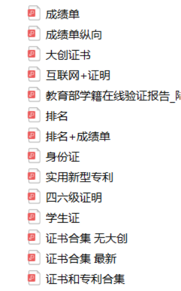
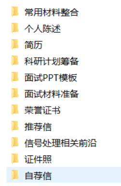

# 18-通信-陆梦雅-哈尔滨工业大学(深圳)

## 基本背景

> 三年绩点排名：2/116
>
> 综合排名：2/116
>
> 绩点：4.14/5
>
> 四级：476
>
> 六级：479
>
> 获奖情况：没有什么特别突出的竞赛，一个省级大创，2个省级水奖，还有大大小小的荣誉证书若干
>
> 夏令营入营：川大、上科大、科大先研院、科学岛、声学所
>
> 预推免通过：电子科大国家抗干扰、哈工深、华科、华工、声学所、中山、天大
>
> 最终去向：哈工深

## **个人材料准备：(话不多说，直接上图)**

下面我简单介绍一下用途哈

**常用材料：**一般存放各种常用的证明材料内容pdf，基本上所有学校都会允许用pdf作为提交的格式，里面是各项可能会用到的材料的整合 大概这样吧

**个人陈述：**一般填系统要用。可以准备一下。800字/1500字都要有的。可以方便增加和删减。

**简历：**超级重要的，大多导师面试的都是看简历面试，认真准备准没错！

**科研计划筹备：**即使我的个人科研很薄弱，但我还是要挖掘一些内容进行自我提问。如果大家已经忘记了，一定要理解多看。觉得很low，也没关系，在导师眼里大家的都不是很强的啦，相信自己，讲清楚让老师相信你参与了，在当中不是划水很重要！！！

**面试PPT模板：**大多数为线上，不知道以后会不会线下啦。准备一个PPT，介绍好自己的情况，一般5分钟就好。时间允许中英文都准备一下，没有任何坏处！

**面试材料准备：**哈哈哈，里面是一些专业课的复习英语口语什么的

**荣誉证书：**各种材料的jpg版本，最开始准备材料用到比较多，后来都用常用材料素材整合了

**推荐信：**大部分夏令营都要，个人感觉嗯用处不是太大啦，除非你找的老师是大牛另讲了啦

**信号处理前沿：**当时想作这个方向，找了些材料进行了阅读

**证件照：**哈哈哈，美美的照片超重要的啦，建议花个半天画一个妆，打扮一下，去专业的店里好好照一下！

**自荐信：**俗称套磁信，打动导师的法宝！！！一般不建议太长，表表自己的意愿决心、留下自己的联系方式千万别让老师找不到你哈！

## 具体准备技巧：

1. **关于前期材料：**推荐一个整理PDF网站：https://www.ilovepdf.com/zh-cn 
2. **关于信通方向专业课：**我作了总结有需要的可以自取吧：https://pan.baidu.com/s/1QXi1wPLHFe5kh68GWn2t4g   提取码：1234
3. **关于英语准备：**本人也很烂，所以多背一些稿子，只要背到一篇都不是白费的啦：具体包括以下一些主题：家乡、学校、爱好、读研究生原因、喜欢的书籍、敬佩的人、为什么来这里、还有一些热点话题准备一下哈
4. **关于自我介绍：**一般包括中文3分钟、1分钟；英文3分钟、1分钟；PPT：5分钟英文、中文
5. **关于联系导师：**被拒绝千万不要害怕，多尝试一下。一般前期超过1周可以重新发送一封，若无回复可更换导师。后期的话2天没回复可以试着重新发送一封。不建议同时联系一所高校两个老师
6. **面试具体题目：**这个嘛，需要积累。有条件，最好可以找找一些原题，很有帮助的啦。

附上我自己的一些感悟哈：

保研是一场持久战，尤其是对于本科偏弱的学生。

如果你是大一：希望你可以认真对待你的每一次课程、任何一场比赛，相信三年后你会感谢之前的自己；大二的学生可以尝试多参加比赛、科研经历丰富真的超级加分！！！大三的学生一切都来的急，英语六级不够刷分、或者考考雅思什么的。专业课千万别掉至少要有保研资格。

一般对于末流的高校第一具有绝对优势！所以如果可以冲一把，我个人比较佛系，哈哈哈，大四还有水课没有修完，千万别学我！我们专业允许刷水课提高绩点算成绩的，这一点我吃了很大亏。一直都没有认真考虑过保研什么的，直到后来才发现大家都准备了这么多。所以平时多和周围同学交流交流，因为你们不是敌人，你们的对手是来自外面的各个高校。对于第一也不要沾沾自喜，更要利用好自己的优势，冲一冲自己心仪的高校。

保研后，会有你排名后的同学保研比你好，也会有考研的比你去的高校好。这些都会客观存在，但是，只要自己觉得可以就好了的。在保研过程中，我曾一度迷失了方向，非要去报知名度很高的高校。其实没有必要，对于未来发展，专业和一个好导师很重要。研究生的平台已经够大了，关键是看自己如何利用了的。学校再好，也有毕不了业的学生。学校再差，也有每年拿着高薪的学生。保研过程中，千万要守住自己的初心，知道自己想要的，做好就可以了的。

最后，分享一句我最近很喜欢的一句话：纵有疾风起，人生不言弃！共勉！

