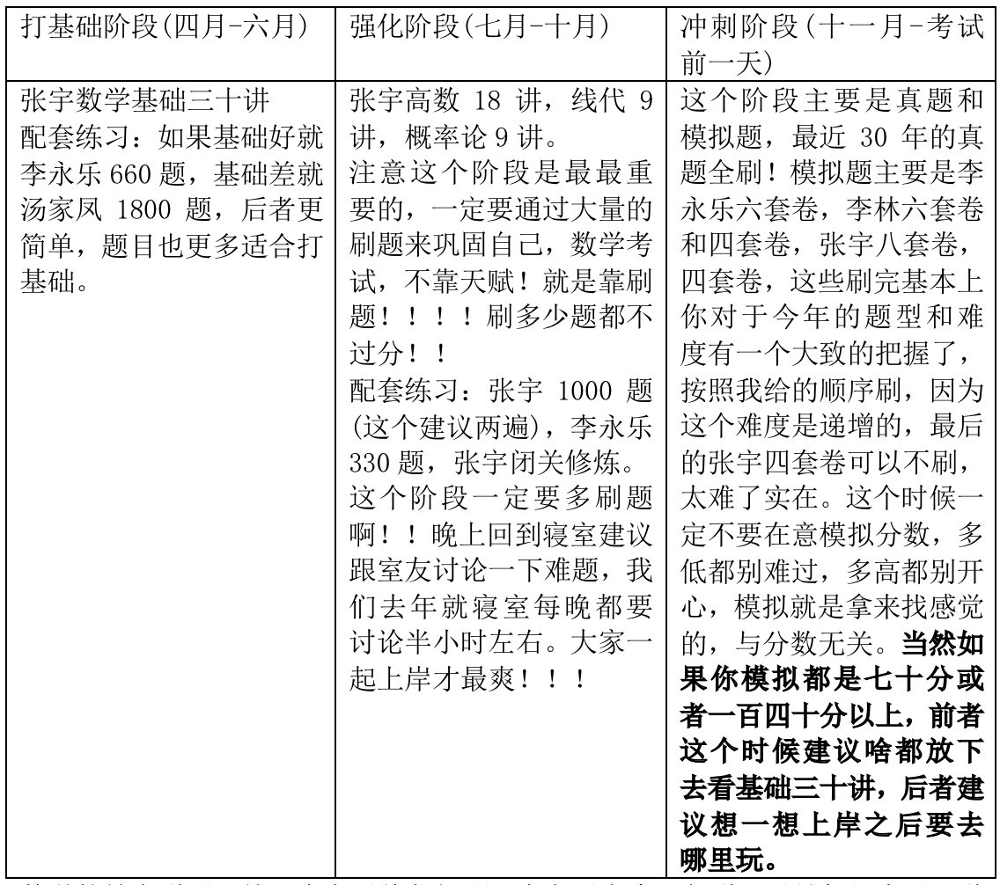

# 17-计科-郭云-中国科学技术大学

## 基本信息

> 本科材料物理，后转专业至计科英才班
>
> 六级：480
>
> 奖证：除了国家励志，拿到过所有种类的奖学金
>
> 科研：国家级大创结项，手握专利一项

## 考研结果

> 录取学校：中科大软件学院
>
> 初试总分：400
>
> 政治：74
>
> 英语二：75
>
> 数学二：131
>
> 专业课（408）：120
>
> 复试情况：初试排名一般，靠复试的上级考试逆袭上岸

## 初试部分

### 总体说明

大家好我叫郭云，是去年八月底正式开始考研的，前前后后大概用了四个月左右吧，所以看到这份经验贴的人，从今天开始（按四月一号算吧），你有八个月的充足时间，如果你决定22考研，那你清明之后真的可以开始了，我去年因为准备时间太少差点翻车，最后一个月的时候一堆东西没看没学没写，整天上火，鼻腔里都是血。但是考试发挥的还是很不错的。

话不多说，下面从数学开始。

### 数学

数学我建议全程就跟张宇就行了，不需要同济教材，不需要同济教材，不需要同济教材！！！！因为各种数学复习全书比你想象得内容详细的多，只要是考研会考的知识点，里面一定会有。张宇讲课生动有趣，前期能慢慢的引导你进入复习状态，笑呵呵的考研何乐而不为呢。中期强化带你刷题，后期推荐武忠祥的十七堂课，对自己查缺补漏。（我觉得主要是后期刷题刷不动了，看会视频放松一下！）

数学辅导书：

数学的补充说明：关于李永乐线代问题，李永乐实力没得说，只是年纪大了，说话声音我实在不习惯那种苍老无力感(对不起，李佬！)反之张宇老师年轻有力，吐字清晰，而且张宇真的是全能大神，**任何一科都不比任何一个人差**，我跟我俩兄弟都是全程张宇，大家都高分上岸了。

### 英语（红宝书，田静语法分析，黄宝书真题）

英语的话，时间宽度很大，前期背单词，中期语法和阅读，后期真题加背大小作文。

单词书推荐红宝书，很详细，能背完的你就是我大哥。**这里我要说我考研期间最大的心得了，注意听！！！！！没错！！！我考研期间最大的心得不是数学，不是专业课，是英语单词！！！！**准备考研英语属于应试教育，考了几十年了，常考的就那么两三千个单词，早就已经出现无数次了，所以我的建议是前期单词背不住也没关系，直接吃语法！！！推荐**新东方田静的语法课以及辅导书长难句解析**，人美声甜，每天看看视频，自己总结一下，单词能背就背，不能背就放轻松。多刷高数题，找张宇玩去，他非常想要莱布尼兹的手稿。等到了九月份，直接上真题！然后**只要是真题里出现的单词，不会的，找个本子记下来，然后一定一定一定要背下来！！这个是最最最常考的**，你们不信自己做着就会发现，举个例子，你在05年真题刚背的两个生词，06年就又出现了，06年又背的两个单词，07年就来了！！！！我就靠这个方法，15年往后基本没有我不认识的单词了！！有一年的真题，我甚至达成了整张试卷只错四个选择题的成就。做完所有真题，就再做一遍，越多越好，每次都有新收获(所以建议铅笔做，做完擦掉)，英语不需要模拟题，市面上没有任何一种模拟题能跟考研相似甚至相近，南辕北辙的道理你们都懂。**真题推荐黄宝书**。

最后的时候，推荐**刘晓燕英语作文班！！**跟着准备自己的作文模板，背下来就完事了！！！！她是让你自己准备模板，每个人都是独一无二的！！！！你看了视频就懂了！！！大家都是聪明的孩子！！

### 政治（核心考案，肖八肖四，腿姐押题卷)）

其实最不用慌的就是政治了，九月份开始看徐涛的网课，买他的核心考案，跟着看着玩就行了，后期肖八肖四，**两个的选择题全背，肖四的大题全背**。70分稳稳的。觉得不放心可以再买点腿姐的押题卷，做一做选择就行。

### 专业课

我考的专业课是号称工科最难的计算机统考，代号408，专业课的话呢，某宝都有相应的辅导机构准备的资料，不管是自命题还是统考。

我就说说408吧，八月份开始，四本王道过三遍！！！不需要看视频，浪费时间，最后做王道的真题和模拟，有精力的可以买一本408的一千题做做，我感觉没啥用，全是错题，我跟王CG天天给它改错，不过好处就是，可以查缺补漏，找错误最能提高一个人的实力了，哈哈哈哈哈哈。

### 总结

最后再说一下啊，不是说资料买的越多越好，你买十本都不看，不如买一本吃透，道理你们都懂我就不多说了。最后再叮嘱几点：

1.决定考研了就要风雨兼程，一定不要放弃，坚持到最后，你就打败了四分之一的人了。考研是一场孤独的旅行，也是对自己的淬炼！！高考之后，又一次向世界证明你自己的绝佳机会！！！

2.找一个好兄弟或者姐妹一起努力，往往事半功倍，我跟王还有逸哥虽然有时候一起颓废寝室打游戏，但几乎每天都是学习十多个小时的，刚得到消息，王琛光在今天早上刚刚确定上岸老牌985重庆大学了，逸哥估计也快了，我身边的都是稳的。

3.有条件的话，尽量找一个固定的地方考研，每天搬书挺累的。

4.拼多多上面的辅导书 很便宜，便宜，宜。

5.你会上岸的！！！！！

