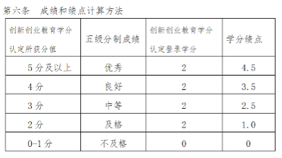
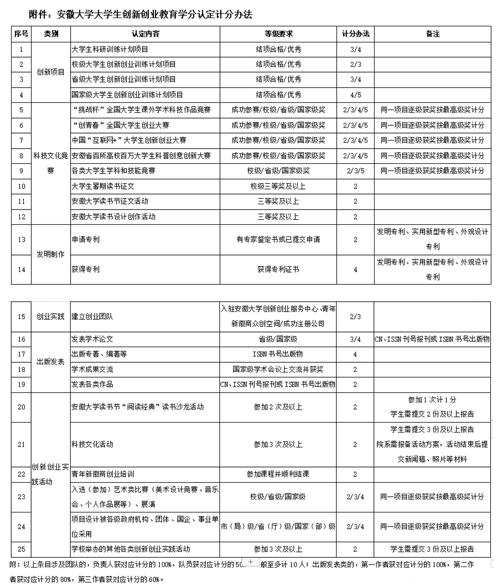
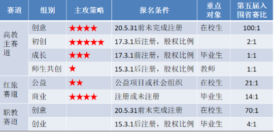
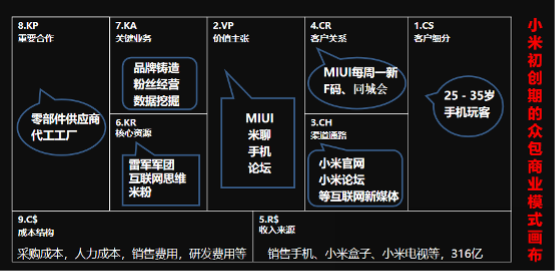
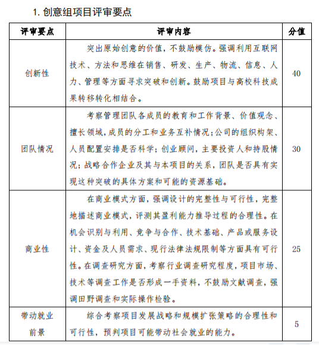
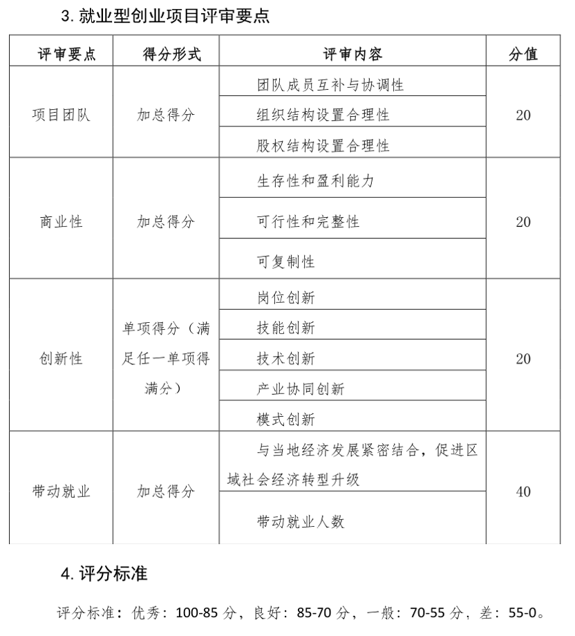
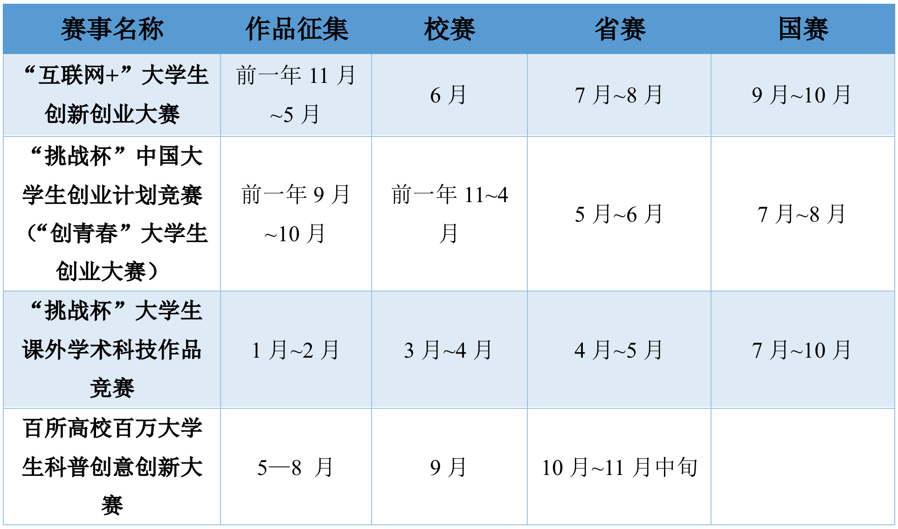

# 17-新能源-陈炳旭-创新创业赛事分享

## 基本背景

> **主要奖证：**
>
> 社会实践奖学金、团学工作奖学金、学术科技奖（团队）三等奖、国家级大创负责人
>
> **比赛获奖：**
>
> 安徽大学第二届万朗杯青年新徽商创新创业大赛 一等奖 优胜奖
>
> 第四届“互联网+”大学生创新创业大赛 安徽省银奖
>
> 第六届“互联网+”大学生创新创业大赛 安徽省金奖、国赛铜奖
>
> 第十届安徽省“双百大赛” 优秀奖

在正文开始之前，想说些题外话，很高兴能看到安徽大学飞跃手册的出现，背后的运营者做了我之前想过但未曾实施过的事请，并以一种新的形式呈现出来，也由衷祝愿安徽大学飞跃手册能秉持初心，一路走下去……

毕业弥留之际，复试结束去向已定，毕业论文结束，还剩些闲暇，回想过往四年，思绪万千，有幸能师从教书、育人的恩师以及遇见几位能称作榜样的学长学姐，我也希望在离校前能留下些有意义的东西。本文将从“互联网+”大赛、挑战杯系列赛事和双百大赛入手，穿插一些与之相关的内容，分享我本科期间参加这些创新创业比赛的经验，这也是最主要的几项创新创业赛事，希望能增进读者对于这类比赛的了解。

此外，仍有较多高质量高水平的A、B类赛事（如：全国高校“创意 创新 创业”电子商务挑战赛、全国高校商业精英挑战赛会计与商业管理案例竞赛等），因了解比较少，我在此就不详细叙述，也希望能有更多优秀的同学对内容进行补充。

## 一、 前言

可能有不少人会问，“为什么要花时间花心思去做科研或者创业项目、去参加这些比赛，对我有什么好处吗”、“有意愿参加但是不知道具体形式和流程该到哪里去咨询”、“团队构成和任务分配该怎样进行”……

首先要对毕业后去向有个较清楚的规划，是读研优先还是工作优先，从而有所侧重；对自己有一个比较理性的认知，绝大部分人都没足够的精力面面俱到，但是要明确自己有哪些强项和闪光点，在同其他人竞争时，才能拿出比较有含金量的东西，扬长避短。如果觉得自己没拿得出手的奖优或者证书，那问题就比较好办，找到自己想要去突破的方向，结合读研or工作的规划，着重加强自己所需要的部分，如果确定想读研就投入到专业学习、科研或者实验中，如果选择工作就要注重实践。比如我本人，很清楚自己成绩绩点不拔尖，日常也很难静下心来学习，不论是自己还是家人都认为读研是必由之路，于是选择在更适合自己的创新创业、科研项目方面去加强。

除此之外，对学术科技奖学金（团队奖学金三千起步）申请、保研都有一定好处，安徽大学对于学生基本的实践教育也有一定的要求，主要包括素质教育、创新创业教育和社会责任教育等三项（详细请见教务处通知文件），下图为化学化工学院2021年推荐免试研究生实施办法（部分）和创新创业教育学分绩点计算方法：

但更重要的是自己的综合能力得到提升，借用我本科指导老师的话 “不论最后是证书还是奖金，那些只是用处不大的纸张，而在面对突发问题时思考怎样去解决，这样一种思维，是伴随我们终身的”。如何快速融入团队，找到自己的定位，都是需要去慢慢摸索、学习的，用实际行动来证明自己可以充分信任以及不可替代性，用句比较通俗的话来说，要做到当自己接过任务就代表着任务已经完成。

那就来到了第二个问题，有意愿参与创新创业赛事，但疏于对形式和流程的了解。其实信息来源最靠谱也是最全面的方式，就是详细阅读比赛的官方文件通知，里面涉及到比赛背景、赛制、时间流程、组别类型及要求等信息，能够回应大部分人的疑问，但大部分人反而疏忽了官方文件这最重要的信息来源。其次可以通过校内负责这类赛事的学生组织和相应创业实践课程来了解，比如安徽大学青年科技创新中心或者所在院系的宣讲会、新徽商工作室的青年新徽商创业培训，不论是青创的宣讲还是新徽商工作室汪老师组织的相关课程，都比较高质量高水平。

创新创业赛事与其他专业性赛事不同，偏向于商业化和综合性，这就要求项目团队包含各方面人才，除了最基本的熟知项目技术的成员外，还需要做报表的经济金融成员，甚至可以邀请台风较好、主持经验丰富的成员进行项目汇报，在踏入省赛后，可能团队中还需要一些挂名的成员，需要的是他们的专业、实力、学历来完善项目团队整体实力。项目成员可以来源于自己认为可靠的或者通过老师和同学介绍的朋友，也可以在比赛交流群中招募，不要不好意思在群里发这种消息，毕竟只要自己不尴尬，尴尬的就是别人。

## 二、 相关比赛简介

### 1. “互联网+”大学生创新创业大赛

中国国际“互联网+”大学生创新创业大赛于2015年由李克强总理亲自提议举办，扎实推进大众创业万众创新，创新驱动创业，创业引领就业，由教育部等部门共同主办，至今已成功举办六届。根据项目形式、是否成立公司等，大赛分为高教主赛道、“青年红色筑梦之旅”赛道、职教赛道和萌芽赛道，以及校赛、省赛、国赛三级赛制。大赛主要通过采用**书面评审**和**PPT汇报、答辩**的方式进行，在进入国赛后会增加**短视频评审**环节。

第五届“互联网+”大赛共有来自国内外124个国家和地区、4093所学校的457万名大学生、109万个团队报名参赛；安徽省共有178所学校、15.5万人次、3.7万个团队报名参赛，比去年增长50%，在国赛中获**4金8银34铜+1个萌芽版块创新潜力奖**（历届战绩：**2015第一届1金3银；2016第二届3银；2017第三届1银；2018第四届3银**）。

第六届“互联网+”大赛共有117个国家和地区、4186所学校的631万人、147万个项目报名参赛，经过激烈角逐共有164个中国大陆参赛项目、23个中国港澳台地区参赛项目和111个国际参赛项目从全球147万个参赛项目中脱颖而出参与总决赛；安徽大学在本次大赛中更是取得了**国赛1银3铜、省赛7金19银39铜**的好成绩。

不论是安徽省组委会，还是安徽大学，都是愈来愈重视这项新兴赛事，赛事组委会、筹备组和高校在赛事上花的精力越来越多。我曾经参加过第四届和第六届“互联网+”大赛，与第四届相比，有了几年筹备参赛积累的经验，安大在第六届大赛上投入了大量人力物力财力，给每个通过省赛初筛的项目的商业计划书和PPT讲述都进行了辅导，甚至对几项重点项目进行了五六轮辅导，对项目存在的问题进行针对性完善，从安大比赛成果就可以看出了，取得了很优异的成果，在今年第七届比赛中，安大也会投入更多的精力来打磨项目。

今年的“互联网+”大赛分为五个组别：**本科生创意组、研究生创意组、初创组**（工商等各类登记注册未满3年且获机构或个人股权投资不超过1轮次）、**成长组**（工商等各类登记注册3年以上或获机构或个人股权投资2轮次及以上）、**师生共创组**。在安徽大学，近两年“互联网+”这项赛事主要是由互联网学院和新徽商办公室来牵头组织，服务于各个项目，而“青年红色筑梦之旅”赛道是由校团委来组织。以2020年第六届“互联网+”大赛为例，从下图可以看处，我们本科在校生大部分项目参加的是高校主赛道的创意组，而已注册公司的项目根据注册时间和股权占比不同按照要求参加初创组、成长组或者师生共创组，其中师生共创组要求师生股权占比超过51%并且学生参赛成员合计股份不低于20%。

高教主赛道的参赛项目主要源于学生创意、创业实践、科研成果转化（例如大学生创新创业项目），以往的获奖项目中有包括全固态锂电池、可食用洗洁精、纳米靶向药物、地下无人矿车这些高端技术的项目，也有做专利转化、文旅的项目；一个比较好的创意组项目，理应是除了最后一步创建公司外，所有的核心技术或想法、厂房租赁、上下游厂商、合作伙伴、竞争对手、预计财务报表和预计营收都已经摸清楚，给评委呈现出来的是下一步我们就可以直接注册公司开始搞钱。

**商业计划书**是创新创业比赛中最为重要的一环，以下是创意组项目（未注册公司，左图）与创业组项目（已注册公司，右图）计划书的大概框架

一个好的商业计划书应该注重四个点：

* **广阔的市场空间：**市场份额足够大，新产品在进入市场时才能够分一杯羹且发展前景巨大，相应国家号召，符合国家期望；目前商用产品存在痛点或者未被满足的功能，别人做不到的我们能做得到，这就是我们的绝对优势

* **完善的商业模式与营销计划：**可赢利，可复制，难模仿，可持续，有益社会

* **优秀的创业团队和指导老师：**人员架构合理，团队成员有梦想，有技术，有能力，术业有专攻，通过对专家顾问组成、团队成员组成、学历、技术、经验的介绍让评审专家或投资者相信这群人很靠谱

* **计划书附件更为重要：**附件主要包含能够证明项目可靠性的主要证据链，例如发明专利、三大奖、参与起草编写的行业标准、高水平论文等，这些都是项目实打实的核心竞争力。

**答辩PPT**主要由**行业背景-市场分析及痛点-产品介绍-项目团队-营销计划-优势前景**等部分组成，整个PPT都是围绕商业计划书展开的，在讲述和答辩过程中更要扬长避短，技术不行的就重营销，同样在和竞争对手的产品做对比时，着重说我们优胜的地方，通过**字体加粗、关键词提炼**让评委迅速抓住项目的重点和亮点。

行业背景和市场分析是为了给项目做铺垫，是因为市场上大规模常用的产品存在哪些痛点还是哪些核心技术仍然没有国有化仍被外国企业扼住喉咙，这些痛点是由哪种原因造成的，会给产业链上下游带来怎样的影响；可以从国家发展战略与重大需求出发，从十三五规划、十九大报告、权威机构报告中寻找热点方向、展现市场规模，国计民生中寻找商机，让投资人了解行业存在的哪些问题/痛点，如何通过项目有效解决，通过故事性、戏剧性、易记性的背景来铺垫；

在介绍产品服务时，单一数据表现出来非常枯燥无力，只有在对比中才能明显地看出优势，和市场上大规模商用的同类型进行技术、性能、成本、功耗等全面性对比，和国内外科研实验室的产品进行对比，同样要注重扬长避短，再怎么也不能搬起石头砸自己的脚。

就比如某项目做的全固态锂电池，实际上常温下的导电性能比较弱，在高温下性能较好，目前市面上大规模商用的均为液态锂电池，那么与商用产品相比，我们项目的产品在安全性上遥遥领先，在折叠甚至刺破等极端条件下都有优异的稳定性，但是在导电性方面，就只与液态锂电池比较在高温下的导电性能相比，所设计的适用场所也是用作动力汽车等设备的储能和供能器件，不去提及我们的短处。在营销计划方面尽量使用商业画布，清晰明了，有逻辑性，这一部分要包含营销计划、销售渠道、品牌推广、可合作的资源等，展示项目在市场方面的规划，可结合的资源等。

PPT整体简洁不花哨，成段成段的文字是绝对的禁忌，不论是美观度还是清晰明了都不能满足要求，能用图表就不用大段文字，能用流程图绝不用文字叙述，PPT只是辅助讲述的工具，只需要放上关键信息就好，而其他内容和节奏是由讲述人来控制，讲述人才是最关键的。可以换位思考下，评委大多数是投资人、创业导师等资深专家，年龄都比较大，花里胡哨的PPT在他们那里只会是减分项，如果没有十足的把握做出流畅、美观的动画，甚至可以不添加任何动画，至简为美。根据答辩要求的PPT讲述时间，正常来说最后留下30s的时间是最好的，这样不论是现场讲述节奏过快或者过慢，最后时间把控都比较合理，并且给突发时间留下一些处理时间。讲述人要做到铿锵有力、抑扬顿挫，服装整体协调，适当以肢体配合讲述。

以下附上各组别项目的评审标准供参考：

### 2. “创青春”大学生创业大赛 &“挑战杯”中国大学生创业计划竞赛（小挑）

“挑战杯”全国大学生系列科技学术竞赛主要包含两部分，即“挑战杯”中国大学生创业计划竞赛和“挑战杯”全国大学生课外学术科技作品竞赛，这两项竞赛交叉进行，均为每两年举办一届，由共青团中央、中国科协、教育部、全国学联和地方政府共同主办，自1989年首届竞赛举办以来，在广大高校乃至社会上产生了广泛而良好的影响，被誉为当代大学生科技创新的“奥林匹克”盛会，已经得到了多位党和国家领导同志的亲切关怀，同样采取校赛、省赛、国赛三级赛制。为了便于分类和区别，本节主要针对“挑战杯”中国大学生创业计划竞赛（小挑）进行介绍，“挑战杯”大学生课外学术科技作品竞赛（大挑）见下一节。

2013年习近平总书记向2013年全球创业周中国站活动组委会专门致贺信，强调了青年学生在创新创业中的重要作用，并指出全社会都应当重视和支持青年创新创业。共青团中央、教育部、工业和信息化部等单位牵头组织，在原有“挑战杯”中国大学生创业计划竞赛的基础上，自2014年起举办 “创青春”大学生创业大赛，每两年一届，其主要分为三类：

#### 大学生创业计划竞赛

面向在校学生，以商业计划书评审、现场答辩等作为参赛项目的主要评价内容；项目以是否在工商、民政等政府部门注册登记或注册登记时间在3个月以下（以当年3月为截止日期）为限制，可申报已创业类（甲类）或未创业类（乙类）项目，并分为农林、畜牧、食品及相关产业，生物医药，化工技术、环境科学，电子信息，材料，机械能源，服务咨询等七组

#### 创业实践挑战赛

面向在校学生或毕业未满3年的我校毕业生，且已投入实际创业3个月以上，以经营状况、发展前景、营销策略、财务管理等四个方面作为参赛项目的主要评价内容；参赛项目申报不区分具体类别组别，但要求项目拥有或授权拥有产品或服务，并已在工商、民政等政府部门注册登记为企业、个体工商户、民办非企业单位等组织形式，且法人代表或经营者符合相关规定、运营时间在3个月以上（以当年3月为截止日期），参赛团队第一负责人必须为申报项目（企业、民办非企业单位等）法人代表或（个体工商户）经营者

#### 公益创业赛

面向在校学生，以创办非盈利性质社会组织的计划和实践等作为参赛项目的主要评价内容；参赛项目申报不区分具体类别组别，应满足拥有较强的工艺特征、创业特征、实践特征等要求。

自2014年第一届“创青春”大赛以来，伴随着广大高校走过了六七个年头，与中国“互联网+”大学生创新创业大赛齐名，二者都是全国规格最高的大学生创新创业大赛。直到2020年，小挑时隔六七年再次回归，于2020年继续举办第十二届“挑战杯”中国大学生创业计划竞赛；与“创青春”和“互联网+”大赛相比，小挑最主要的差别就是：参赛对象为当年6月1日以前正式注册的全日制**在校本科生、硕士研究生**（不含在职研究生），限制了毕业生参赛，这也就直接限制了一些神仙级别的项目参赛，一定程度上有利于在校生的项目，往年在“互联网+”大赛师生共创组、成长组和“创青春”的创业实践挑战赛经常能看到高规格、高水平、高技术含量、经过多年打磨的成熟创业团队站在领奖台上。

同样与其他赛事类似，“挑战杯”中国大学生创业计划竞赛（小挑）分为五个组别：科技创新和未来产业、乡村振兴和脱贫攻坚、城市治理和社会服务、生态环保和可持续发展、文化创意和区域合作。因这类比赛都是主要通过书面评审和PPT汇报、答辩的方式进行，详细内容请上一节“互联网+”大赛的对应内容，在此不多叙述。

### 3. “挑战杯”大学生课外学术科技作品竞赛（大挑）

大挑自1989年来，从最初的19所高校发起，发展到1000多所高校参与；从300多人的小擂台发展到200多万大学生的竞技场，“挑战杯”竞赛在广大青年学生中的影响力和号召力显著增强。与创青春、互联网+、小挑这些创新创业大赛类似，同样包括书面评审和答辩评审，但主要有两点不同：

大挑的参赛作品主要分为三类：**自然科学类学术论文**（作者限本专科生）、**哲学社会科学类社会调查报告和学术论文、科技发明制作**（分为AB类：A类指科技含量较高、制作投入较大的作品；B类指制作投入较小，对生产技术或社会生活带来便利的小发明、小制作），且提交材料**不需要商业计划书**，只需论申报书、论文、专利和相关材料即可。

大挑参赛作品可以分为个人和集体申报作品，而其他几项比赛只能通过团队申报；申报**个人作品**的申报者必须承担申报作品60%以上的研究工作，作品鉴定证书、专利证书及发表的有关作品上的署名均应为第一作者，合作者必须是学生且不得超过2人；凡作者超过3人的项目或作者不超过3人、但无法区分第一作者的项目，均须申报集体作品

个人觉得大挑是最有含金量的比赛，也是真正能反映参赛成员科研能力的比赛，完全靠着专利、论文顶起来，不需要计划书、商业模式、盈利能力那些可操作性比较强的材料。如果答辩过程中没太大问题的话，论文强、专利强，那不可能不获奖，当然所申报的论文和专利必须自己是作者。与其他几项比赛不同，大挑在评审过程中综合考虑作品的科学性、先进性、现实意义等方面因素，自然科学类学术论文侧重考核基础学科学术探索的前沿性和学术性，哲学社会科学类社会调查报告和学术论文侧重考核与经济社会发展热点难点问题的结合程度和前瞻意义，科技发明制作侧重考核作品的应用价值和转化前景。

在上文中我曾提到创新创业赛事的项目主要源于学生创意、创业实践、科研项目成果转化，因为有论文、专利的要求，可以看出大挑的项目只能来源于科研项目。

### 4. 安徽省百所高校百万大学生科普创意创新大赛（双百大赛）

双百大赛是由省科协、省教育厅、团省委主办，被誉为培养科普创新人才的“摇篮工程”，参赛对象为在皖各高校在读全日制大学生、研究生。双百大赛主要围绕“**科普**”和“**创新**”这两个关键词进行，参赛作品分为以下三类：

#### 科普展教品（实物、设计方案）

需提交实物图片或演示视频，注重交互性、激发观众探索兴趣，促进其深入思考，应充分采用成熟的技术和设备，如机械结构等实物的方式展现科学技术原理的抽象概念，具有易操作、简维护、耐用等特点，更有助于实现观众的自助操作；该类别的作品从科学技术原理正确性、新颖性与艺术性、完整性、可重复性、互动性与趣味性这几点进行评审

#### 数字科普作品（动漫、游戏、微视频、APP）

须同时提交相应的创意说明文档（Word版本），说明作品的创作背景、核心创意、脚本要点以及创作过程。该类别的作品从公益性、科学性、原创性、传播性和普及性等方面进行评审

#### 科普文学作品（小说、诗歌、散文、剧本）

体现普及科学知识、弘扬科学精神、传播科学思想、倡导科学方法；主要从科技性、创新性、艺术性、实用性进行评审。

双百大赛有非常优厚的奖金奖励，特等奖 2 名（奖金各 25000 元，颁发获奖证书）一等奖 12 名（奖金各 10000 元，颁发获奖证书）、二等奖 26 名（奖金各 5000 元，颁发获奖证书）、三等奖 100 名，奖金各 2000 元，颁发获奖证书）、优秀奖 200 名（颁发获奖证书），当特等奖出现空缺时，则每空缺 1 名特等奖相应增加 1 名一等奖、3 名二等奖获奖名额。因为是科普类型赛事，也没有专利、论文那些隐形门槛，不论是冲着拿奖去还是冲着奖金去，都可以大胆试一试。

对于我们化院人来说，做出科普展教品和科普文学作品比较难，没有相关的技术和文笔支撑，并且不好下手。我在参赛时也考虑过很多作品形式，思前想后最后决定选用短视频的形式来科普丁达尔效应，以动物课堂（手偶操作，真人配音）的创新形式展现，将原理动画演示和生活中的丁达尔效应结合，力求达到优质的科学性展现和科普效果。团队成员不超过五人的限制也要求每个人都必须术业有专攻，我和化院另一位同学负责主要思路和视频内容的撰写，既然是视频作品，除了正常素材拍摄外还得进行大量剪辑工作，通过朋友推荐了位新传的同学来负责主要的视频剪辑工作，我虽然不会做视频但也知道剪辑的工作量很大，最后又找了两位同学辅助剪辑以及视频拍摄，整体工作包括包括台词打磨、手偶操作、拍摄、配音、剪辑等。虽然这个团队只有五人，虽然我之前也接触过大大小小不少团队，但是我不得不说这五人团队很强很出色，革命友谊永远铭记。

## 三、 联系及差别

对于小挑、互联网+、创青春这些创新创业赛事来说，有很多相同点，都采用书面评审和PPT汇报、答辩的方式进行，都分为校赛、省赛、国赛三级赛制，申报材料都主要为商业计划书和答辩PPT，甚至可以看到部分项目前前后后在多项赛事都拿了省级甚至国家级奖项；对于较优秀的项目，都会有一定的政策，比如对参赛项目团队择优推荐参赛项目入孵各级大学生创业园或创业基地，给予税务登记、小额贷款、风险投资等方面的政策优惠，对获奖项目成员颁发奖金和证书，对指导教师工作量、教学科研奖励的认可有相关政策。

而不同点主要存在于对项目和成员的要求，比如上文提到过小挑要求参赛对象为全日制在校本科生、硕士研究生（不含在职研究生）、大挑可以申报个人项目等等。

## 四、 赛事时间流程
以下时间可作为参考，每年的时间都会有所变动，以当年通知为准（比如2020年因疫情影响，小挑和“互联网+”时间均有推迟）。

## 五、 写在最后

我曾经在一篇致谢中写过“创新创业是我本科生涯浓墨重彩的一笔”，将大学四分之三的时间都献给了它，现在还记得18年暑假在图书馆一楼刚与任学姐和鋆哥见面时的场景，一点不夸张的说，他们是我的引路人。选择这条路会很难，连续熬夜半个月都很常见，完整打磨一个项目去参赛甚至前前后后需要一年的时间，但带给我们的远远不止那几张证书，就像我的本科指导老师所说“在面对突发问题时思考怎样去解决，这样一种思维，是伴随我们终身的”。在我们自己团队赢得荣誉时，也是院系的荣幸，更是安大的荣誉，背后也有很多老师、评审专家、其他同学支持着我们。

行文至此，接近尾声，水平有限，请见谅。也把想说的都以文字的形式表达了出来，希望这篇文章能够帮助到有需要的人。附上我自己很喜欢的一句话：甘于平凡，却不甘于平凡地溃败。