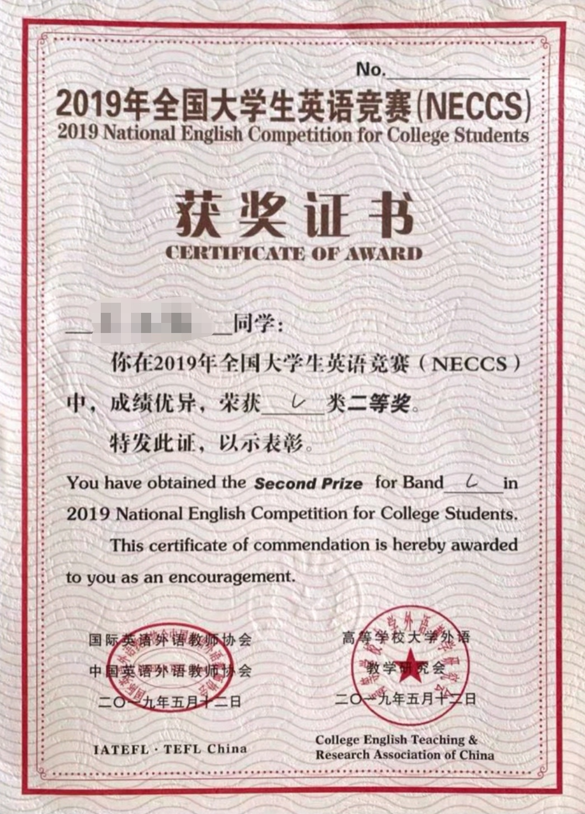
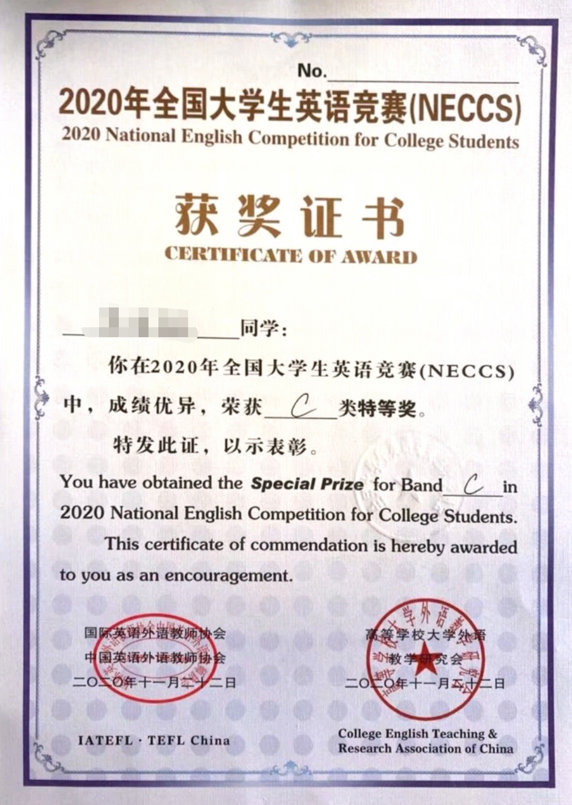

# 18-广告-吴亚颖《快看，你们要的大英赛特等奖经验贴来了！》

## 为什么出经验贴？

本人一共参加过两次大英赛，第一次二等奖，第二次特等奖！两次参赛也算是把这个比赛摸透了。之前一直有朋友、老师来问我比赛经验与方法，但回答都比较琐碎，不够系统。趁寒假，有时间有精力，索性出一篇经验贴分享给大家，献丑。里面的方法与观点纯属个人主观感受，请自行斟酌采用。呜呜我不是好为人师，单纯想分享自己的一点收获与小经验给想要在大英赛中取得满意成绩的友友们，能有一点帮助我就很开心了。

说在前面，码字不易，主要内容传达出去即可，别纠结我的字句用法，我在输出观点的时候，不太注重遣词造句，拗口之处，你懂即可，嘻嘻。

另外，这帖子全是我的经验，很主观，但也很真实，在这里你看不到官方的那一套哈（要知道官方的去大英赛官网看看就行http://www.chinaneccs.cn）

## 首先说一下，这个比赛是啥？

这么说吧，大英赛（全国大学生英语竞赛）应该是国内的大学生能获奖的性价比最高的英语竞赛。在我看来，它就是很适合会做题的孩子们去努力的比赛，不考察演讲、辩论等很考语言表达和积累的内在功力，就考你的做题能力，会做题就行！（这在后面的考试方法中会具体谈到，别急）我大学参加了这么多英语比赛，我觉得这个是最容易拿奖的。（想想19年花四五个月的时间准备跨文化能力大赛的体验，简直，现在码字的手都是抖的）但是，哈哈哈，不巧，拿完大英赛特等奖，暑假可以参加总决赛，总决赛还是要比表达能力的（演讲辩论等）。说到这里，不得不提一嘴，大家真的要练好全面的听说读写能力，尤其是表达，毕竟英语是一门语言，语言是一种表达的艺术。多说多练吧，英语不是一天学好的，慢慢积累慢慢进步才是王道！

## 这个比赛有啥用？

现在的大学生多少都会对比赛有功利主义的心态（这很正常，我也会有），那说到这里，我就更推荐大英赛给这些“比赛有用论”的友友们了。大英赛只要获奖，就是国家级奖项，呜呜，相比什么建模、创新创业比赛等那些周期长、难度大的比赛，拿大英赛的国奖不香吗？你真的就是好好备考，刷刷题，英语有点底子，认真准备，那可是太有可能获奖了。这也是我前面说大英赛是性价比很高的英语竞赛的原因。

再者，这比赛本身就是你英语能力的展示，获奖了对考核加分、保研、出国、求职啥的都百利而无一害吧。

对了，我看有些学校貌似获奖了还能拿奖金（我慕了...）边比赛，边提升英语水平还能边拿钱，这好事情不做吗？

## 这个比赛难度啥样？

我个人感觉就跟四六级差不多吧，说不上谁更难一些，因为题型不一样。当然，不认真学英语，啥比赛都难。

## 获奖难度啥样？

哈哈哈，这个解答还是交给官方。获奖不难，可能进决赛获特等奖、一等奖会难一些。而且越好的学校竞争越大，越难。

> 好了，前面铺垫的差不多了，该入正题了。

## 方法！

大前提，先点击官网，了解这个比赛具体考什么，怎么考？（讲的比我官方但是详细，请相信权威！）认真看完官网，会有个大致的印象。

### 1. 宏观上说刷题

* 刷第一套题

  就找市面上最新的一套，比如现在你要准备大英赛，那就找2020大英赛初赛的试卷（ABC类自行看自己的专业分类）。

  然后开始看试卷！就是过一遍试卷长啥样，题目在考什么？方法就像你第一次看高考卷一样！

  看完了吧？然后，找完整的1.5h做这一套试题。（作文不写）（一定要限时训练！！！）如果你是第一次做大英赛的题目，一般情况，做题场面会蛮惨烈的（英语大佬请忽略）。你会开始质疑自己，但这太正常了，平常心对待，它也只是一套你不太熟悉的题目而已。

  做完后批改，批改后，认真总结！！！

  我一般订正总结反思的时间是远远大于我做题目的时间的。（因为试题在学校，没办法给大家看我订正总结的真实画面）订正总结这一步很重要，这是提升的关键。看看参考答案上给出的出题角度与解题思路，尽管这几年的题目题型和分值都有所变化，但是出题核心都是没有变化的。

   

* 重复

  如果你认真的走这一套流程下来，你像这样刷一个五套题目，然后上考场。获奖应该问题不大。（前提你英语底子比较好）那英语底子一般的呢？就多刷呗！

  “人一能之己百之，人十能之己千之，虽愚比必明，虽柔必强！”

  备考时间：比赛前一个月就行。

  但你要说想从寒假开始，当然更好，只不过你要保证状态和快要比赛前一样。

  别轻易拉长备赛战线，很容易盲目自我感动。

  基础不错的，比赛前两个星期甚至前一个星期。

  我第二次备赛，就是比赛前两个星期买试题，比赛前一个星期开始刷题。每天除了上课，就是刷题。每天的强度比较大。

  特别注意！比赛的两个小时做题目其实时间是有点紧张的。这也是大英赛的特点，题量大，时间不够用。但这也是大英赛取胜的一个关键点，请在比赛的时候！做完题目！！！做完题目，你就成功了一大半！！再加上，你之前认真的准备，准确率在那，你就更容易获奖了！

### 2. 微观上说题型

* 听力：

  无论四六级，雅思托福还是大英赛，我想多听多听多听是必须的吧。泡在英语里，才不会在乍一听英语的时候，感觉自己像长了假耳朵的人。提升听力的方法，参考四六级听力。但要注意的是，大英赛的听力有听写，尤其是最后一题听写还是蛮难的，但再难多练也就那样了。

 

* 词汇与语法：

  这个很像初中的英语选择题，考的都是很基础的词汇、辨析、语法、情景。这个我当时也就是跟着试题来，没有额外去补充。但是遇到不会的、错的请务必详细弄透弄通这个点。

 

* 完形填空：

  这个也是自己写答案，整体难度不大，但是建议在做题的过程中，总结这个题目经常会考哪些词性，当不知道填什么的时候，把之前做题目总结的经验用上，也就够了。

 

* 阅读理解：

  不难，自认为是整套题目里，相对简单的了。就和你平时做的所有阅读理解一样，题目中都有答案，认真读就找得到。

 

* 改错题：

  呜呜呜，这个题目可是难到我了。我不敢给你们支招，我一般也就对一半。我的英语基本功还是不扎实。所以，归根到底，只要英语基础好，什么比赛都难不倒。

 

* 智力题：

  emmm，题如其名。考智力的。这我没办法说，你们各自发挥吧嘿嘿。但是要重视这个题目，它已经从以前的一分一题上到两分一题了。有些题型的方法还是有迹可循的。

  

* 作文：

  平时多积累，考前把两道作文的大致结构掌握，基本分不会跑。提醒一下，前面的时间控制好，否则少于半个小时，两道作文你是拿不下的。温馨提示：要有自己的一个作文库（积累好词好句好结构的那种，方便每次比赛考试写作文的时候用上，作文库也要不断更新哈）

 

* 做题顺序推荐：

  按性价比高低做题！

  听力-词汇-完形-阅读-作文-改错-智力（仅供参考）

 

* 资料推荐：

  不打广告，tb的那一本就行。如果想冲好成绩，官网有一套资料，共三本，100+。如果想要的或者想看看的，我那三本还在（有做过），可私聊我。

 

> 好家伙，写了这么多。算是，我在这个比赛上的“毕生绝学”都说出来了。
>
> 当然，比赛有运气成分的，但是你认真努力了，结果绝对不会差。
>
> 我英语其实就是一般水平，但我考虑到有不少朋友和老师问过，就花了半天的时间，认真整理，献丑了。
>
> 希望对你们有帮助。请相信，我行，你们也行。
>
> 友友们！祝你们好运！也欢迎你们指正和提问。