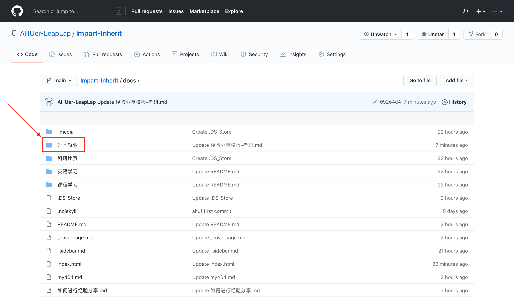
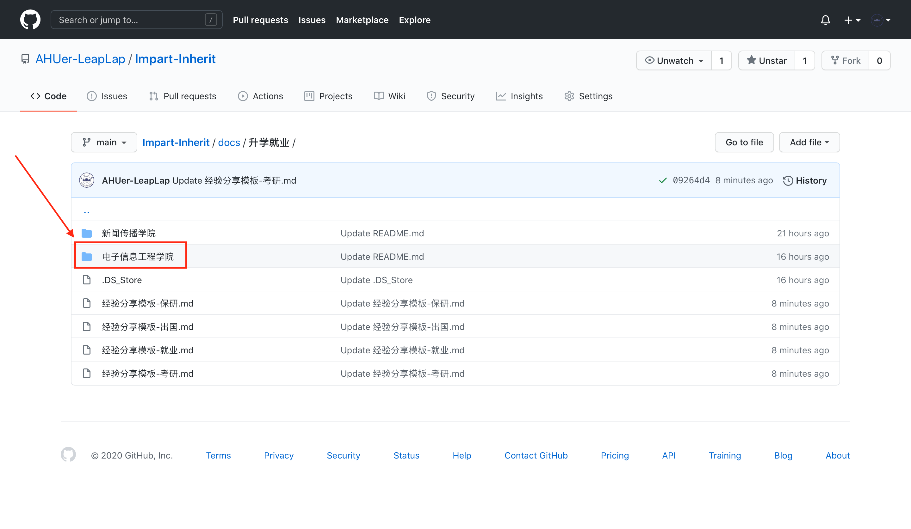
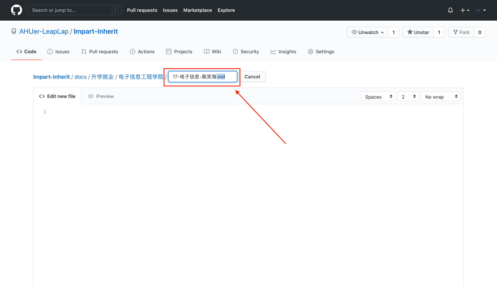
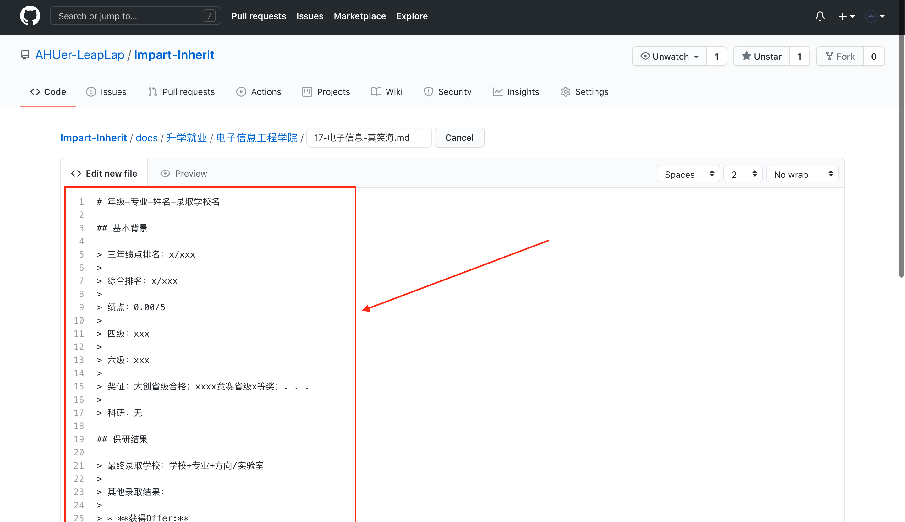
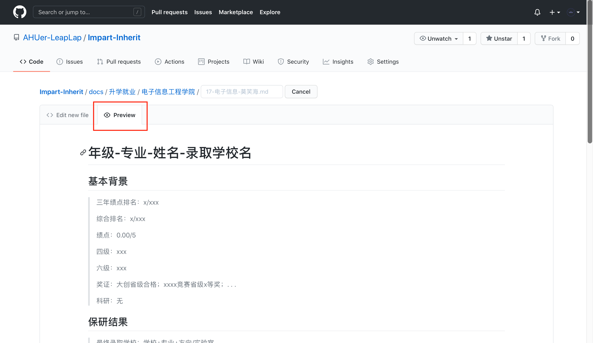
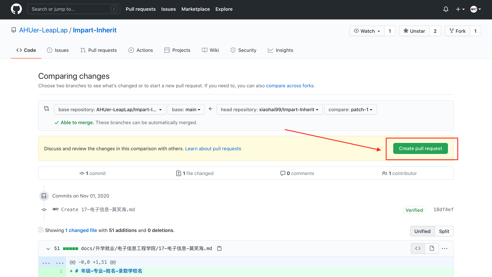
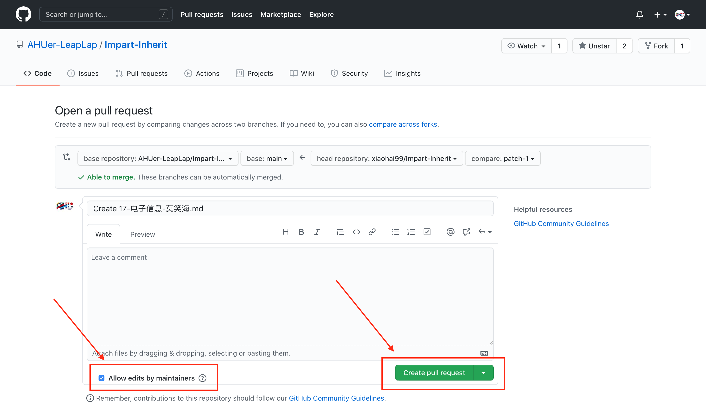

## 如何进行经验分享

1. 如果已有`Github`账号可以跳过此步。打开[Github](https://github.com)，点击右上角`Sign Up`按钮注册一个`Github`账号。

2. 登陆后进入[这个页面](https://github.com/AHUer-LeapLap/Impart-Inherit/tree/main/docs)，打开一个你希望分享的页面，如``升学就业``->``电子信息工程学院``，这篇文章将会一直以此为例进行说明。





3. 点击`Create new file`按钮。


命名方式为：`年级-专业-姓名.md`。如：`17-电子信息工程-莫笑海.md`。注意不要漏掉后缀`.md`。



将你想要分享的内容填写在上图`Edit new file` 的下方。我们在此提供模板（下文为保研分享模板），同学们只需要改动其中的汉字部分即可。

```markdown
# 年级-专业-姓名-录取学校名    在这里为自己的分享起一个标题

## 基本背景

> 三年绩点排名：x/xxx
>
> 综合排名：x/xxx
>
> 绩点：0.00/5
>
> 四级：xxx
>
> 六级：xxx
>
> 奖证：大创省级合格；xxxx竞赛省级x等奖；. . . 
>
> 科研：无

## 保研结果

> 最终录取学校：学校+专业+方向/实验室
>
> 其他录取结果：
>
> * **获得Offer:**
>   * 学校+专业；学校+专业 . . .
> * **获得面试机会后放弃:**
>   * 学校+专业；学校+专业 . . .
> * **被刷**:
>   * 学校+专业+简历被刷/面试被刷；学校+专业+简历被刷/面试被刷 . . .

## 保研心得

### 1. 这是小标题格式

### 2. 开始你的分享

### 3. 

* 这是分点格式
* 

>这是引用格式
>
>
>
>

**这是加粗格式**

更多格式需求请参考 https://siriusq.top/Markdown写作语法.html
```



点击`Preview`按钮可以进行预览。



4. 填写好内容后点击`Propose new file`按钮。


5. 点击`Create pull request`按钮。



6. 确保`Allow edits by maintainers`是被选中状态，点击`Create pull request`按钮。



7.大功告成。

首先请我们代表学弟学妹，感谢你愿意分享自己宝贵的经历，同时我们也要感谢你选择了自食其力的方式，这为我们节省了大量格式转换的时间，现在我们只需专注于修改、审核即可。同时我们要恭喜你拥有了自己的`Github`账号并且了解了`.md`也就是`Markdown`这种神奇的事物。希望这个账号不会就此荒废，因为`Github`是这个世界上最富饶的代码库，你几乎可以找到任何你想要的东西。

最后，祝前程似锦。


------------

##### 本操作步骤文稿修改自[南方科技大学飞跃手册](https://sustech-application.github.io/2020-Fall/#/如何进行经验分享)
